# litehub 🚀🚀🌟  
<div align='center'>
  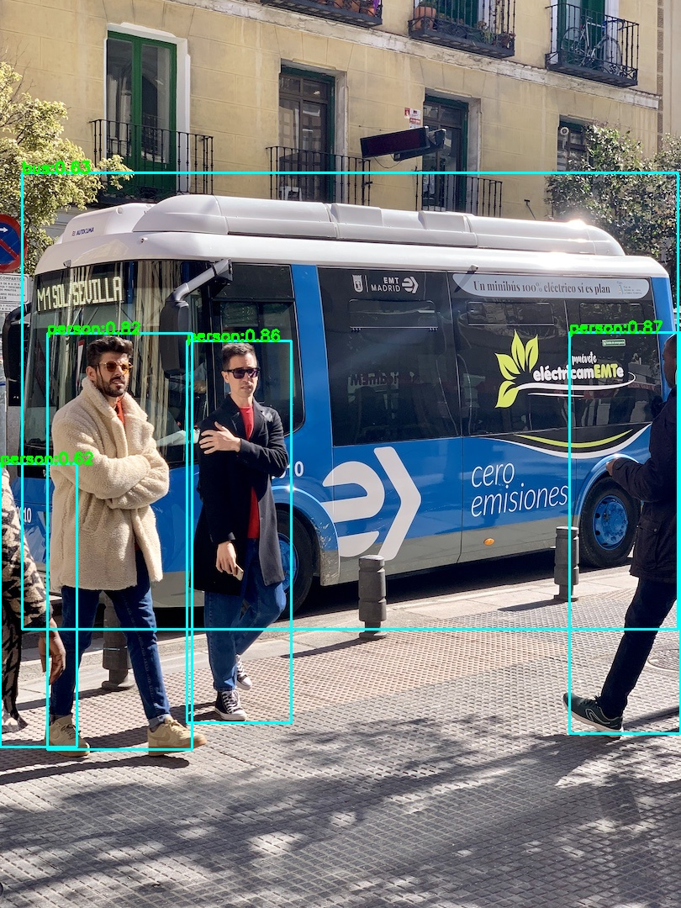
  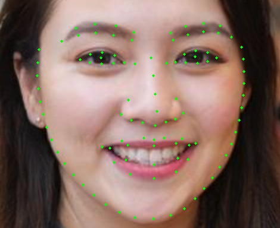
  
  <br> 
  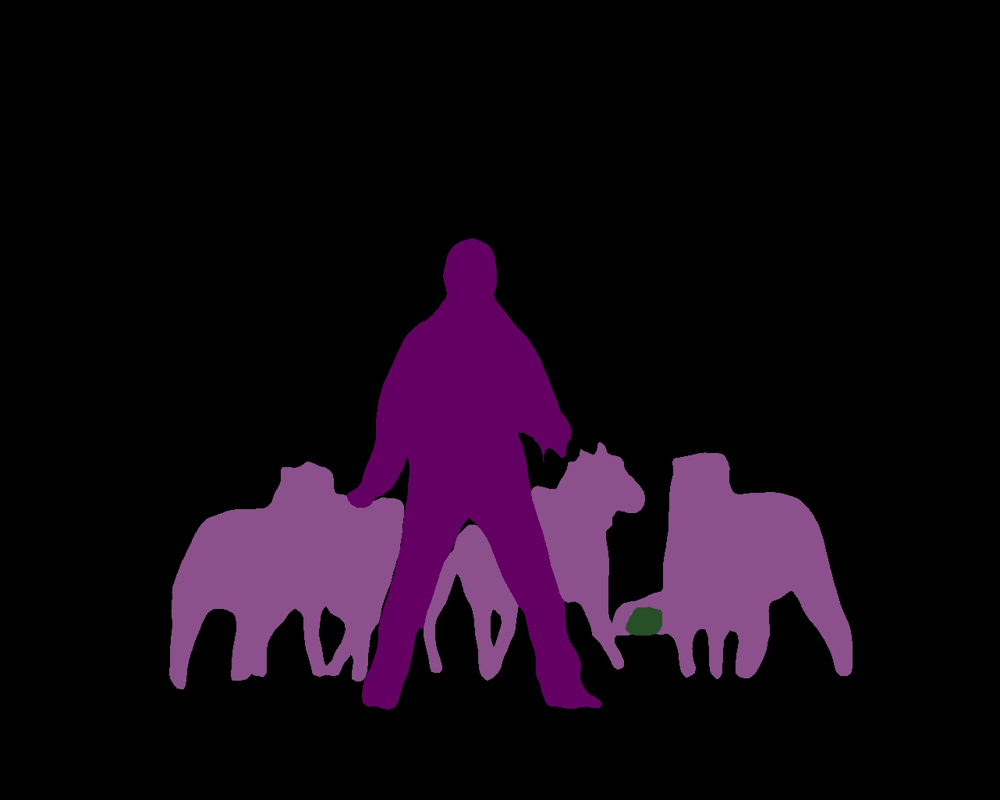
  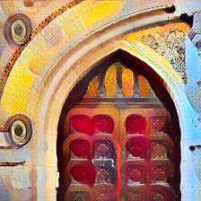
  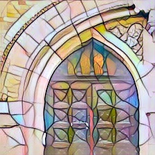 
</div>

*litehub* for onnxruntime/ncnn/mnn. This library integrates some interesting models and implement with onnxruntime/ncnn/mnn. Such as `YoloV5`、`UltraFace`、`PFLD`、`Colorization`、`FastStyleTransfer` and so on.
Most of the models come from `ONNX-Model-Zoo`, `PytorchHub` and `other open source projects`. All models used will be cited. Many thanks to these contributors. What you see is what you get, and hopefully you get something out of it.

## 1. Dependencies.  
* Mac OS.  
install `opencv` and `onnxruntime` libraries using Homebrew.
```shell
  brew update
  brew install opencv
  brew install onnxruntime
```  
or you can download the built dependencies from this repo. See [third_party](https://github.com/DefTruth/litehub/tree/main/third_party) and build-docs[<sup>1</sup>](#refer-anchor-1).
* Linux & Windows. 
  * TODO
  
## 2. Implementation Plans.
* Inference Engine Plans:
  * Doing:
    * [x] `onnxruntime c++` 
  * TODO:
    * `NCNN`
    * `MNN`
    * `OpenMP` support

## 3. Model Zoo.

### 3.1 model-zoo for ONNX version.
Some of the models were converted by this repo, and others were referenced from third-party libraries.

<div id="refer-anchor-2"></div>

|Model|Size|Download|From|Docs|Usage|  
|:---:|:---:|:---:|:---:|:---:|:---:| 
|[FSANet](https://github.com/omasaht/headpose-fsanet-pytorch)|1.2Mb|[Baidu Drive](https://pan.baidu.com/s/1X5y7bOSPyeBzT9nSgQiMIQ) code:g83e| [FSANet](https://github.com/omasaht/headpose-fsanet-pytorch)| - | [demo](https://github.com/DefTruth/litehub/blob/main/examples/ort/cv/test_ortcv_fsanet.cpp) |
|[PFLD](https://github.com/Hsintao/pfld_106_face_landmarks)|1.0Mb~5.5Mb|[Baidu Drive](https://pan.baidu.com/s/1X5y7bOSPyeBzT9nSgQiMIQ) code:g83e| [PFLD](https://github.com/Hsintao/pfld_106_face_landmarks) | - | [demo](https://github.com/DefTruth/litehub/blob/main/examples/ort/cv/test_ortcv_pfld.cpp) |
|[UltraFace](https://github.com/Linzaer/Ultra-Light-Fast-Generic-Face-Detector-1MB)|1.1Mb~1.5Mb|[Baidu Drive](https://pan.baidu.com/s/1X5y7bOSPyeBzT9nSgQiMIQ) code:g83e| [UltraFace](https://github.com/Linzaer/Ultra-Light-Fast-Generic-Face-Detector-1MB) | - | [demo](https://github.com/DefTruth/litehub/blob/main/examples/ort/cv/test_ortcv_ultraface.cpp) |
|[AgeGoogleNet](https://github.com/onnx/models/tree/master/vision/body_analysis/age_gender)|23Mb|[Baidu Drive](https://pan.baidu.com/s/1X5y7bOSPyeBzT9nSgQiMIQ) code:g83e| [AgeGoogleNet](https://github.com/onnx/models/tree/master/vision/body_analysis/age_gender) | - | [demo](https://github.com/DefTruth/litehub/blob/main/examples/ort/cv/test_ortcv_age_googlenet.cpp) |
|[GenderGoogleNet](https://github.com/onnx/models/tree/master/vision/body_analysis/age_gender)|23Mb|[Baidu Drive](https://pan.baidu.com/s/1X5y7bOSPyeBzT9nSgQiMIQ) code:g83e| [GenderGoogleNet](https://github.com/onnx/models/tree/master/vision/body_analysis/age_gender) | - | [demo](https://github.com/DefTruth/litehub/blob/main/examples/ort/cv/test_ortcv_gender_googlenet.cpp) |
|[EmotionFerPlus](https://github.com/onnx/models/blob/master/vision/body_analysis/emotion_ferplus)|33Mb|[Baidu Drive](https://pan.baidu.com/s/1X5y7bOSPyeBzT9nSgQiMIQ) code:g83e| [EmotionFerPlus](https://github.com/onnx/models/blob/master/vision/body_analysis/emotion_ferplus) | - | [demo](https://github.com/DefTruth/litehub/blob/main/examples/ort/cv/test_ortcv_emotion_ferplus.cpp) |
|[VGG16Age](https://github.com/onnx/models/tree/master/vision/body_analysis/age_gender)|514Mb|[Baidu Drive](https://pan.baidu.com/s/1X5y7bOSPyeBzT9nSgQiMIQ) code:g83e| [VGG16Age](https://github.com/onnx/models/tree/master/vision/body_analysis/age_gender) | - | [demo](https://github.com/DefTruth/litehub/blob/main/examples/ort/cv/test_ortcv_vgg16_age.cpp) |
|[VGG16Gender](https://github.com/onnx/models/tree/master/vision/body_analysis/age_gender)|512Mb|[Baidu Drive](https://pan.baidu.com/s/1X5y7bOSPyeBzT9nSgQiMIQ) code:g83e| [VGG16Gender](https://github.com/onnx/models/tree/master/vision/body_analysis/age_gender) | - | [demo](https://github.com/DefTruth/litehub/blob/main/examples/ort/cv/test_ortcv_vgg16_gender.cpp) |
|[SSRNet](https://github.com/oukohou/SSR_Net_Pytorch)|190Kb|[Baidu Drive](https://pan.baidu.com/s/1X5y7bOSPyeBzT9nSgQiMIQ) code:g83e| [litehub](https://github.com/DefTruth/litehub/blob/main/docs/ort/ort_ssrnet.zh.md) | [link](https://github.com/DefTruth/litehub/blob/main/docs/ort/ort_ssrnet.zh.md) | [demo](https://github.com/DefTruth/litehub/blob/main/examples/ort/cv/test_ortcv_ssrnet.cpp) |
|[FastStyleTransfer](https://github.com/onnx/models/blob/master/vision/style_transfer/fast_neural_style)|6.4Mb|[Baidu Drive](https://pan.baidu.com/s/1X5y7bOSPyeBzT9nSgQiMIQ) code:g83e| [FastStyleTransfer](https://github.com/onnx/models/blob/master/vision/style_transfer/fast_neural_style) | - | [demo](https://github.com/DefTruth/litehub/blob/main/examples/ort/cv/test_ortcv_fast_style_transfer.cpp) |
|[ArcFaceResNet](https://github.com/onnx/models/blob/master/vision/body_analysis/arcface)|249Mb|[Baidu Drive](https://pan.baidu.com/s/1X5y7bOSPyeBzT9nSgQiMIQ) code:g83e| [ArcFaceResNet](https://github.com/onnx/models/blob/master/vision/body_analysis/arcface) | - | [demo](https://github.com/DefTruth/litehub/blob/main/examples/ort/cv/test_ortcv_arcface_resnet.cpp) |
|[Colorizer](https://github.com/richzhang/colorization)|123Mb~130Mb|[Baidu Drive](https://pan.baidu.com/s/1X5y7bOSPyeBzT9nSgQiMIQ) code:g83e| [litehub](https://github.com/DefTruth/litehub/blob/main/docs/ort/ort_colorizer.zh.md) | [link](https://github.com/DefTruth/litehub/blob/main/docs/ort/ort_colorizer.zh.md) | [demo](https://github.com/DefTruth/litehub/blob/main/examples/ort/cv/test_ortcv_colorizer.cpp) |
|[SubPixelCNN](https://github.com/niazwazir/SUB_PIXEL_CNN)|234Kb|[Baidu Drive](https://pan.baidu.com/s/1X5y7bOSPyeBzT9nSgQiMIQ) code:g83e| [litehub](https://github.com/DefTruth/litehub/blob/main/docs/ort/ort_subpixel_cnn.zh.md) | [link](https://github.com/DefTruth/litehub/blob/main/docs/ort/ort_subpixel_cnn.zh.md) | [demo](https://github.com/DefTruth/litehub/blob/main/examples/ort/cv/test_ortcv_subpixel_cnn.cpp) |
|[YoloV5](https://github.com/ultralytics/yolov5)|28Mb~335Mb|[Baidu Drive](https://pan.baidu.com/s/1X5y7bOSPyeBzT9nSgQiMIQ) code:g83e| [litehub](https://github.com/DefTruth/litehub/blob/main/docs/ort/ort_yolov5.zh.md) | [link](https://github.com/DefTruth/litehub/blob/main/docs/ort/ort_yolov5.zh.md) | [demo](https://github.com/DefTruth/litehub/blob/main/examples/ort/cv/test_ortcv_yolov5.cpp) |
|[YoloV3](https://github.com/onnx/models/blob/master/vision/object_detection_segmentation/yolov3)|236Mb|[Baidu Drive](https://pan.baidu.com/s/1X5y7bOSPyeBzT9nSgQiMIQ) code:g83e| [YoloV3](https://github.com/onnx/models/blob/master/vision/object_detection_segmentation/yolov3) | [link](https://github.com/DefTruth/litehub/blob/main/docs/ort/ort_yolov3.zh.md) | [demo](https://github.com/DefTruth/litehub/blob/main/examples/ort/cv/test_ortcv_yolov3.cpp) |
|[TinyYoloV3](https://github.com/onnx/models/blob/master/vision/object_detection_segmentation/tiny-yolov3)|33Mb|[Baidu Drive](https://pan.baidu.com/s/1X5y7bOSPyeBzT9nSgQiMIQ) code:g83e| [TinyYoloV3](https://github.com/onnx/models/blob/master/vision/object_detection_segmentation/tiny-yolov3) | - | [demo](https://github.com/DefTruth/litehub/blob/main/examples/ort/cv/test_ortcv_tiny_yolov3.cpp) |
|[YoloV4](https://github.com/argusswift/YOLOv4-pytorch)|176Mb|[Baidu Drive](https://pan.baidu.com/s/1X5y7bOSPyeBzT9nSgQiMIQ) code:g83e| [litehub](https://github.com/DefTruth/litehub/blob/main/docs/ort/ort_yolov4.zh.md) | [link](https://github.com/DefTruth/litehub/blob/main/docs/ort/ort_yolov4.zh.md) | [demo](https://github.com/DefTruth/litehub/blob/main/examples/ort/cv/test_ortcv_tiny_yolov4.cpp) |
|[EfficientNet-Lite4](https://github.com/onnx/models/blob/master/vision/classification/efficientnet-lite4)|49Mb|[Baidu Drive](https://pan.baidu.com/s/1X5y7bOSPyeBzT9nSgQiMIQ) code:g83e| [EfficientNet-Lite4](https://github.com/onnx/models/blob/master/vision/classification/efficientnet-lite4) | - | [demo](https://github.com/DefTruth/litehub/blob/main/examples/ort/cv/test_ortcv_efficientnet_lite4.cpp) |
|[ShuffleNetV2](https://github.com/onnx/models/blob/master/vision/classification/shufflenet)|8.7Mb|[Baidu Drive](https://pan.baidu.com/s/1X5y7bOSPyeBzT9nSgQiMIQ) code:g83e| [ShuffleNetV2](https://github.com/onnx/models/blob/master/vision/classification/shufflenet) | - | [demo](https://github.com/DefTruth/litehub/blob/main/examples/ort/cv/test_ortcv_shufflenetv2.cpp) |
|[SSD](https://github.com/onnx/models/blob/master/vision/object_detection_segmentation/ssd)|76Mb|[Baidu Drive](https://pan.baidu.com/s/1X5y7bOSPyeBzT9nSgQiMIQ) code:g83e| [SSD](https://github.com/onnx/models/blob/master/vision/object_detection_segmentation/ssd) | - | [demo](https://github.com/DefTruth/litehub/blob/main/examples/ort/cv/test_ortcv_ssd.cpp) |
|[SSDMobileNetV1](https://github.com/onnx/models/blob/master/vision/object_detection_segmentation/ssd-mobilenetv1)|27Mb|[Baidu Drive](https://pan.baidu.com/s/1X5y7bOSPyeBzT9nSgQiMIQ) code:g83e| [SSDMobileNetV1](https://github.com/onnx/models/blob/master/vision/object_detection_segmentation/ssd-mobilenetv1) | - | [demo](https://github.com/DefTruth/litehub/blob/main/examples/ort/cv/test_ortcv_ssd_mobilenetv1.cpp) |
|[DeepLabV3ResNet101](https://pytorch.org/hub/pytorch_vision_deeplabv3_resnet101/)|232Mb|[Baidu Drive](https://pan.baidu.com/s/1X5y7bOSPyeBzT9nSgQiMIQ) code:g83e| [litehub](https://github.com/DefTruth/litehub/blob/main/docs/ort/ort_deeplabv3_resnet101.zh.md) | [link](https://github.com/DefTruth/litehub/blob/main/docs/ort/ort_deeplabv3_resnet101.zh.md) | [demo](https://github.com/DefTruth/litehub/blob/main/examples/ort/cv/test_ortcv_deeplabv3_resnet101.cpp) |
|[DenseNet121](https://pytorch.org/hub/pytorch_vision_densenet/)|30.7Mb|[Baidu Drive](https://pan.baidu.com/s/1X5y7bOSPyeBzT9nSgQiMIQ) code:g83e| [litehub](https://github.com/DefTruth/litehub/blob/main/docs/ort/ort_densenet121.zh.md) | [link](https://github.com/DefTruth/litehub/blob/main/docs/ort/ort_densenet121.zh.md) | [demo](https://github.com/DefTruth/litehub/blob/main/examples/ort/cv/test_ortcv_densenet121.cpp) |


## 4. Usage
Disclaimer: The following test pictures are from the Internet search, if it has any impact on you, please contact me immediately, I will remove it immediately. 
### 4.1 Usage for ONNXRuntime Interfaces.
More examples can find at [ortcv-examples](https://github.com/DefTruth/litehub/tree/main/examples/ort/cv).  
#### 4.1.1 Object detection using [YoloV5](https://github.com/ultralytics/yolov5). Download model from Model-Zoo[<sup>2</sup>](#refer-anchor-2).
```c++
#include <iostream>
#include <vector>
#include "ort/cv/yolov5.h"
#include "ort/core/ort_utils.h"


static void test_ortcv_yolov5()
{
  std::string onnx_path = "../../../hub/onnx/cv/yolov5s.onnx";
  std::string test_img_path = "../../../examples/ort/resources/test_ortcv_yolov5.jpg";
  std::string save_img_path = "../../../logs/test_ortcv_yolov5.jpg";

  ortcv::YoloV5 *yolov5 = new ortcv::YoloV5(onnx_path);

  std::vector<ortcv::types::Boxf> detected_boxes;
  cv::Mat img_bgr = cv::imread(test_img_path);
  yolov5->detect(img_bgr, detected_boxes);

  ortcv::utils::draw_boxes_inplace(img_bgr, detected_boxes);
  cv::imwrite(save_img_path, img_bgr);

  std::cout << "Detected Boxes Num: " << detected_boxes.size() << std::endl;

  delete yolov5;
}

int main(__unused int argc, __unused char *argv[])
{
  test_ortcv_yolov5();
  return 0;
}

```

The output is:
<div align='center'>
  
  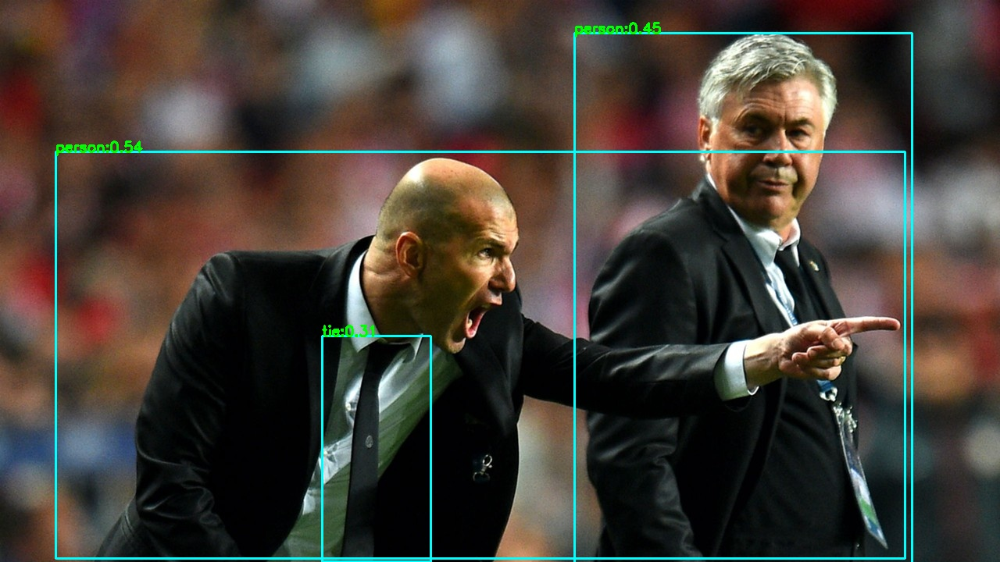
</div>  

#### 4.1.2 Segmentation using [DeepLabV3ResNet101](https://pytorch.org/hub/pytorch_vision_deeplabv3_resnet101/). Download model from Model-Zoo[<sup>2</sup>](#refer-anchor-2).
```c++
#include <iostream>
#include <vector>

#include "ort/cv/deeplabv3_resnet101.h"
#include "ort/core/ort_utils.h"


static void test_ortcv_deeplabv3_resnet101()
{
  std::string onnx_path = "../../../hub/onnx/cv/deeplabv3_resnet101_coco.onnx";
  std::string test_img_path = "../../../examples/ort/resources/test_ortcv_deeplabv3_resnet101.png";
  std::string save_img_path = "../../../logs/test_ortcv_deeplabv3_resnet101.jpg";
  
  ortcv::DeepLabV3ResNet101 *deeplabv3_resnet101 = new ortcv::DeepLabV3ResNet101(onnx_path, 16);
  
  ortcv::types::SegmentContent content;
  cv::Mat img_bgr = cv::imread(test_img_path);
  deeplabv3_resnet101->detect(img_bgr, content);

  if (content.flag)
  {
    cv::imwrite(save_img_path, content.color_mat);
    if (!content.names_map.empty())
    {
      for (auto it = content.names_map.begin(); it != content.names_map.end(); ++it)
      {
        std::cout << "Detected Label: " << it->first << " Name: " << it->second << std::endl;
      }
    }
  }
  
  delete deeplabv3_resnet101;
}

int main(__unused int argc, __unused char *argv[])
{
  test_ortcv_deeplabv3_resnet101();
  return 0;
}

```

The output is:
<div align='center'>
  
  
</div> 

#### 4.1.3 Style transfer using [FastStyleTransfer](https://github.com/onnx/models/tree/master/vision/style_transfer/fast_neural_style). Download model from Model-Zoo[<sup>2</sup>](#refer-anchor-2).
```c++
#include <iostream>
#include <vector>
#include "ort/cv/fast_style_transfer.h"
#include "ort/core/ort_utils.h"

static void test_ortcv_fast_style_transfer()
{
  std::string candy_onnx_path = "../../../hub/onnx/cv/style-candy-8.onnx";
  std::string mosaic_onnx_path = "../../../hub/onnx/cv/style-mosaic-8.onnx";
  /**skip other onnx models ... **/
  std::string test_img_path = "../../../examples/ort/resources/test_ortcv_fast_style_transfer.jpg";
  std::string save_candy_path = "../../../logs/test_ortcv_fast_style_transfer_candy.jpg";
  std::string save_mosaic_path = "../../../logs/test_ortcv_fast_style_transfer_mosaic.jpg";
  /**skip other saved images ... **/
  ortcv::FastStyleTransfer *candy_fast_style_transfer = new ortcv::FastStyleTransfer(candy_onnx_path);
  ortcv::FastStyleTransfer *mosaic_fast_style_transfer = new ortcv::FastStyleTransfer(mosaic_onnx_path);
  ortcv::types::StyleContent candy_style_content, mosaic_style_content; /** skip other contents ... **/
  
  cv::Mat img_bgr = cv::imread(test_img_path);
  candy_fast_style_transfer->detect(img_bgr, candy_style_content);
  mosaic_fast_style_transfer->detect(img_bgr, mosaic_style_content); /** skip other transferring ... **/
  if (candy_style_content.flag) cv::imwrite(save_candy_path, candy_style_content.mat);
  if (mosaic_style_content.flag) cv::imwrite(save_mosaic_path, mosaic_style_content.mat);
  /** ... **/
  std::cout << "Style Transfer Done." << std::endl;
  delete candy_fast_style_transfer; delete mosaic_fast_style_transfer;
  /** ... **/
}

int main(__unused int argc, __unused char *argv[])
{
  test_ortcv_fast_style_transfer();
  return 0;
}
```  
The output is:

<div align='center'>
  
  
    
  <br> 
  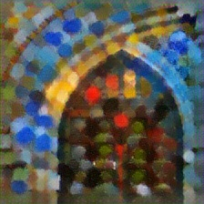
  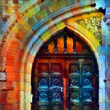
  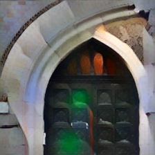
</div>

#### 4.1.4 Colorization using [colorization](https://github.com/richzhang/colorization). Download model from Model-Zoo[<sup>2</sup>](#refer-anchor-2).
```c++
#include <iostream>
#include <vector>
#include "ort/cv/colorizer.h"
#include "ort/core/ort_utils.h"

static void test_ortcv_colorizer()
{
  std::string eccv16_onnx_path = "../../../hub/onnx/cv/eccv16-colorizer.onnx";
  std::string siggraph17_onnx_path = "../../../hub/onnx/cv/siggraph17-colorizer.onnx";
  std::string test_img_path1 = "../../../examples/ort/resources/test_ortcv_colorizer_1.jpg";
  std::string test_img_path2 = "../../../examples/ort/resources/test_ortcv_colorizer_2.jpg";
  std::string test_img_path3 = "../../../examples/ort/resources/test_ortcv_colorizer_3.jpg";
  std::string save_eccv_img_path1 = "../../../logs/test_ortcv_eccv16_colorizer_1.jpg";
  std::string save_eccv_img_path2 = "../../../logs/test_ortcv_eccv16_colorizer_2.jpg";
  std::string save_eccv_img_path3 = "../../../logs/test_ortcv_eccv16_colorizer_3.jpg";
  std::string save_siggraph_img_path1 = "../../../logs/test_ortcv_siggraph17_colorizer_1.jpg";
  std::string save_siggraph_img_path2 = "../../../logs/test_ortcv_siggraph17_colorizer_2.jpg";
  std::string save_siggraph_img_path3 = "../../../logs/test_ortcv_siggraph17_colorizer_3.jpg";

  ortcv::Colorizer *eccv16_colorizer = new ortcv::Colorizer(eccv16_onnx_path);
  ortcv::Colorizer *siggraph17_colorizer = new ortcv::Colorizer(siggraph17_onnx_path);

  cv::Mat img_bgr1 = cv::imread(test_img_path1);
  cv::Mat img_bgr2 = cv::imread(test_img_path2);
  cv::Mat img_bgr3 = cv::imread(test_img_path3);
  ortcv::types::ColorizeContent eccv16_colorize_content1;
  ortcv::types::ColorizeContent eccv16_colorize_content2;
  ortcv::types::ColorizeContent eccv16_colorize_content3;
  ortcv::types::ColorizeContent siggraph17_colorize_content1;
  ortcv::types::ColorizeContent siggraph17_colorize_content2;
  ortcv::types::ColorizeContent siggraph17_colorize_content3;
  eccv16_colorizer->detect(img_bgr1, eccv16_colorize_content1);
  eccv16_colorizer->detect(img_bgr2, eccv16_colorize_content2);
  eccv16_colorizer->detect(img_bgr3, eccv16_colorize_content3);
  siggraph17_colorizer->detect(img_bgr1, siggraph17_colorize_content1);
  siggraph17_colorizer->detect(img_bgr2, siggraph17_colorize_content2);
  siggraph17_colorizer->detect(img_bgr3, siggraph17_colorize_content3);

  if (eccv16_colorize_content1.flag) cv::imwrite(save_eccv_img_path1, eccv16_colorize_content1.mat);
  if (eccv16_colorize_content2.flag) cv::imwrite(save_eccv_img_path2, eccv16_colorize_content2.mat);
  if (eccv16_colorize_content3.flag) cv::imwrite(save_eccv_img_path3, eccv16_colorize_content3.mat);
  if (siggraph17_colorize_content1.flag) cv::imwrite(save_siggraph_img_path1, siggraph17_colorize_content1.mat);
  if (siggraph17_colorize_content2.flag) cv::imwrite(save_siggraph_img_path2, siggraph17_colorize_content2.mat);
  if (siggraph17_colorize_content3.flag) cv::imwrite(save_siggraph_img_path3, siggraph17_colorize_content3.mat);

  std::cout << "Colorization Done." << std::endl;

  delete eccv16_colorizer;
  delete siggraph17_colorizer;
}

int main(__unused int argc, __unused char *argv[])
{
  test_ortcv_colorizer();
  return 0;
}
```
The output is:

<div align='center'>
  
  
    
  <br> 
  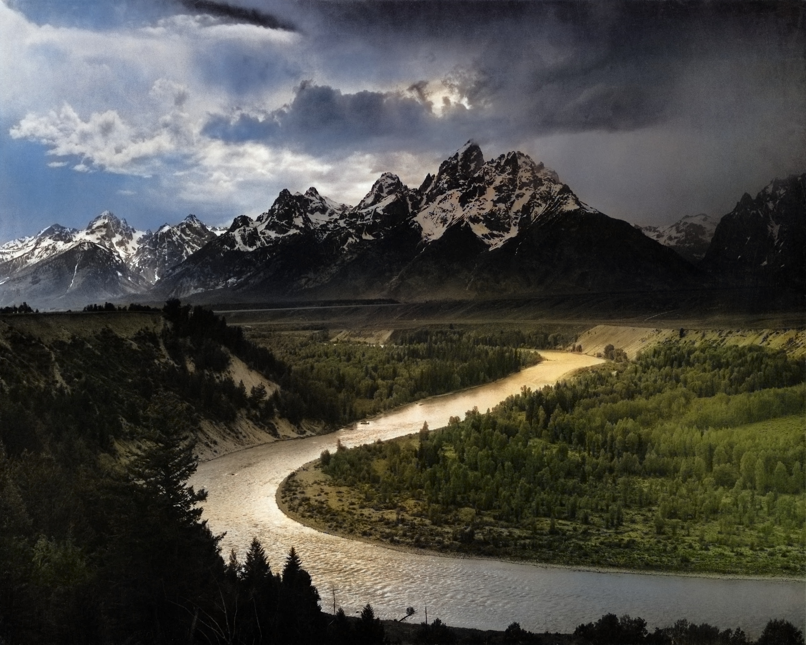
  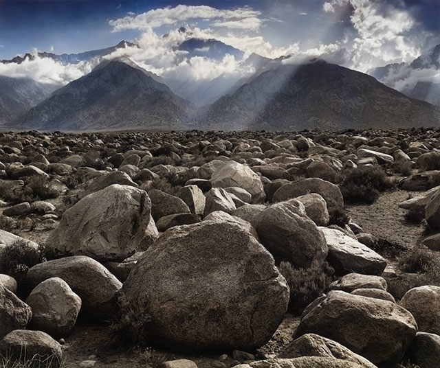
  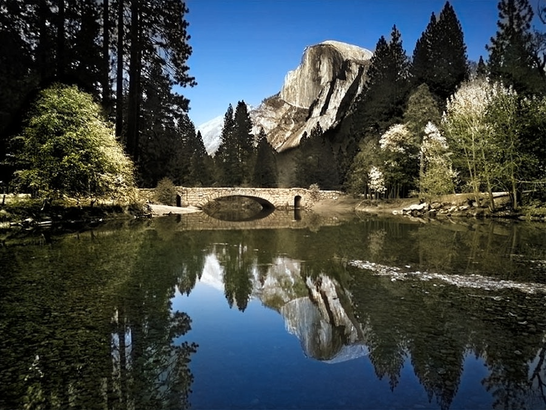
</div>  


#### 4.1.5 Facial Landmarks detection using [PFLD](https://github.com/Hsintao/pfld_106_face_landmarks). Download model from Model-Zoo[<sup>2</sup>](#refer-anchor-2).
```c++
#include <iostream>
#include <vector>
#include "ort/cv/pfld.h"
#include "ort/core/ort_utils.h"

static void test_ortcv_pfld() 
{
  std::string onnx_path = "../../../hub/onnx/cv/pfld-106-v3.onnx";
  std::string test_img_path = "../../../examples/ort/resources/test_ortcv_pfld.jpg";
  std::string save_img_path = "../../../logs/test_ortcv_pfld.jpg";
  
  ortcv::PFLD *pfld = new ortcv::PFLD(onnx_path);
  ortcv::types::Landmarks landmarks;
  cv::Mat img_bgr = cv::imread(test_img_path);
  pfld->detect(img_bgr, landmarks);
  ortcv::utils::draw_landmarks_inplace(img_bgr, landmarks);
  cv::imwrite(save_img_path, img_bgr);
  std::cout << "Detected Landmarks Num: " << landmarks.points.size() << std::endl;
  delete pfld;
}

int main(__unused int argc, __unused char *argv[]) 
{
  test_ortcv_pfld();
  return 0;
}
```   
The output is:  
<div align=center></div>  

#### 4.1.6 Face detection using [UltraFace](https://github.com/Linzaer/Ultra-Light-Fast-Generic-Face-Detector-1MB). Download model from Model-Zoo[<sup>2</sup>](#refer-anchor-2).
```c++
#include <iostream>
#include <vector>
#include "ort/cv/ultraface.h"
#include "ort/core/ort_utils.h"

static void test_ortcv_ultraface() 
{
  std::string onnx_path = "../../../hub/onnx/cv/ultraface-rfb-640.onnx";
  std::string test_img_path = "../../../examples/ort/resources/test_ortcv_ultraface.jpg";
  std::string save_img_path = "../../../logs/test_ortcv_ultraface.jpg";
  
  ortcv::UltraFace *ultraface = new ortcv::UltraFace(onnx_path);
  std::vector<ortcv::types::Boxf> detected_boxes;
  cv::Mat img_bgr = cv::imread(test_img_path);
  ultraface->detect(img_bgr, detected_boxes);
  ortcv::utils::draw_boxes_inplace(img_bgr, detected_boxes);
  cv::imwrite(save_img_path, img_bgr);
  std::cout << "Detected Face Num: " << detected_boxes.size() << std::endl;
  delete ultraface;
}

int main(__unused int argc, __unused char *argv[]) 
{
  test_ortcv_ultraface();
  return 0;
}
```
The output is:  
<div align=center></div>  


## 5. Documents.  
### 5.1 ONNXRuntime Inference Engine. 
* [Rapid implementation of your inference using BasicOrtHandler](https://github.com/DefTruth/litehub/blob/main/docs/ort/ort_handler.zh.md)  
* [Some very useful onnxruntime c++ interfaces](https://github.com/DefTruth/litehub/blob/main/docs/ort/ort_useful_api.zh.md)  
* [How to compile a single model in this library you needed](https://github.com/DefTruth/litehub/blob/main/docs/ort/ort_build_single.zh.md)
* [How to convert SubPixelCNN to ONNX and implements with onnxruntime c++](https://github.com/DefTruth/litehub/blob/main/docs/ort/ort_subpixel_cnn.zh.md)
* [How to convert Colorizer to ONNX and implements with onnxruntime c++](https://github.com/DefTruth/litehub/blob/main/docs/ort/ort_colorizer.zh.md)
* [How to convert SSRNet to ONNX and implements with onnxruntime c++](https://github.com/DefTruth/litehub/blob/main/docs/ort/ort_ssrnet.zh.md)
* [How to convert YoloV3 to ONNX and implements with onnxruntime c++](https://github.com/DefTruth/litehub/blob/main/docs/ort/ort_yolov3.zh.md)
* [How to convert YoloV5 to ONNX and implements with onnxruntime c++](https://github.com/DefTruth/litehub/blob/main/docs/ort/ort_yolov5.zh.md)

### 5.2 How to build [third_party](https://github.com/DefTruth/litehub/tree/main/third_party).  
Other build documents for different engines and different targets will be added later.

<div id="refer-anchor-1"></div> 


|Library|Target|Docs|  
|:---:|:---:|:---:|  
|OpenCV| mac-x86_64 | [opencv-mac-x86_64-build.zh.md](https://github.com/DefTruth/litehub/blob/main/docs/third_party/opencv-mac-x86_64-build.zh.md) |
|OpenCV| android-arm | [opencv-static-android-arm-build.zh.md](https://github.com/DefTruth/litehub/blob/main/docs/third_party/opencv-static-android-arm-build.zh.md) |
|onnxruntime| mac-x86_64 | [onnxruntime-mac-x86_64-build.zh.md](https://github.com/DefTruth/litehub/blob/main/docs/third_party/onnxruntime-mac-x86_64-build.zh.md) |
|onnxruntime| android-arm | [onnxruntime-android-arm-build.zh.md](https://github.com/DefTruth/litehub/blob/main/docs/third_party/onnxruntime-android-arm-build.zh.md) |
|NCNN| mac-x86_64 | TODO |  
|MNN| mac-x86_64 | TODO |  
|TNN| mac-x86_64 | TODO |  


