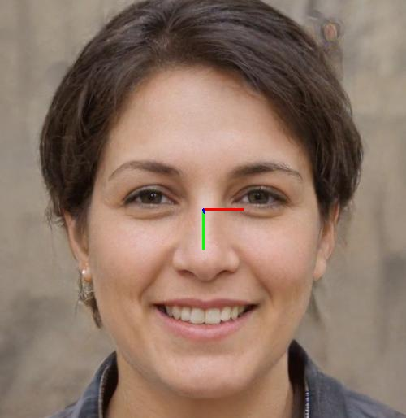
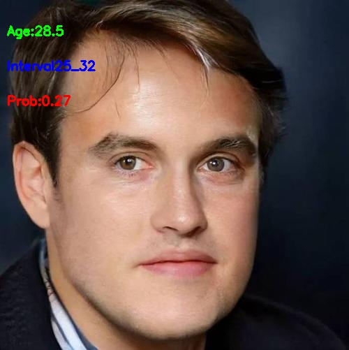
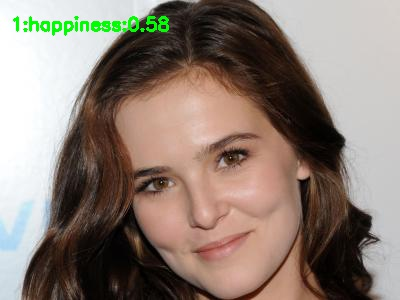

# litehub 🚀🚀🌟  
<div align='center'>
  
  
  
  <br> 
  
  
   
</div>

*litehub* for onnxruntime/ncnn/mnn/tnn. What you see is what you get! This library integrates some interesting models. I use them as practice cases when I was learning some mobile inference engines.
Most of the models come from `ONNX-Model-Zoo`, `PytorchHub` and `other open source projects`. All models used will be cited. 
Many thanks to these contributors. To be clear, I do not plan to maintain the library diligently, they are just examples of my practices. 
What you see is what you get, and hopefully you get something out of it.

## 1. Dependencies.  
* Mac OS.  
install `opencv` and `onnxruntime` libraries using Homebrew.
```shell
  brew update
  brew install opencv
  brew install onnxruntime
```  
or you can download the built dependencies from this repo. See [third_party](https://github.com/DefTruth/litehub/tree/main/third_party) and build-docs[<sup>1</sup>](#refer-anchor-1).
* Linux & Windows. 
  * TODO
  
## 2. Implementation Plans.
* Models Plan: 
  * Maybe `200+` models from community, includes cv & nlp & asr. Most of them come from the ONNX-Model-Zoo & PytorchHub & other open source projects.
* Inference Engine Plans:
  * Doing:
    * [x] <font color=green size=2> onnxruntime c++ </font>
  * TODO:
    * [x] `NCNN`
    * [x] `MNN`
    * [x] `TNN`

## 3. Usage
Disclaimer: The following test pictures are from the Internet search, if it has any impact on you, please contact me immediately, I will remove it immediately. 
### 3.1 Usage for ONNXRuntime Interfaces.
More examples can find at [ortcv-examples](https://github.com/DefTruth/litehub/tree/main/examples/ort/cv).  
### 3.1.1 Style transfer using [FastStyleTransfer](https://github.com/onnx/models/tree/master/vision/style_transfer/fast_neural_style). Download model from Model-Zoo[<sup>2</sup>](#refer-anchor-2).
```c++
#include <iostream>
#include <vector>
#include "ort/cv/fast_style_transfer.h"
#include "ort/core/ort_utils.h"

static void test_ortcv_fast_style_transfer()
{
  std::string candy_onnx_path = "../../../hub/onnx/cv/style-candy-8.onnx";
  std::string mosaic_onnx_path = "../../../hub/onnx/cv/style-mosaic-8.onnx";
  /**skip other onnx models ... **/
  std::string test_img_path = "../../../examples/ort/resources/test_ortcv_fast_style_transfer.jpg";
  std::string save_candy_path = "../../../logs/test_ortcv_fast_style_transfer_candy.jpg";
  std::string save_mosaic_path = "../../../logs/test_ortcv_fast_style_transfer_mosaic.jpg";
  /**skip other saved images ... **/
  ortcv::FastStyleTransfer *candy_fast_style_transfer = new ortcv::FastStyleTransfer(candy_onnx_path);
  ortcv::FastStyleTransfer *mosaic_fast_style_transfer = new ortcv::FastStyleTransfer(mosaic_onnx_path);
  ortcv::types::StyleContent candy_style_content, mosaic_style_content; /** skip other contents ... **/
  
  cv::Mat img_bgr = cv::imread(test_img_path);
  candy_fast_style_transfer->detect(img_bgr, candy_style_content);
  mosaic_fast_style_transfer->detect(img_bgr, mosaic_style_content); /** skip other transferring ... **/
  if (candy_style_content.flag) cv::imwrite(save_candy_path, candy_style_content.mat);
  if (mosaic_style_content.flag) cv::imwrite(save_mosaic_path, mosaic_style_content.mat);
  /** ... **/
  std::cout << "Style Transfer Done." << std::endl;
  delete candy_fast_style_transfer; delete mosaic_fast_style_transfer;
  /** ... **/
}

int main(__unused int argc, __unused char *argv[])
{
  test_ortcv_fast_style_transfer();
  return 0;
}
```  
The output is:

<div align='center'>
  
  
    
  <br> 
  
  
  
</div>

#### 3.1.2 Colorization using [colorization](https://github.com/richzhang/colorization). Download model from Model-Zoo[<sup>2</sup>](#refer-anchor-2).
```c++
#include <iostream>
#include <vector>
#include "ort/cv/colorizer.h"
#include "ort/core/ort_utils.h"

static void test_ortcv_colorizer()
{
  std::string eccv16_onnx_path = "../../../hub/onnx/cv/eccv16-colorizer.onnx";
  std::string siggraph17_onnx_path = "../../../hub/onnx/cv/siggraph17-colorizer.onnx";
  std::string test_img_path1 = "../../../examples/ort/resources/test_ortcv_colorizer_1.jpg";
  std::string test_img_path2 = "../../../examples/ort/resources/test_ortcv_colorizer_2.jpg";
  std::string test_img_path3 = "../../../examples/ort/resources/test_ortcv_colorizer_3.jpg";
  std::string save_eccv_img_path1 = "../../../logs/test_ortcv_eccv16_colorizer_1.jpg";
  std::string save_eccv_img_path2 = "../../../logs/test_ortcv_eccv16_colorizer_2.jpg";
  std::string save_eccv_img_path3 = "../../../logs/test_ortcv_eccv16_colorizer_3.jpg";
  std::string save_siggraph_img_path1 = "../../../logs/test_ortcv_siggraph17_colorizer_1.jpg";
  std::string save_siggraph_img_path2 = "../../../logs/test_ortcv_siggraph17_colorizer_2.jpg";
  std::string save_siggraph_img_path3 = "../../../logs/test_ortcv_siggraph17_colorizer_3.jpg";

  ortcv::Colorizer *eccv16_colorizer = new ortcv::Colorizer(eccv16_onnx_path);
  ortcv::Colorizer *siggraph17_colorizer = new ortcv::Colorizer(siggraph17_onnx_path);

  cv::Mat img_bgr1 = cv::imread(test_img_path1);
  cv::Mat img_bgr2 = cv::imread(test_img_path2);
  cv::Mat img_bgr3 = cv::imread(test_img_path3);
  ortcv::types::ColorizeContent eccv16_colorize_content1;
  ortcv::types::ColorizeContent eccv16_colorize_content2;
  ortcv::types::ColorizeContent eccv16_colorize_content3;
  ortcv::types::ColorizeContent siggraph17_colorize_content1;
  ortcv::types::ColorizeContent siggraph17_colorize_content2;
  ortcv::types::ColorizeContent siggraph17_colorize_content3;
  eccv16_colorizer->detect(img_bgr1, eccv16_colorize_content1);
  eccv16_colorizer->detect(img_bgr2, eccv16_colorize_content2);
  eccv16_colorizer->detect(img_bgr3, eccv16_colorize_content3);
  siggraph17_colorizer->detect(img_bgr1, siggraph17_colorize_content1);
  siggraph17_colorizer->detect(img_bgr2, siggraph17_colorize_content2);
  siggraph17_colorizer->detect(img_bgr3, siggraph17_colorize_content3);

  if (eccv16_colorize_content1.flag) cv::imwrite(save_eccv_img_path1, eccv16_colorize_content1.mat);
  if (eccv16_colorize_content2.flag) cv::imwrite(save_eccv_img_path2, eccv16_colorize_content2.mat);
  if (eccv16_colorize_content3.flag) cv::imwrite(save_eccv_img_path3, eccv16_colorize_content3.mat);
  if (siggraph17_colorize_content1.flag) cv::imwrite(save_siggraph_img_path1, siggraph17_colorize_content1.mat);
  if (siggraph17_colorize_content2.flag) cv::imwrite(save_siggraph_img_path2, siggraph17_colorize_content2.mat);
  if (siggraph17_colorize_content3.flag) cv::imwrite(save_siggraph_img_path3, siggraph17_colorize_content3.mat);

  std::cout << "Colorization Done." << std::endl;

  delete eccv16_colorizer;
  delete siggraph17_colorizer;
}

int main(__unused int argc, __unused char *argv[])
{
  test_ortcv_colorizer();
  return 0;
}
```
The output is:

<div align='center'>
  
  
    
  <br> 
  
  
  
</div>

#### 3.1.3 Age detection using [GoogleNet](https://github.com/onnx/models/tree/master/vision/body_analysis/age_gender). Download model from Model-Zoo[<sup>2</sup>](#refer-anchor-2).
```c++
#include <iostream>
#include <vector>
#include "ort/cv/age_googlenet.h"
#include "ort/core/ort_utils.h"

static void test_ortcv_age_googlenet() {
  std::string onnx_path = "../../../hub/onnx/cv/age_googlenet.onnx";
  std::string test_img_path = "../../../examples/ort/resources/test_ortcv_age_googlenet.jpg";
  std::string save_img_path = "../../../logs/test_ortcv_age_googlenet.jpg";

  ortcv::AgeGoogleNet *age_googlenet = new ortcv::AgeGoogleNet(onnx_path);
  ortcv::types::Age age;
  cv::Mat img_bgr = cv::imread(test_img_path);
  age_googlenet->detect(img_bgr, age);
  ortcv::utils::draw_age_inplace(img_bgr, age);
  cv::imwrite(save_img_path, img_bgr);
  std::cout << "Detected Age: " << age.age << std::endl;
  delete age_googlenet;
}

int main(__unused int argc, __unused char *argv[]) {
  test_ortcv_age_googlenet();
  return 0;
}
```  
The output is:  
<div align=center></div>  

#### 3.1.4 Facial Landmarks detection using [PFLD](https://github.com/Hsintao/pfld_106_face_landmarks). Download model from Model-Zoo[<sup>2</sup>](#refer-anchor-2).
```c++
#include <iostream>
#include <vector>
#include "ort/cv/pfld.h"
#include "ort/core/ort_utils.h"

static void test_ortcv_pfld() {
  std::string onnx_path = "../../../hub/onnx/cv/pfld-106-v3.onnx";
  std::string test_img_path = "../../../examples/ort/resources/test_ortcv_pfld.jpg";
  std::string save_img_path = "../../../logs/test_ortcv_pfld.jpg";
  
  ortcv::PFLD *pfld = new ortcv::PFLD(onnx_path);
  ortcv::types::Landmarks landmarks;
  cv::Mat img_bgr = cv::imread(test_img_path);
  pfld->detect(img_bgr, landmarks);
  ortcv::utils::draw_landmarks_inplace(img_bgr, landmarks);
  cv::imwrite(save_img_path, img_bgr);
  std::cout << "Detected Landmarks Num: " << landmarks.points.size() << std::endl;
  delete pfld;
}

int main(__unused int argc, __unused char *argv[]) {
  test_ortcv_pfld();
  return 0;
}
```   
The output is:  
<div align=center></div>  

#### 3.1.5 Face detection using [UltraFace](https://github.com/Linzaer/Ultra-Light-Fast-Generic-Face-Detector-1MB). Download model from Model-Zoo[<sup>2</sup>](#refer-anchor-2).
```c++
#include <iostream>
#include <vector>
#include "ort/cv/ultraface.h"
#include "ort/core/ort_utils.h"

static void test_ortcv_ultraface() {
  std::string onnx_path = "../../../hub/onnx/cv/ultraface-rfb-640.onnx";
  std::string test_img_path = "../../../examples/ort/resources/test_ortcv_ultraface.jpg";
  std::string save_img_path = "../../../logs/test_ortcv_ultraface.jpg";
  
  ortcv::UltraFace *ultraface = new ortcv::UltraFace(onnx_path);
  std::vector<ortcv::types::Boxf> detected_boxes;
  cv::Mat img_bgr = cv::imread(test_img_path);
  ultraface->detect(img_bgr, detected_boxes);
  ortcv::utils::draw_boxes_inplace(img_bgr, detected_boxes);
  cv::imwrite(save_img_path, img_bgr);
  std::cout << "Detected Face Num: " << detected_boxes.size() << std::endl;
  delete ultraface;
}

int main(__unused int argc, __unused char *argv[]) {
  test_ortcv_ultraface();
  return 0;
}
```
The output is:  
<div align=center></div>  

#### 3.1.6 Emotion detection using [EmotionFerPlus](https://github.com/onnx/models/blob/master/vision/body_analysis/emotion_ferplus). Download model from Model-Zoo[<sup>2</sup>](#refer-anchor-2).
```c++
#include <iostream>
#include <vector>
#include "ort/cv/emotion_ferplus.h"
#include "ort/core/ort_utils.h"

static void test_ortcv_emotion_ferplus() {
  std::string onnx_path = "../../../hub/onnx/cv/emotion-ferplus-8.onnx";
  std::string test_img_path = "../../../examples/ort/resources/test_ortcv_emotion_ferplus.jpg";
  std::string save_img_path = "../../../logs/test_ortcv_emotion_ferplus.jpg";
  
  ortcv::EmotionFerPlus *emotion_ferplus = new ortcv::EmotionFerPlus(onnx_path);
  ortcv::types::Emotions emotions;
  cv::Mat img_bgr = cv::imread(test_img_path);
  emotion_ferplus->detect(img_bgr, emotions);
  ortcv::utils::draw_emotion_inplace(img_bgr, emotions);
  cv::imwrite(save_img_path, img_bgr);
  std::cout << "Detected Emotion: " << emotions.text << std::endl;
  delete emotion_ferplus;
}

int main(__unused int argc, __unused char *argv[]) {
  test_ortcv_emotion_ferplus();
  return 0;
}
```
The output is:  
<div align=center></div>

### 3.2 Usage for NCNN Interfaces.  
* TODO.  
### 3.3 Usage for MNN Interfaces.
* TODO. 
### 3.4 Usage for TNN Interfaces.
* TODO. 

## 4. Reference & Implementation Details  
The `*` symbol indicates that the C ++ inference interface for the model has been implemented, and more models may be added. 
But I don't guarantee that there will be more models.
### 4.1 ONNXRuntime Inference Engine. 
```c++
namespace ortcv
{
  class FSANet;              // [0] * reference: https://github.com/omasaht/headpose-fsanet-pytorch
  class PFLD;                // [1] * reference: https://github.com/Hsintao/pfld_106_face_landmarks
  class UltraFace;           // [2] * reference: https://github.com/Linzaer/Ultra-Light-Fast-Generic-Face-Detector-1MB
  class AgeGoogleNet;        // [3] * reference: https://github.com/onnx/models/tree/master/vision/body_analysis/age_gender
  class GenderGoogleNet;     // [4] * reference: https://github.com/onnx/models/tree/master/vision/body_analysis/age_gender
  class EmotionFerPlus;      // [5] * reference: https://github.com/onnx/models/blob/master/vision/body_analysis/emotion_ferplus
  class VGG16Age;            // [6] * reference: https://github.com/onnx/models/tree/master/vision/body_analysis/age_gender
  class VGG16Gender;         // [7] * reference: https://github.com/onnx/models/tree/master/vision/body_analysis/age_gender
  class SSRNet;              // [8] * reference: https://github.com/oukohou/SSR_Net_Pytorch
  class FastStyleTransfer;   // [9] * reference: https://github.com/onnx/models/blob/master/vision/style_transfer/fast_neural_style
  class ArcFaceResNet;       // [10] * reference: https://github.com/onnx/models/blob/master/vision/body_analysis/arcface
  class Colorizer;           // [11] * reference: https://github.com/richzhang/colorization
  class SubPixelCNN;         // [12] * reference: https://github.com/niazwazir/SUB_PIXEL_CNN
  class ChineseOCR;          // [13] reference: https://github.com/DayBreak-u/chineseocr_lite
  class ChineseOCRAngleNet;  // [14] reference: https://github.com/DayBreak-u/chineseocr_lite
  class ChineseOCRLiteLSTM;  // [15] reference: https://github.com/DayBreak-u/chineseocr_lite
  class ChineseOCRDBNet;     // [16] reference: https://github.com/DayBreak-u/chineseocr_lite
  class YoloV4;              // [17] reference: https://github.com/AllanYiin/YoloV4
  class YoloV5;              // [18] reference: https://github.com/ultralytics/yolov5
  class YoloV3;              // [19] reference: https://github.com/onnx/models/blob/master/vision/object_detection_segmentation/yolov3
  class EfficientNetLite4;   // [20] reference: https://github.com/onnx/models/blob/master/vision/classification/efficientnet-lite4
  class ShuffleNetV2;        // [21] reference: https://github.com/onnx/models/blob/master/vision/classification/shufflenet
  class TinyYoloV3;          // [22] reference: https://github.com/onnx/models/blob/master/vision/object_detection_segmentation/tiny-yolov3
  class SSD;                 // [23] reference: https://github.com/onnx/models/blob/master/vision/object_detection_segmentation/ssd
  class SSDMobileNetV1;      // [24] reference: https://github.com/onnx/models/blob/master/vision/object_detection_segmentation/ssd-mobilenetv1
  class DeepLabV3ResNet101;  // [25] reference: https://pytorch.org/hub/pytorch_vision_deeplabv3_resnet101/
  class DenseNet;            // [26] reference: https://pytorch.org/hub/pytorch_vision_densenet/
  class FCNResNet101;        // [27] reference: https://pytorch.org/hub/pytorch_vision_fcn_resnet101/
  class GhostNet;            // [28] reference：https://pytorch.org/hub/pytorch_vision_ghostnet/
  class HdrDNet;             // [29] reference: https://pytorch.org/hub/pytorch_vision_hardnet/
  class IBNNet;              // [30] reference: https://pytorch.org/hub/pytorch_vision_ibnnet/
  class MobileNetV2;         // [31] reference: https://pytorch.org/hub/pytorch_vision_mobilenet_v2/
  class ResNet;              // [32] reference: https://pytorch.org/hub/pytorch_vision_resnet/
  class ResNeXt;             // [33] reference: https://pytorch.org/hub/pytorch_vision_resnext/
  class UNet;                // [34] reference: https://github.com/milesial/Pytorch-UNet
}


```  
See [ort-core](https://github.com/DefTruth/litehub/blob/main/ort/core/ort_core.h) for more details.  
### 4.2 NCNN Inference Engine. 
* TODO. 
### 4.3 MNN Inference Engine.
* TODO. 
### 4.4 TNN Inference Engine.
* TODO. 

## 5. Documents.  
### 5.1 ONNXRuntime Inference Engine. 
* [Rapid implementation of your inference using BasicOrtHandler](https://github.com/DefTruth/litehub/blob/main/docs/ort/ort_handler.md)  
* [Some very useful interfaces in onnxruntime c++](https://github.com/DefTruth/litehub/blob/main/docs/ort/ort_useful_api-cn.md)  
* [How to compile a single model in this library you needed](https://github.com/DefTruth/litehub/blob/main/docs/ort/ort_build_single-cn.md)
* [How to convert SubPixelCNN to ONNX and implements with onnxruntime c++](https://github.com/DefTruth/litehub/blob/main/docs/ort/ort_subpixel_cnn-cn.md)
* [How to convert Colorizer to ONNX and implements with onnxruntime c++](https://github.com/DefTruth/litehub/blob/main/docs/ort/ort_colorizer-cn.md)
* [How to convert SSRNet to ONNX and implements with onnxruntime c++](https://github.com/DefTruth/litehub/blob/main/docs/ort/ort_ssrnet-cn.md)

### 5.2 NCNN Inference Engine.
* TODO.
### 5.3 MNN Inference Engine.
* TODO.
### 5.4 TNN Inference Engine.
* TODO.  
### 5.5 How to build [third_party](https://github.com/DefTruth/litehub/tree/main/third_party).  
Other build documents for different engines and different targets will be added later.

<div id="refer-anchor-1"></div> 


|Library|Target|Docs|  
|:---:|:---:|:---:|  
|OpenCV| MacOS-x86_64 | [opencv-mac-x86_64-build-cn.md](https://github.com/DefTruth/litehub/blob/main/docs/third_party/opencv-mac-x86_64-build-cn.md) |
|onnxruntime| MacOS-x86_64 | [onnxruntime-mac-x86_64-build-cn.md](https://github.com/DefTruth/litehub/blob/main/docs/third_party/onnxruntime-mac-x86_64-build-cn.md) |
|onnxruntime| Android-arm | TODO |
|NCNN| MacOS-x86_64 | TODO |  
|MNN| MacOS-x86_64 | TODO |  
|TNN| MacOS-x86_64 | TODO |  

## 6. Model Zoo.  

### 6.1 model-zoo for ONNX version.  
Some of the models were converted by this repo, and others were referenced from third-party libraries. 

<div id="refer-anchor-2"></div>

|Model|Size|Download|From|Docs|  
|:---:|:---:|:---:|:---:|:---:| 
|FSANet|1.2Mb|[Baidu Drive](https://pan.baidu.com/s/1ajwMt3UVQ0kEM0L9NQebTA) code:1dsc; Google Drive: TODO| [FSANet](https://github.com/omasaht/headpose-fsanet-pytorch)| - |
|PFLD|1.0Mb~5.5Mb|[Baidu Drive](https://pan.baidu.com/s/1ajwMt3UVQ0kEM0L9NQebTA) code:1dsc; Google Drive: TODO| [PFLD](https://github.com/Hsintao/pfld_106_face_landmarks) | - |
|UltraFace|1.1Mb~1.5Mb|[Baidu Drive](https://pan.baidu.com/s/1ajwMt3UVQ0kEM0L9NQebTA) code:1dsc; Google Drive: TODO| [UltraFace](https://github.com/Linzaer/Ultra-Light-Fast-Generic-Face-Detector-1MB) | - |
|AgeGoogleNet|23Mb|[Baidu Drive](https://pan.baidu.com/s/1ajwMt3UVQ0kEM0L9NQebTA) code:1dsc; Google Drive: TODO| [AgeGoogleNet](https://github.com/onnx/models/tree/master/vision/body_analysis/age_gender) | - |
|GenderGoogleNet|23Mb|[Baidu Drive](https://pan.baidu.com/s/1ajwMt3UVQ0kEM0L9NQebTA) code:1dsc; Google Drive: TODO| [GenderGoogleNet](https://github.com/onnx/models/tree/master/vision/body_analysis/age_gender) | - |
|EmotionFerPlus|33Mb|[Baidu Drive](https://pan.baidu.com/s/1ajwMt3UVQ0kEM0L9NQebTA) code:1dsc; Google Drive: TODO| [EmotionFerPlus](https://github.com/onnx/models/blob/master/vision/body_analysis/emotion_ferplus) | - |
|VGG16Age|514Mb|[Baidu Drive](https://pan.baidu.com/s/1ajwMt3UVQ0kEM0L9NQebTA) code:1dsc; Google Drive: TODO| [VGG16Age](https://github.com/onnx/models/tree/master/vision/body_analysis/age_gender) | - |
|VGG16Gender|512Mb|[Baidu Drive](https://pan.baidu.com/s/1ajwMt3UVQ0kEM0L9NQebTA) code:1dsc; Google Drive: TODO| [VGG16Gender](https://github.com/onnx/models/tree/master/vision/body_analysis/age_gender) | - |
|SSRNet|190Kb|[Baidu Drive](https://pan.baidu.com/s/1ajwMt3UVQ0kEM0L9NQebTA) code:1dsc; Google Drive: TODO| [litehub](https://github.com/DefTruth/litehub/blob/main/docs/ort/ort_ssrnet-cn.md) | [ort_ssrnet-cn.md](https://github.com/DefTruth/litehub/blob/main/docs/ort/ort_ssrnet-cn.md) |
|FastStyleTransfer|6.4Mb|[Baidu Drive](https://pan.baidu.com/s/1ajwMt3UVQ0kEM0L9NQebTA) code:1dsc; Google Drive: TODO| [FastStyleTransfer](https://github.com/onnx/models/blob/master/vision/style_transfer/fast_neural_style) | - |
|ArcFaceResNet|249Mb|[Baidu Drive](https://pan.baidu.com/s/1ajwMt3UVQ0kEM0L9NQebTA) code:1dsc; Google Drive: TODO| [ArcFaceResNet](https://github.com/onnx/models/blob/master/vision/body_analysis/arcface) | - |
|Colorizer|123Mb~130Mb|[Baidu Drive](https://pan.baidu.com/s/1ajwMt3UVQ0kEM0L9NQebTA) code:1dsc; Google Drive: TODO| [litehub](https://github.com/DefTruth/litehub/blob/main/docs/ort/ort_colorizer-cn.md) | [ort_colorizer-cn.md](https://github.com/DefTruth/litehub/blob/main/docs/ort/ort_colorizer-cn.md) |
|SubPixelCNN|234Kb|[Baidu Drive](https://pan.baidu.com/s/1ajwMt3UVQ0kEM0L9NQebTA) code:1dsc; Google Drive: TODO| [litehub](https://github.com/DefTruth/litehub/blob/main/docs/ort/ort_subpixel_cnn-cn.md) | [ort_subpixel_cnn-cn.md](https://github.com/DefTruth/litehub/blob/main/docs/ort/ort_subpixel_cnn-cn.md) |


### 6.2 model-zoo for NCNN version.  
* TODO  
### 6.3 model-zoo for MNN version.  
* TODO  
### 6.4 model-zoo for TNN version.
* TODO  

