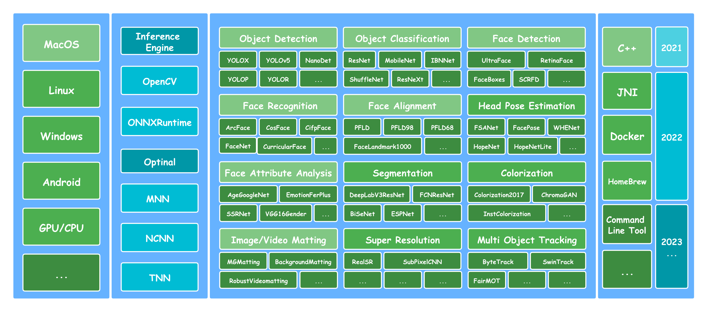
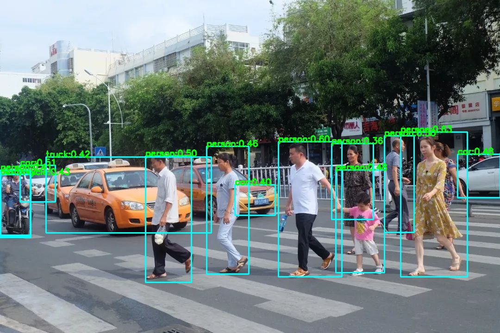
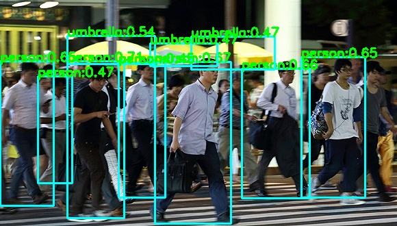
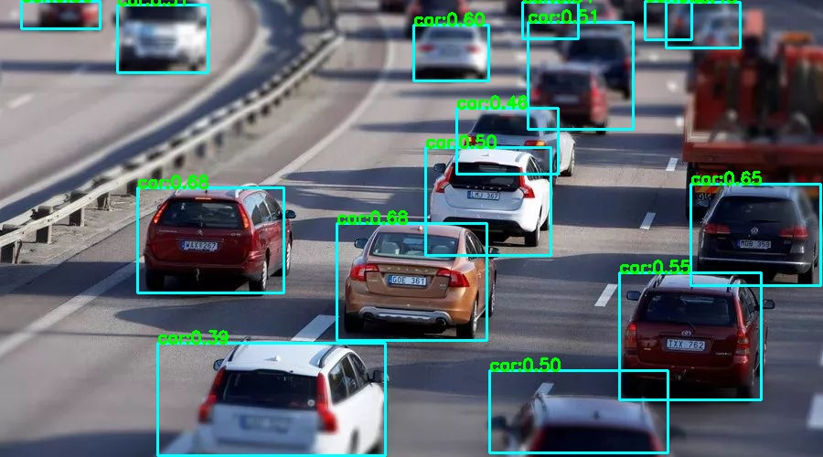
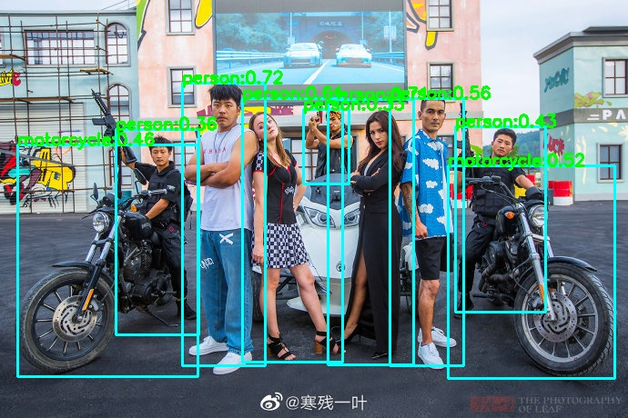
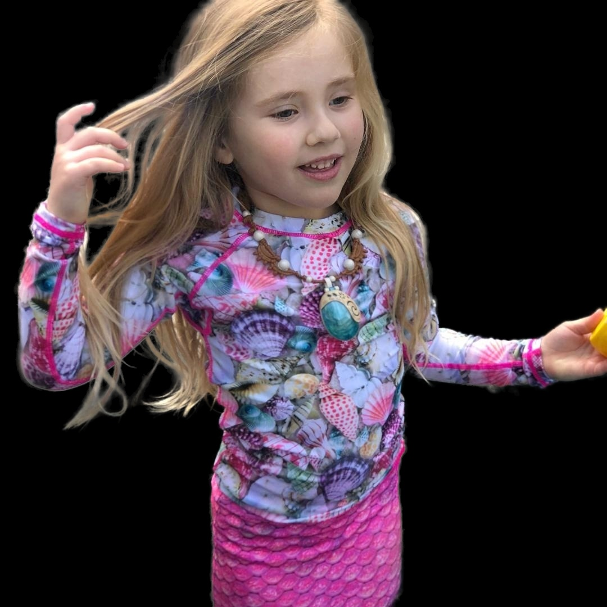
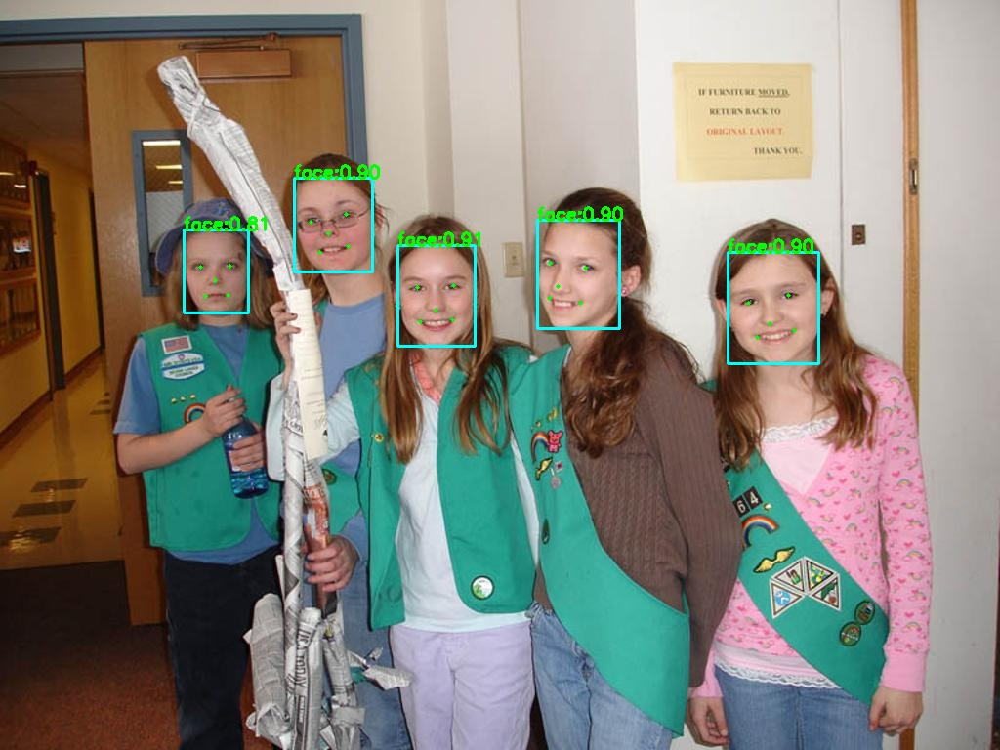
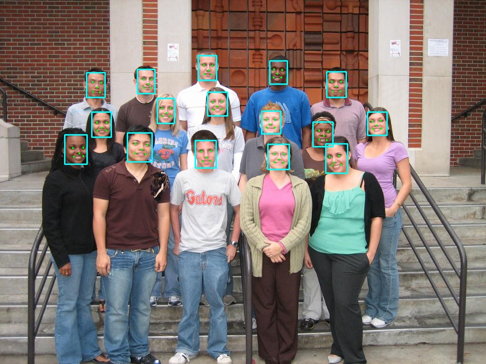

##  <p align="center"> 🍅🍅Lite.AI.ToolKit: A lite C++ toolkit of awesome AI models. </p>

<div id="lite.ai.toolkit-Introduction"></div>  

<div align='center'>
  
  
  
  
  
  
  
   
  <br>
  
  
  
    
  
  
  
  

</div>    

<p align="center">English | <a href="README.zh.md">中文文档</a> | <a href=#lite.ai.toolkit-Build-MacOS>MacOS</a> | <a href=#lite.ai.toolkit-Build-Linux>Linux</a> | <a href=#lite.ai.toolkit-Build-Windows>Windows</a> </p>

<div align='center'>
  
  
  
  
  
  
  
</div>   


<!-----
<div align='center'> 
  
  
  
  
<br>
  
  
   
</div>    


🍅🍅*Lite.AI.ToolKit*: A lite `C++` toolkit of awesome AI models which contains *[70+](https://github.com/DefTruth/lite.ai.toolkit/tree/main/docs/hub/lite.ai.toolkit.hub.onnx.md)* models now. It's a collection of personal interests. Such as RVM, YOLOX, YOLOP, YOLOR, YoloV5, DeepLabV3, ArcFace, etc. emmm😞 ... it's not perfect yet. For now, let's regard it as a large collection of application cases for inference engines. *Lite.AI.ToolKit* based on *[ONNXRuntime C++](https://github.com/microsoft/onnxruntime)* by default. I do have plans to reimplement it with *[NCNN](https://github.com/Tencent/ncnn)*, *[MNN](https://github.com/alibaba/MNN)* and *[TNN](https://github.com/Tencent/TNN)*, some models are already supported. 

----->

🍅🍅*Lite.AI.ToolKit*: A lite C++ toolkit of awesome AI models, such as [Object Detection](#lite.ai.toolkit-object-detection), [Face Detection](#lite.ai.toolkit-face-detection), [Face Recognition](#lite.ai.toolkit-face-recognition), [Segmentation](#lite.ai.toolkit-segmentation), [Matting](#lite.ai.toolkit-matting), etc. See [Model Zoo](#lite.ai.toolkit-Model-Zoo) and [ONNX Hub](https://github.com/DefTruth/lite.ai.toolkit/tree/main/docs/hub/lite.ai.toolkit.hub.onnx.md), [MNN Hub](https://github.com/DefTruth/lite.ai.toolkit/tree/main/docs/hub/lite.ai.toolkit.hub.mnn.md), [TNN Hub](https://github.com/DefTruth/lite.ai.toolkit/tree/main/docs/hub/lite.ai.toolkit.hub.tnn.md), [NCNN Hub](https://github.com/DefTruth/lite.ai.toolkit/tree/main/docs/hub/lite.ai.toolkit.hub.ncnn.md). [❤️ Star 🌟👆🏻 this repo if it does any helps to you, thanks ~ ]

## Core Features and RoadMap👏👋



* *Simply and User friendly.* Simply and Consistent syntax like *lite::cv::Type::Class*, see [examples](#lite.ai.toolkit-Examples-for-Lite.AI.ToolKit).
* *Minimum Dependencies.* Only *OpenCV* and *ONNXRuntime* are required by default, see [build](#lite.ai.toolkit-Build-Lite.AI.ToolKit).
* *Lots of Algorithm Modules.* Contains 10+ modules with *[70+](https://github.com/DefTruth/lite.ai.toolkit/tree/main/docs/hub/lite.ai.toolkit.hub.onnx.md)* AI models and *[500+](https://github.com/DefTruth/lite.ai.toolkit/tree/main/docs/hub/lite.ai.toolkit.hub.onnx.md)* weights now.


## Important Updates!!

|Date|Model|C++|Paper|Code|Awesome|Type|
|:----:|:----:|:----:|:----:|:----:|:----:|:----:| 
|【2022/01/07】|[SCRFD](https://github.com/deepinsight/insightface/blob/master/detection/scrfd/)|[[link](https://github.com/DefTruth/lite.ai.toolkit/blob/main/examples/lite/cv/test_lite_scrfd.cpp)]|[[CVPR 2021](https://arxiv.org/abs/2105.04714)]|[[code](https://github.com/deepinsight/insightface/blob/master/detection/scrfd/)]|| face::detect |
|【2021/12/27】|[NanoDetPlus](https://github.com/RangiLyu/nanodet)|[[link](https://github.com/DefTruth/lite.ai.toolkit/blob/main/examples/lite/cv/test_lite_nanodet_plus.cpp)]|[[blog](https://zhuanlan.zhihu.com/p/449912627)]|[[code](https://github.com/RangiLyu/nanodet)]|| detection |
|【2021/12/08】|[MGMatting](https://github.com/yucornetto/MGMatting)|[[link](https://github.com/DefTruth/lite.ai.toolkit/blob/main/examples/lite/cv/test_lite_mg_matting.cpp)]|[[CVPR 2021](https://arxiv.org/abs/2012.06722)]|[[code](https://github.com/yucornetto/MGMatting)]|| matting |
|【2021/11/11】|[YoloV5_V_6_0](https://github.com/ultralytics/yolov5/releases/tag/v6.0)|[[link](https://github.com/DefTruth/lite.ai.toolkit/blob/main/examples/lite/cv/test_lite_yolov5_v6.0.cpp)]|[[doi](https://zenodo.org/record/5563715#.YbXffH1Bzfs)]|[[code](https://github.com/ultralytics/yolov5/releases/tag/v6.0)]|| detection |
|【2021/10/26】|[YoloX_V_0_1_1](https://github.com/Megvii-BaseDetection/YOLOX/releases/tag/0.1.1rc0)|[[link](https://github.com/DefTruth/lite.ai.toolkit/blob/main/examples/lite/cv/test_lite_yolox_v0.1.1.cpp)]|[[arXiv 2021](https://arxiv.org/abs/2107.08430)]|[[code](https://github.com/Megvii-BaseDetection/YOLOX)]|| detection |
|【2021/10/02】|[NanoDet](https://github.com/RangiLyu/nanodet)|[[link](https://github.com/DefTruth/lite.ai.toolkit/blob/main/examples/lite/cv/test_lite_nanodet.cpp)]|[[blog](https://zhuanlan.zhihu.com/p/306530300)]|[[code](https://github.com/RangiLyu/nanodet)]|| detection |
|【2021/09/20】|[RobustVideoMatting](https://github.com/PeterL1n/RobustVideoMatting)|[[link](https://github.com/DefTruth/lite.ai.toolkit/blob/main/examples/lite/cv/test_lite_rvm.cpp)]|[[WACV 2022](https://arxiv.org/abs/2108.11515)]|[[code](https://github.com/PeterL1n/RobustVideoMatting)]|| matting |
|【2021/09/02】|[YOLOP](https://github.com/hustvl/YOLOP)|[[link](https://github.com/DefTruth/lite.ai.toolkit/blob/main/examples/lite/cv/test_lite_yolop.cpp)]|[[arXiv 2021](https://arxiv.org/abs/2108.11250)]|[[code](https://github.com/hustvl/YOLOP)]|| detection |

<!-----

<div align='left'>
  
<br>
  
  
  
  
<br>
  
  
  
  
</div>  

<div align='left'>
  
</div>  

----->


## Supported Models Matrix

* / = not supported now.
* ✅ = known work and official supported now.
* ✔️ = known work, but unofficial supported now.
* ❔ = in my plan, but not coming soon, maybe a few months later.

|Class|Size|Type|Demo|ONNXRuntime|MNN|NCNN|TNN|MacOS|Linux|Windows|Android|
|:---:|:---:|:---:|:---:|:---:|:---:|:---:|:---:|:---:|:---:|:---:|:---:|
|[YoloV5](https://github.com/ultralytics/yolov5)|28M|*detection*|[demo](https://github.com/DefTruth/lite.ai.toolkit/blob/main/examples/lite/cv/test_lite_yolov5.cpp)|✅| ✅ | ✅ | ✅ | ✅ |✔️|✔️|❔|
|[YoloV3](https://github.com/onnx/models/blob/master/vision/object_detection_segmentation/yolov3)|236M|*detection*|[demo](https://github.com/DefTruth/lite.ai.toolkit/blob/main/examples/lite/cv/test_lite_yolov3.cpp)|✅| / | / | / | ✅ |✔️|✔️|/|
|[TinyYoloV3](https://github.com/onnx/models/blob/master/vision/object_detection_segmentation/tiny-yolov3)|33M|  *detection*     | [demo](https://github.com/DefTruth/lite.ai.toolkit/blob/main/examples/lite/cv/test_lite_tiny_yolov3.cpp) | ✅ | / | / | / | ✅ |✔️|✔️|/|
|[YoloV4](https://github.com/argusswift/YOLOv4-pytorch)|176M| *detection* | [demo](https://github.com/DefTruth/lite.ai.toolkit/blob/main/examples/lite/cv/test_lite_yolov4.cpp) | ✅ | / | / | / | ✅ |✔️|✔️|/|
|[SSD](https://github.com/onnx/models/blob/master/vision/object_detection_segmentation/ssd)|76M|        *detection*         | [demo](https://github.com/DefTruth/lite.ai.toolkit/blob/main/examples/lite/cv/test_lite_ssd.cpp) | ✅| / | / | / | ✅ |✔️|✔️|/|
|[SSDMobileNetV1](https://github.com/onnx/models/blob/master/vision/object_detection_segmentation/ssd-mobilenetv1)|27M|        *detection*         | [demo](https://github.com/DefTruth/lite.ai.toolkit/blob/main/examples/lite/cv/test_lite_ssd_mobilenetv1.cpp) | ✅ | / | / | / | ✅ |✔️|✔️|/|
|[YoloX](https://github.com/Megvii-BaseDetection/YOLOX)|3.5M|*detection* |[demo](https://github.com/DefTruth/lite.ai.toolkit/blob/main/examples/lite/cv/test_lite_yolox.cpp) | ✅ | ✅ | ✅ | ✅ | ✅ |✔️|✔️|❔|
|[TinyYoloV4VOC](https://github.com/bubbliiiing/yolov4-tiny-pytorch)|22M|*detection* |[demo](https://github.com/DefTruth/lite.ai.toolkit/blob/main/examples/lite/cv/test_lite_tiny_yolov4_voc.cpp) | ✅ | / | / | / | ✅ |✔️|✔️|/|
|[TinyYoloV4COCO](https://github.com/bubbliiiing/yolov4-tiny-pytorch)|22M| *detection* | [demo](https://github.com/DefTruth/lite.ai.toolkit/blob/main/examples/lite/cv/test_lite_tiny_yolov4_coco.cpp) | ✅| / | / | / | ✅ |✔️|✔️|/|
|[YoloR](https://github.com/WongKinYiu/yolor)|39M| *detection* | [demo](https://github.com/DefTruth/lite.ai.toolkit/blob/main/examples/lite/cv/test_lite_yolor.cpp) | ✅ | ✅ | ✅ | ✅ | ✅ |✔️|✔️|❔|
|[ScaledYoloV4](https://github.com/WongKinYiu/ScaledYOLOv4)|270M| *detection* | [demo](https://github.com/DefTruth/lite.ai.toolkit/blob/main/examples/lite/cv/test_lite_scaled_yolov4.cpp) | ✅ | / | / | / | ✅ |✔️|✔️|/|
|[EfficientDet](https://github.com/zylo117/Yet-Another-EfficientDet-Pytorch)|15M| *detection* | [demo](https://github.com/DefTruth/lite.ai.toolkit/blob/main/examples/lite/cv/test_lite_efficientdet.cpp) | ✅ | / | / | / | ✅ |✔️|✔️|/|
|[EfficientDetD7](https://github.com/zylo117/Yet-Another-EfficientDet-Pytorch)|220M| *detection* | [demo](https://github.com/DefTruth/lite.ai.toolkit/blob/main/examples/lite/cv/test_lite_efficientdet_d7.cpp) | ✅ | / | / | / | ✅ |✔️|✔️|/|
|[EfficientDetD8](https://github.com/zylo117/Yet-Another-EfficientDet-Pytorch)|322M| *detection* | [demo](https://github.com/DefTruth/lite.ai.toolkit/blob/main/examples/lite/cv/test_lite_efficientdet_d8.cpp) | ✅ | / | / | / | ✅ |✔️|✔️|/|
|[YOLOP](https://github.com/hustvl/YOLOP)|30M| *detection* | [demo](https://github.com/DefTruth/lite.ai.toolkit/blob/main/examples/lite/cv/test_lite_yolop.cpp) | ✅ | ✅ | ✅ | ✅ | ✅ |✔️|✔️|❔|
|[NanoDet](https://github.com/RangiLyu/nanodet)|1.1M| *detection* | [demo](https://github.com/DefTruth/lite.ai.toolkit/blob/main/examples/lite/cv/test_lite_nanodet.cpp) | ✅ | ✅ | ✅ | ✅ | ✅ |✔️|✔️|❔|
|[NanoDetPlus](https://github.com/RangiLyu/nanodet)|4.5M| *detection* | [demo](https://github.com/DefTruth/lite.ai.toolkit/blob/main/examples/lite/cv/test_lite_nanodet_plus.cpp) | ✅ | ✅ | ✅ | ✅ | ✅ |✔️|✔️|❔|
|[NanoDetEffi...](https://github.com/RangiLyu/nanodet)|12M| *detection* | [demo](https://github.com/DefTruth/lite.ai.toolkit/blob/main/examples/lite/cv/test_lite_nanodet_efficientnet_lite.cpp) | ✅ | ✅ | ✅ | ✅ | ✅ |✔️|✔️|❔|
|[YoloX_V_0_1_1](https://github.com/Megvii-BaseDetection/YOLOX)|3.5M| *detection* | [demo](https://github.com/DefTruth/lite.ai.toolkit/blob/main/examples/lite/cv/test_lite_yolox_v0.1.1.cpp) | ✅ | ✅ | ✅ | ✅ | ✅ |✔️|✔️|❔|
|[YoloV5_V_6_0](https://github.com/ultralytics/yolov5)|7.5M|*detection*|[demo](https://github.com/DefTruth/lite.ai.toolkit/blob/main/examples/lite/cv/test_lite_yolov5_v6.0.cpp)|✅| ✅ | ✅ | ✅ | ✅ |✔️|✔️|❔|
| [GlintArcFace](https://github.com/deepinsight/insightface/tree/master/recognition/arcface_torch) |92M|*faceid*|[demo](https://github.com/DefTruth/lite.ai.toolkit/blob/main/examples/lite/cv/test_lite_glint_arcface.cpp)|✅| ✅ | ✅ | ✅ | ✅ |✔️|✔️|❔|
|[GlintCosFace](https://github.com/deepinsight/insightface/tree/master/recognition/arcface_torch)|92M|*faceid*|[demo](https://github.com/DefTruth/lite.ai.toolkit/blob/main/examples/lite/cv/test_lite_glint_cosface.cpp)|✅| ✅ | ✅ | ✅ | ✅ |✔️|✔️|/|
|[GlintPartialFC](https://github.com/deepinsight/insightface/tree/master/recognition/partial_fc)|170M|*faceid*|[demo](https://github.com/DefTruth/lite.ai.toolkit/blob/main/examples/lite/cv/test_lite_glint_partial_fc.cpp)|✅| ✅ | ✅ | ✅ | ✅ |✔️|✔️|/|
|[FaceNet](https://github.com/timesler/facenet-pytorch)|89M|*faceid*|[demo](https://github.com/DefTruth/lite.ai.toolkit/blob/main/examples/lite/cv/test_lite_facenet.cpp)|✅| ✅ | ✅ | ✅ | ✅ |✔️|✔️|/|
|[FocalArcFace](https://github.com/ZhaoJ9014/face.evoLVe.PyTorch)|166M|*faceid*|[demo](https://github.com/DefTruth/lite.ai.toolkit/blob/main/examples/lite/cv/test_lite_focal_arcface.cpp)|✅| ✅ | ✅ | ✅ | ✅ |✔️|✔️|/|
|[FocalAsiaArcFace](https://github.com/ZhaoJ9014/face.evoLVe.PyTorch)|166M|*faceid*|[demo](https://github.com/DefTruth/lite.ai.toolkit/blob/main/examples/lite/cv/test_lite_focal_asia_arcface.cpp)|✅| ✅ | ✅ | ✅ | ✅ |✔️|✔️|/|
|[TencentCurricularFace](https://github.com/Tencent/TFace/tree/master/tasks/distfc)|249M|*faceid*|[demo](https://github.com/DefTruth/lite.ai.toolkit/blob/main/examples/lite/cv/test_lite_tencent_curricular_face.cpp)|✅| ✅ | ✅ | ✅ | ✅ |✔️|✔️|/|
|[TencentCifpFace](https://github.com/Tencent/TFace/tree/master/tasks/cifp)|130M|*faceid*|[demo](https://github.com/DefTruth/lite.ai.toolkit/blob/main/examples/lite/cv/test_lite_tencent_cifp_face.cpp)|✅| ✅ | ✅ | ✅ | ✅ |✔️|✔️|/|
|[CenterLossFace](https://github.com/louis-she/center-loss.pytorch)|280M|*faceid*|[demo](https://github.com/DefTruth/lite.ai.toolkit/blob/main/examples/lite/cv/test_lite_center_loss_face.cpp)|✅| ✅ | ✅ | ✅ | ✅ |✔️|✔️|/|
|[SphereFace](https://github.com/clcarwin/sphereface_pytorch)|80M|*faceid*|[demo](https://github.com/DefTruth/lite.ai.toolkit/blob/main/examples/lite/cv/test_lite_sphere_face.cpp)|✅| ✅ | ✅ | ✅ | ✅ |✔️|✔️|/|
|[PoseRobustFace](https://github.com/penincillin/DREAM)|92M|*faceid*|[demo](https://github.com/DefTruth/lite.ai.toolkit/blob/main/examples/lite/cv/test_lite_pose_robust_face.cpp)|✅| / | / | / | ✅ |✔️|✔️|/|
|[NaivePoseRobustFace](https://github.com/penincillin/DREAM)|43M|*faceid*|[demo](https://github.com/DefTruth/lite.ai.toolkit/blob/main/examples/lite/cv/test_lite_naive_pose_robust_face.cpp)|✅| / | / | / | ✅ |✔️|✔️|/|
|[MobileFaceNet](https://github.com/Xiaoccer/MobileFaceNet_Pytorch)|3.8M|*faceid*|[demo](https://github.com/DefTruth/lite.ai.toolkit/blob/main/examples/lite/cv/test_lite_mobile_facenet.cpp)|✅| ✅ | ✅ | ✅ | ✅ |✔️|✔️|❔|
|[CavaGhostArcFace](https://github.com/cavalleria/cavaface.pytorch)|15M|*faceid*|[demo](https://github.com/DefTruth/lite.ai.toolkit/blob/main/examples/lite/cv/test_lite_cava_ghost_arcface.cpp)|✅| ✅ | ✅ | ✅ | ✅ |✔️|✔️|❔|
|[CavaCombinedFace](https://github.com/cavalleria/cavaface.pytorch)|250M|*faceid*|[demo](https://github.com/DefTruth/lite.ai.toolkit/blob/main/examples/lite/cv/test_lite_cava_combined_face.cpp)|✅| ✅ | ✅ | ✅ | ✅ |✔️|✔️|/|
|[MobileSEFocalFace](https://github.com/grib0ed0v/face_recognition.pytorch)|4.5M|*faceid*|[demo](https://github.com/DefTruth/lite.ai.toolkit/blob/main/examples/lite/cv/test_lite_mobilese_focal_face.cpp)|✅| ✅ | ✅ | ✅ | ✅ |✔️|✔️|❔|
|[RobustVideoMatting](https://github.com/PeterL1n/RobustVideoMatting)|14M|*matting*|[demo](https://github.com/DefTruth/lite.ai.toolkit/blob/main/examples/lite/cv/test_lite_rvm.cpp)|✅| ✅ | / | ✅ | ✅ |✔️|✔️|❔|
|[MGMatting](https://github.com/yucornetto/MGMatting)|113M|*matting*|[demo](https://github.com/DefTruth/lite.ai.toolkit/blob/main/examples/lite/cv/test_lite_mg_matting.cpp)|✅| ✅ | / | ✅ | ✅ |✔️|✔️|/|
|[UltraFace](https://github.com/Linzaer/Ultra-Light-Fast-Generic-Face-Detector-1MB)|1.1M|*face::detect*|[demo](https://github.com/DefTruth/lite.ai.toolkit/blob/main/examples/lite/cv/test_lite_ultraface.cpp)|✅| ✅ | ✅ | ✅ | ✅ |✔️|✔️|❔|
|[RetinaFace](https://github.com/biubug6/Pytorch_Retinaface)|1.6M|*face::detect*|[demo](https://github.com/DefTruth/lite.ai.toolkit/blob/main/examples/lite/cv/test_lite_retinaface.cpp)|✅| ✅ | ✅ | ✅ | ✅ |✔️|✔️|❔|
|[FaceBoxes](https://github.com/zisianw/FaceBoxes.PyTorch)|3.8M|*face::detect*|[demo](https://github.com/DefTruth/lite.ai.toolkit/blob/main/examples/lite/cv/test_lite_faceboxes.cpp)|✅| ✅ | ✅ | ✅ | ✅ |✔️|✔️|❔|
|[SCRFD](https://github.com/deepinsight/insightface/blob/master/detection/scrfd/)|2.5M|*face::detect*|[demo](https://github.com/DefTruth/lite.ai.toolkit/blob/main/examples/lite/cv/test_lite_scrfd.cpp)|✅| ✅ | ✅ | ✅ | ✅ |✔️|✔️|❔|  
|[PFLD](https://github.com/Hsintao/pfld_106_face_landmarks)|1.0M|*face::align*|[demo](https://github.com/DefTruth/lite.ai.toolkit/blob/main/examples/lite/cv/test_lite_pfld.cpp)|✅| ✅ | ✅ | ✅ | ✅ |✔️|✔️|❔|
|[PFLD98](https://github.com/polarisZhao/PFLD-pytorch)|4.8M|*face::align*|[demo](https://github.com/DefTruth/lite.ai.toolkit/blob/main/examples/lite/cv/test_lite_pfld98.cpp)|✅| ✅ | ✅ | ✅ | ✅ |✔️|✔️|❔|
|[MobileNetV268](https://github.com/cunjian/pytorch_face_landmark)|9.4M|*face::align*|[demo](https://github.com/DefTruth/lite.ai.toolkit/blob/main/examples/lite/cv/test_lite_mobilenetv2_68.cpp)|✅| ✅ | ✅ | ✅ | ✅ |✔️|✔️|❔|
|[MobileNetV2SE68](https://github.com/cunjian/pytorch_face_landmark)|11M|*face::align*|[demo](https://github.com/DefTruth/lite.ai.toolkit/blob/main/examples/lite/cv/test_lite_mobilenetv2_se_68.cpp)|✅| ✅ | ✅ | ✅ | ✅ |✔️|✔️|❔|
|[PFLD68](https://github.com/cunjian/pytorch_face_landmark)|2.8M|*face::align*|[demo](https://github.com/DefTruth/lite.ai.toolkit/blob/main/examples/lite/cv/test_lite_pfld68.cpp)|✅| ✅ | ✅ | ✅ | ✅ |✔️|✔️|❔|
|[FaceLandmark1000](https://github.com/Single430/FaceLandmark1000)|2.0M|*face::align*|[demo](https://github.com/DefTruth/lite.ai.toolkit/blob/main/examples/lite/cv/test_lite_face_landmarks_1000.cpp)|✅| ✅ | ✅ | ✅ | ✅ |✔️|✔️|❔|
|[FSANet](https://github.com/omasaht/headpose-fsanet-pytorch)|1.2M|*face::pose*|[demo](https://github.com/DefTruth/lite.ai.toolkit/blob/main/examples/lite/cv/test_lite_fsanet.cpp)|✅| ✅ | / | ✅ | ✅ |✔️|✔️|❔|
|[AgeGoogleNet](https://github.com/onnx/models/tree/master/vision/body_analysis/age_gender)|23M|*face::attr*|[demo](https://github.com/DefTruth/lite.ai.toolkit/blob/main/examples/lite/cv/test_lite_age_googlenet.cpp)|✅| ✅ | ✅ | ✅ | ✅ |✔️|✔️|❔|
|[GenderGoogleNet](https://github.com/onnx/models/tree/master/vision/body_analysis/age_gender)|23M|*face::attr*|[demo](https://github.com/DefTruth/lite.ai.toolkit/blob/main/examples/lite/cv/test_lite_gender_googlenet.cpp)|✅| ✅ | ✅ | ✅ | ✅ |✔️|✔️|❔|
|[EmotionFerPlus](https://github.com/onnx/models/blob/master/vision/body_analysis/emotion_ferplus)|33M|*face::attr*|[demo](https://github.com/DefTruth/lite.ai.toolkit/blob/main/examples/lite/cv/test_lite_emotion_ferplus.cpp)|✅| ✅ | ✅ | ✅ | ✅ |✔️|✔️|❔|
|[VGG16Age](https://github.com/onnx/models/tree/master/vision/body_analysis/age_gender)|514M|*face::attr*|[demo](https://github.com/DefTruth/lite.ai.toolkit/blob/main/examples/lite/cv/test_lite_vgg16_age.cpp)|✅| ✅ | ✅ | ✅ | ✅ |✔️|✔️|/|
|[VGG16Gender](https://github.com/onnx/models/tree/master/vision/body_analysis/age_gender)|512M|*face::attr*|[demo](https://github.com/DefTruth/lite.ai.toolkit/blob/main/examples/lite/cv/test_lite_vgg16_gender.cpp)|✅| ✅ | ✅ | ✅ | ✅ |✔️|✔️|/|
|[SSRNet](https://github.com/oukohou/SSR_Net_Pytorch)|190K|*face::attr*|[demo](https://github.com/DefTruth/lite.ai.toolkit/blob/main/examples/lite/cv/test_lite_ssrnet.cpp)|✅| ✅ | / | ✅ | ✅ |✔️|✔️|❔|
|[EfficientEmotion7](https://github.com/HSE-asavchenko/face-emotion-recognition)|15M|*face::attr*|[demo](https://github.com/DefTruth/lite.ai.toolkit/blob/main/examples/lite/cv/test_lite_efficient_emotion7.cpp)|✅| ✅ | ✅ | ✅ | ✅ |✔️|✔️|❔|
|[EfficientEmotion8](https://github.com/HSE-asavchenko/face-emotion-recognition)|15M|*face::attr*|[demo](https://github.com/DefTruth/lite.ai.toolkit/blob/main/examples/lite/cv/test_lite_efficient_emotion8.cpp)|✅| ✅ | ✅ | ✅ | ✅ |✔️|✔️|❔|
|[MobileEmotion7](https://github.com/HSE-asavchenko/face-emotion-recognition)|13M|*face::attr*|[demo](https://github.com/DefTruth/lite.ai.toolkit/blob/main/examples/lite/cv/test_lite_mobile_emotion7.cpp)|✅| ✅ | ✅ | ✅ | ✅ |✔️|✔️|❔|
|[ReXNetEmotion7](https://github.com/HSE-asavchenko/face-emotion-recognition)|30M|*face::attr*|[demo](https://github.com/DefTruth/lite.ai.toolkit/blob/main/examples/lite/cv/test_lite_rexnet_emotion7.cpp)|✅| ✅ | / | ✅ | ✅ |✔️|✔️|/|
|[EfficientNetLite4](https://github.com/onnx/models/blob/master/vision/classification/efficientnet-lite4)|49M|*classification*|[demo](https://github.com/DefTruth/lite.ai.toolkit/blob/main/examples/lite/cv/test_lite_efficientnet_lite4.cpp)|✅| ✅ | / | ✅ | ✅ |✔️|✔️|/|
|[ShuffleNetV2](https://github.com/onnx/models/blob/master/vision/classification/shufflenet)|8.7M|*classification*|[demo](https://github.com/DefTruth/lite.ai.toolkit/blob/main/examples/lite/cv/test_lite_shufflenetv2.cpp)|✅| ✅ | ✅ | ✅ | ✅ |✔️|✔️|❔|
|[DenseNet121](https://pytorch.org/hub/pytorch_vision_densenet/)|30.7M|*classification*|[demo](https://github.com/DefTruth/lite.ai.toolkit/blob/main/examples/lite/cv/test_lite_densenet.cpp)|✅| ✅ | ✅ | ✅ | ✅ |✔️|✔️|/|
|[GhostNet](https://pytorch.org/hub/pytorch_vision_ghostnet/)|20M|*classification*|[demo](https://github.com/DefTruth/lite.ai.toolkit/blob/main/examples/lite/cv/test_lite_ghostnet.cpp)|✅| ✅ | ✅ | ✅ | ✅ |✔️|✔️|❔|
|[HdrDNet](https://pytorch.org/hub/pytorch_vision_hardnet//)|13M|*classification*|[demo](https://github.com/DefTruth/lite.ai.toolkit/blob/main/examples/lite/cv/test_lite_hardnet.cpp)|✅| ✅ | ✅ | ✅ | ✅ |✔️|✔️|❔|
|[IBNNet](https://pytorch.org/hub/pytorch_vision_ibnnet/)|97M|*classification*|[demo](https://github.com/DefTruth/lite.ai.toolkit/blob/main/examples/lite/cv/test_lite_ibnnet.cpp)|✅| ✅ | ✅ | ✅ | ✅ |✔️|✔️|/|
|[MobileNetV2](https://pytorch.org/hub/pytorch_vision_mobilenet_v2/)|13M|*classification*|[demo](https://github.com/DefTruth/lite.ai.toolkit/blob/main/examples/lite/cv/test_lite_mobilenetv2.cpp)|✅| ✅ | ✅ | ✅ | ✅ |✔️|✔️|❔|
|[ResNet](https://pytorch.org/hub/pytorch_vision_resnet/)|44M|*classification*|[demo](https://github.com/DefTruth/lite.ai.toolkit/blob/main/examples/lite/cv/test_lite_resnet.cpp)|✅| ✅ | ✅ | ✅ | ✅ |✔️|✔️|/|
|[ResNeXt](https://pytorch.org/hub/pytorch_vision_resnext/)|95M|*classification*|[demo](https://github.com/DefTruth/lite.ai.toolkit/blob/main/examples/lite/cv/test_lite_resnext.cpp)|✅| ✅ | ✅ | ✅ | ✅ |✔️|✔️|/|
|[DeepLabV3ResNet101](https://pytorch.org/hub/pytorch_vision_deeplabv3_resnet101/)|232M|*segmentation*|[demo](https://github.com/DefTruth/lite.ai.toolkit/blob/main/examples/lite/cv/test_lite_deeplabv3_resnet101.cpp)|✅| ✅ | ✅ | ✅ | ✅ |✔️|✔️|/|
|[FCNResNet101](https://pytorch.org/hub/pytorch_vision_fcn_resnet101/)|207M|*segmentation*|[demo](https://github.com/DefTruth/lite.ai.toolkit/blob/main/examples/lite/cv/test_lite_fcn_resnet101.cpp)|✅| ✅ | ✅ | ✅ | ✅ |✔️|✔️|/|
|[FastStyleTransfer](https://github.com/onnx/models/blob/master/vision/style_transfer/fast_neural_style)|6.4M|*style*|[demo](https://github.com/DefTruth/lite.ai.toolkit/blob/main/examples/lite/cv/test_lite_fast_style_transfer.cpp)|✅| ✅ | ✅ | ✅ | ✅ |✔️|✔️|❔|
|[Colorizer](https://github.com/richzhang/colorization)|123M|*colorization*|[demo](https://github.com/DefTruth/lite.ai.toolkit/blob/main/examples/lite/cv/test_lite_colorizer.cpp)|✅| ✅ | / | ✅ | ✅ |✔️|✔️|/|
|[SubPixelCNN](https://github.com/niazwazir/SUB_PIXEL_CNN)|234K|*resolution*|[demo](https://github.com/DefTruth/lite.ai.toolkit/blob/main/examples/lite/cv/test_lite_subpixel_cnn.cpp)|✅| ✅ | / | ✅ | ✅ |✔️|✔️|❔|


## Contents.
* [Build](#lite.ai.toolkit-Build-Lite.AI.ToolKit)
* [Model Zoo](#lite.ai.toolkit-Model-Zoo)
* [Examples](#lite.ai.toolkit-Examples-for-Lite.AI.ToolKit)
* [License](#lite.ai.toolkit-License)
* [References](#lite.ai.toolkit-References)


## 1. Build.
<div id="lite.ai.toolkit-Build-MacOS"></div>
<div id="lite.ai.toolkit-Build-Lite.AI.ToolKit"></div>

* MacOS: Build the shared lib of *Lite.AI.ToolKit* for *MacOS* from sources. Note that Lite.AI.ToolKit uses `onnxruntime` as default backend, for the reason that onnxruntime supports the most of onnx's operators. 

```shell
    git clone --depth=1 https://github.com/DefTruth/lite.ai.toolkit.git  # latest
    cd lite.ai.toolkit && sh ./build.sh  # On MacOS, you can use the built OpenCV, ONNXRuntime, MNN, NCNN and TNN libs in this repo.
```

<div id="lite.ai.toolkit-Build-Linux"></div>
<div id="lite.ai.toolkit-Build-Windows"></div>

<details>
<summary>💡 Linux and Windows. </summary>  

### Linux and Windows.

⚠️ *Lite.AI.ToolKit* is not directly support Linux and Windows now. For Linux and Windows, you need to build or download(if have official builts) the shared libs of *OpenCV*、*ONNXRuntime* and any other Engines(like MNN, NCNN, TNN) firstly, then put the headers into the specific directories or just let these directories unchange(use the headers offer by this repo, the header file of the dependent library of this project is directly copied from the corresponding official library). However, the dynamic libraries under different operating systems need to be recompiled or downloaded. MacOS users can directly use the dynamic libraries of each dependent library provided by this project:
* *lite.ai.toolkit/opencv2*
  ```shell
    cp -r you-path-to-downloaded-or-built-opencv/include/opencv4/opencv2 lite.ai.toolkit/opencv2
  ```
* *lite.ai.toolkit/onnxruntime*
  ```shell
    cp -r you-path-to-downloaded-or-built-onnxruntime/include/onnxruntime lite.ai.toolkit/onnxruntime
  ```
* *lite.ai.toolkit/MNN*
  ```shell
    cp -r you-path-to-downloaded-or-built-MNN/include/MNN lite.ai.toolkit/MNN
  ```
* *lite.ai.toolkit/ncnn*
  ```shell
    cp -r you-path-to-downloaded-or-built-ncnn/include/ncnn lite.ai.toolkit/ncnn
  ```
* *lite.ai.toolkit/tnn*
  ```shell
    cp -r you-path-to-downloaded-or-built-TNN/include/tnn lite.ai.toolkit/tnn
  ```

and put the libs into *lite.ai.toolkit/lib* directory. Please reference the build-docs[<sup>1</sup>](#lite.ai.toolkit-1) for *third_party*.
* *lite.ai.toolkit/lib*
  ```shell
    cp you-path-to-downloaded-or-built-opencv/lib/*opencv* lite.ai.toolkit/lib
    cp you-path-to-downloaded-or-built-onnxruntime/lib/*onnxruntime* lite.ai.toolkit/lib
    cp you-path-to-downloaded-or-built-MNN/lib/*MNN* lite.ai.toolkit/lib
    cp you-path-to-downloaded-or-built-ncnn/lib/*ncnn* lite.ai.toolkit/lib
    cp you-path-to-downloaded-or-built-TNN/lib/*TNN* lite.ai.toolkit/lib
  ```


* Windows: You can reference to [issue#6](https://github.com/DefTruth/lite.ai.toolkit/issues/6)
* Linux: The Docs and Docker image for Linux will be coming soon ~ [issue#2](https://github.com/DefTruth/lite.ai.toolkit/issues/2)
* Happy News !!! : 🚀 You can download the latest *ONNXRuntime* official built libs of Windows, Linux, MacOS and Arm !!! Both CPU and GPU versions are available. No more attentions needed pay to build it from source. Download the official built libs from [v1.8.1](https://github.com/microsoft/onnxruntime/releases). I have used version 1.7.0 for Lite.AI.ToolKit now, you can downlod it from [v1.7.0](https://github.com/microsoft/onnxruntime/releases/tag/v1.7.0), but version 1.8.1 should also work, I guess ~  🙃🤪🍀. For *OpenCV*, try to build from source(Linux) or down load the official built(Windows) from [OpenCV 4.5.3](https://github.com/opencv/opencv/releases). Then put the includes and libs into specific directory of Lite.AI.ToolKit.

* GPU Compatibility for Windows: See [issue#10](https://github.com/DefTruth/lite.ai.toolkit/issues/10).
* GPU Compatibility for Linux: See [issue#97](https://github.com/DefTruth/lite.ai.toolkit/issues/97).

</details>  


<details>
<summary>🔑️ How to link Lite.AI.ToolKit?</summary>  
* To link Lite.AI.ToolKit, you can follow the CMakeLists.txt listed belows.

```cmake
cmake_minimum_required(VERSION 3.17)
project(lite.ai.toolkit.demo)

set(CMAKE_CXX_STANDARD 11)

# setting up lite.ai.toolkit
set(LITE_AI_DIR ${CMAKE_SOURCE_DIR}/lite.ai.toolkit)
set(LITE_AI_INCLUDE_DIR ${LITE_AI_DIR}/include)
set(LITE_AI_LIBRARY_DIR ${LITE_AI_DIR}/lib)
include_directories(${LITE_AI_INCLUDE_DIR})
link_directories(${LITE_AI_LIBRARY_DIR})

set(OpenCV_LIBS
        opencv_highgui
        opencv_core
        opencv_imgcodecs
        opencv_imgproc
        opencv_video
        opencv_videoio
        )
# add your executable
set(EXECUTABLE_OUTPUT_PATH ${CMAKE_SOURCE_DIR}/examples/build)

add_executable(lite_rvm examples/test_lite_rvm.cpp)
target_link_libraries(lite_rvm
        lite.ai.toolkit
        onnxruntime
        MNN  # need, if built lite.ai.toolkit with ENABLE_MNN=ON,  default OFF
        ncnn # need, if built lite.ai.toolkit with ENABLE_NCNN=ON, default OFF 
        TNN  # need, if built lite.ai.toolkit with ENABLE_TNN=ON,  default OFF 
        ${OpenCV_LIBS})  # link lite.ai.toolkit & other libs.
```

```shell
cd ./build/lite.ai.toolkit/lib && otool -L liblite.ai.toolkit.0.0.1.dylib 
liblite.ai.toolkit.0.0.1.dylib:
        @rpath/liblite.ai.toolkit.0.0.1.dylib (compatibility version 0.0.1, current version 0.0.1)
        @rpath/libopencv_highgui.4.5.dylib (compatibility version 4.5.0, current version 4.5.2)
        @rpath/libonnxruntime.1.7.0.dylib (compatibility version 0.0.0, current version 1.7.0)
        ...
```


```shell
cd ../ && tree .
├── bin
├── include
│   ├── lite
│   │   ├── backend.h
│   │   ├── config.h
│   │   └── lite.h
│   └── ort
└── lib
    └── liblite.ai.toolkit.0.0.1.dylib
```
* Run the built examples:
```shell
cd ./build/lite.ai.toolkit/bin && ls -lh | grep lite
-rwxr-xr-x  1 root  staff   301K Jun 26 23:10 liblite.ai.toolkit.0.0.1.dylib
...
-rwxr-xr-x  1 root  staff   196K Jun 26 23:10 lite_yolov4
-rwxr-xr-x  1 root  staff   196K Jun 26 23:10 lite_yolov5
...
```

```shell
./lite_yolov5
LITEORT_DEBUG LogId: ../../../hub/onnx/cv/yolov5s.onnx
=============== Input-Dims ==============
...
detected num_anchors: 25200
generate_bboxes num: 66
Default Version Detected Boxes Num: 5
```

To link `lite.ai.toolkit` shared lib. You need to make sure that `OpenCV` and `onnxruntime` are linked correctly. A minimum example to show you how to link the shared lib of Lite.AI.ToolKit correctly for your own project can be found at [CMakeLists.txt](https://github.com/DefTruth/RobustVideoMatting-ncnn-mnn-tnn-onnxruntime/blob/main/CMakeLists.txt).

</details>


## 2. Model Zoo.

<div id="lite.ai.toolkit-Model-Zoo"></div>
<div id="lite.ai.toolkit-2"></div>

*Lite.AI.ToolKit* contains *[70+](https://github.com/DefTruth/lite.ai.toolkit/tree/main/docs/hub/lite.ai.toolkit.hub.onnx.md)* AI models with *[500+](https://github.com/DefTruth/lite.ai.toolkit/tree/main/docs/hub/lite.ai.toolkit.hub.onnx.md)* frozen pretrained  files now. Most of the files are converted by myself. You can use it through *lite::cv::Type::Class* syntax, such as *[lite::cv::detection::YoloV5](#lite.ai.toolkit-object-detection)*. More details can be found at [Examples for Lite.AI.ToolKit](#lite.ai.toolkit-Examples-for-Lite.AI.ToolKit). Note, for Google Drive, I can not upload all the *.onnx files because of the storage limitation (15G).

|File|Baidu Drive|Google Drive|Docker Hub|Hub (Docs)|  
|:---:|:---:|:---:|:---:|:---:|
|ONNX|[Baidu Drive](https://pan.baidu.com/s/1elUGcx7CZkkjEoYhTMwTRQ) code: 8gin|[Google Drive](https://drive.google.com/drive/folders/1p6uBcxGeyS1exc-T61vL8YRhwjYL4iD2?usp=sharing)|[ONNX Docker v0.1.22.01.08 ❔](https://hub.docker.com/repository/docker/qyjdefdocker/lite.ai.toolkit-onnx-hub)|[ONNX Hub](https://github.com/DefTruth/lite.ai.toolkit/tree/main/docs/hub/lite.ai.toolkit.hub.onnx.md)|    
|MNN|[Baidu Drive](https://pan.baidu.com/s/1KyO-bCYUv6qPq2M8BH_Okg) code: 9v63 |❔|[MNN Docker v0.1.22.01.08 (11G)](https://hub.docker.com/repository/docker/qyjdefdocker/lite.ai.toolkit-mnn-hub)|[MNN Hub](https://github.com/DefTruth/lite.ai.toolkit/tree/main/docs/hub/lite.ai.toolkit.hub.mnn.md)|  
|NCNN|[Baidu Drive](https://pan.baidu.com/s/1hlnqyNsFbMseGFWscgVhgQ) code: sc7f |❔|[NCNN Docker v0.1.22.01.08 (9G)](https://hub.docker.com/repository/docker/qyjdefdocker/lite.ai.toolkit-ncnn-hub)|[NCNN Hub](https://github.com/DefTruth/lite.ai.toolkit/tree/main/docs/hub/lite.ai.toolkit.hub.ncnn.md)|
|TNN|[Baidu Drive](https://pan.baidu.com/s/1lvM2YKyUbEc5HKVtqITpcw) code: 6o6k|❔|[TNN Docker v0.1.22.01.08 (11G)](https://hub.docker.com/repository/docker/qyjdefdocker/lite.ai.toolkit-tnn-hub)|[TNN Hub](https://github.com/DefTruth/lite.ai.toolkit/tree/main/docs/hub/lite.ai.toolkit.hub.tnn.md)|

<details>
<summary>  ❇️ Lite.AI.ToolKit modules.</summary>  

### Namespace and Lite.AI.ToolKit modules.

| Namepace                   | Details                                                      |
| :------------------------- | :----------------------------------------------------------- |
| *lite::cv::detection*      | Object Detection. one-stage and anchor-free detectors, YoloV5, YoloV4, SSD, etc. ✅ |
| *lite::cv::classification* | Image Classification. DensNet, ShuffleNet, ResNet, IBNNet, GhostNet, etc. ✅ |
| *lite::cv::faceid*         | Face Recognition. ArcFace, CosFace, CurricularFace, etc. ❇️   |
| *lite::cv::face*           | Face Analysis. *detect*, *align*, *pose*, *attr*, etc. ❇️    |
| *lite::cv::face::detect*   | Face Detection. UltraFace, RetinaFace, FaceBoxes, PyramidBox, etc. ❇️ |
| *lite::cv::face::align*    | Face Alignment. PFLD(106), FaceLandmark1000(1000 landmarks), PRNet, etc. ❇️ |
| *lite::cv::face::pose*     | Head Pose Estimation.  FSANet, etc. ❇️                        |
| *lite::cv::face::attr*     | Face Attributes. Emotion, Age, Gender. EmotionFerPlus, VGG16Age, etc. ❇️ |
| *lite::cv::segmentation*   | Object Segmentation. Such as FCN, DeepLabV3, etc. ⚠️          |
| *lite::cv::style*          | Style Transfer. Contains neural style transfer now, such as FastStyleTransfer.  ⚠️ |
| *lite::cv::matting*        | Image Matting. Object and Human matting.  ⚠️                  |
| *lite::cv::colorization*   | Colorization. Make Gray image become RGB. ⚠️                  |
| *lite::cv::resolution*     | Super Resolution.  ⚠️                                         |


### Lite.AI.ToolKit's Classes and Pretrained Files.

Correspondence between the classes in *Lite.AI.ToolKit* and pretrained model files can be found at [lite.ai.toolkit.hub.onnx.md](https://github.com/DefTruth/lite.ai.toolkit/tree/main/docs/hub/lite.ai.toolkit.hub.onnx.md). For examples, the pretrained model files for *lite::cv::detection::YoloV5* and *lite::cv::detection::YoloX* are listed as follows.


|             Class             | Pretrained ONNX Files |                   Rename or Converted From (Repo)                   | Size  |
| :---------------------------: | :-------------------: | :----------------------------------------------------: | :---: |
| *lite::cv::detection::YoloV5* |     yolov5l.onnx      | [yolov5](https://github.com/ultralytics/yolov5) (🔥🔥💥↑) | 188Mb |
| *lite::cv::detection::YoloV5* |     yolov5m.onnx      | [yolov5](https://github.com/ultralytics/yolov5) (🔥🔥💥↑) | 85Mb  |
| *lite::cv::detection::YoloV5* |     yolov5s.onnx      | [yolov5](https://github.com/ultralytics/yolov5) (🔥🔥💥↑) | 29Mb  |
| *lite::cv::detection::YoloV5* |     yolov5x.onnx      | [yolov5](https://github.com/ultralytics/yolov5) (🔥🔥💥↑) | 351Mb |
| *lite::cv::detection::YoloX* |     yolox_x.onnx      | [YOLOX](https://github.com/Megvii-BaseDetection/YOLOX) (🔥🔥!!↑) | 378Mb |
| *lite::cv::detection::YoloX* |     yolox_l.onnx      | [YOLOX](https://github.com/Megvii-BaseDetection/YOLOX) (🔥🔥!!↑) | 207Mb  |
| *lite::cv::detection::YoloX* |     yolox_m.onnx      | [YOLOX](https://github.com/Megvii-BaseDetection/YOLOX) (🔥🔥!!↑) | 97Mb  |
| *lite::cv::detection::YoloX* |     yolox_s.onnx      | [YOLOX](https://github.com/Megvii-BaseDetection/YOLOX) (🔥🔥!!↑) | 34Mb |
| *lite::cv::detection::YoloX* |     yolox_tiny.onnx      | [YOLOX](https://github.com/Megvii-BaseDetection/YOLOX) (🔥🔥!!↑) | 19Mb |
| *lite::cv::detection::YoloX* |     yolox_nano.onnx      | [YOLOX](https://github.com/Megvii-BaseDetection/YOLOX) (🔥🔥!!↑) | 3.5Mb |

It means that you can load the the any one `yolov5*.onnx` and  `yolox_*.onnx` according to your application through the same Lite.AI.ToolKit's classes, such as *YoloV5*, *YoloX*, etc.

```c++
auto *yolov5 = new lite::cv::detection::YoloV5("yolov5x.onnx");  // for server
auto *yolov5 = new lite::cv::detection::YoloV5("yolov5l.onnx"); 
auto *yolov5 = new lite::cv::detection::YoloV5("yolov5m.onnx");  
auto *yolov5 = new lite::cv::detection::YoloV5("yolov5s.onnx");  // for mobile device 
auto *yolox = new lite::cv::detection::YoloX("yolox_x.onnx");  
auto *yolox = new lite::cv::detection::YoloX("yolox_l.onnx");  
auto *yolox = new lite::cv::detection::YoloX("yolox_m.onnx");  
auto *yolox = new lite::cv::detection::YoloX("yolox_s.onnx");  
auto *yolox = new lite::cv::detection::YoloX("yolox_tiny.onnx");  
auto *yolox = new lite::cv::detection::YoloX("yolox_nano.onnx");  // 3.5Mb only !
```

</details>

<details>
<summary> 🔑️ How to download Model Zoo from Docker Hub?</summary>    

* Firstly, pull the image from docker hub.  
  ```shell
  docker push qyjdefdocker/lite.ai.toolkit-mnn-hub:v0.1.22.01.08 # (11G)
  ```
* Secondly, run the container with local `share` dir using `docker run -idt xxx`. A minimum example will show you as follows.  
  * make a `share` dir in your local device.
  ```shell
  mkdir share # any name is ok.
  ```
  * write `run_mnn_docker_hub.sh` script like:
  ```shell
  #!/bin/bash  
  PORT1=6072
  PORT2=6084
  SERVICE_DIR=/Users/xxx/Desktop/your-path-to/share
  CONRAINER_DIR=/home/hub/share
  CONRAINER_NAME=mnn_docker_hub_d
  
  docker run -idt -p ${PORT2}:${PORT1} -v ${SERVICE_DIR}:${CONRAINER_DIR} --shm-size=16gb --name ${CONRAINER_NAME} qyjdefdocker/lite.ai.toolkit-mnn-hub:v0.1.22.01.08

  ```
* Finally, copy the model weights from `/home/hub/mnn/cv` to your local `share` dir. 
  ```shell
  # activate mnn docker.
  sh ./run_mnn_docker_hub.sh
  docker exec -it mnn_docker_hub_d /bin/bash
  # copy the models to the share dir.
  cd /home/hub 
  cp -rf mnn/cv share/
  ```

</details>


## 3. Examples.

<div id="lite.ai.toolkit-Examples-for-Lite.AI.ToolKit"></div>

More examples can be found at [examples](https://github.com/DefTruth/lite.ai.toolkit/tree/main/examples/lite/cv). 

<div id="lite.ai.toolkit-object-detection"></div>

#### Example0: Object Detection using [YoloV5](https://github.com/ultralytics/yolov5). Download model from Model-Zoo[<sup>2</sup>](#lite.ai.toolkit-2).
```c++
#include "lite/lite.h"

static void test_default()
{
  std::string onnx_path = "../../../hub/onnx/cv/yolov5s.onnx";
  std::string test_img_path = "../../../examples/lite/resources/test_lite_yolov5_1.jpg";
  std::string save_img_path = "../../../logs/test_lite_yolov5_1.jpg";

  auto *yolov5 = new lite::cv::detection::YoloV5(onnx_path); 
  std::vector<lite::types::Boxf> detected_boxes;
  cv::Mat img_bgr = cv::imread(test_img_path);
  yolov5->detect(img_bgr, detected_boxes);
  
  lite::utils::draw_boxes_inplace(img_bgr, detected_boxes);
  cv::imwrite(save_img_path, img_bgr);  
  
  delete yolov5;
}
```

The output is:
<div align='center'>
  
  
</div>

Or you can use Newest 🔥🔥 ! YOLO series's detector [YOLOX](https://github.com/Megvii-BaseDetection/YOLOX) or [YoloR](https://github.com/WongKinYiu/yolor). They got the similar results.

More classes for general object detection (80 classes, COCO).
```c++
auto *detector = new lite::cv::detection::YoloX(onnx_path);  // Newest YOLO detector !!! 2021-07
auto *detector = new lite::cv::detection::YoloV4(onnx_path); 
auto *detector = new lite::cv::detection::YoloV3(onnx_path); 
auto *detector = new lite::cv::detection::TinyYoloV3(onnx_path); 
auto *detector = new lite::cv::detection::SSD(onnx_path); 
auto *detector = new lite::cv::detection::YoloV5(onnx_path); 
auto *detector = new lite::cv::detection::YoloR(onnx_path);  // Newest YOLO detector !!! 2021-05
auto *detector = new lite::cv::detection::TinyYoloV4VOC(onnx_path); 
auto *detector = new lite::cv::detection::TinyYoloV4COCO(onnx_path); 
auto *detector = new lite::cv::detection::ScaledYoloV4(onnx_path); 
auto *detector = new lite::cv::detection::EfficientDet(onnx_path); 
auto *detector = new lite::cv::detection::EfficientDetD7(onnx_path); 
auto *detector = new lite::cv::detection::EfficientDetD8(onnx_path); 
auto *detector = new lite::cv::detection::YOLOP(onnx_path);
auto *detector = new lite::cv::detection::NanoDet(onnx_path); // Super fast and tiny!
auto *detector = new lite::cv::detection::NanoDetPlus(onnx_path); // Super fast and tiny! 2021/12/25
auto *detector = new lite::cv::detection::NanoDetEfficientNetLite(onnx_path); // Super fast and tiny!
```


****

<div id="lite.ai.toolkit-matting"></div>  

#### Example1: Video Matting using [RobustVideoMatting2021🔥🔥🔥](https://github.com/PeterL1n/RobustVideoMatting). Download model from Model-Zoo[<sup>2</sup>](#lite.ai.toolkit-2).

```c++
#include "lite/lite.h"

static void test_default()
{
  std::string onnx_path = "../../../hub/onnx/cv/rvm_mobilenetv3_fp32.onnx";
  std::string video_path = "../../../examples/lite/resources/test_lite_rvm_0.mp4";
  std::string output_path = "../../../logs/test_lite_rvm_0.mp4";
  
  auto *rvm = new lite::cv::matting::RobustVideoMatting(onnx_path, 16); // 16 threads
  std::vector<lite::types::MattingContent> contents;
  
  // 1. video matting.
  rvm->detect_video(video_path, output_path, contents, false, 0.4f);
  
  delete rvm;
}
```
The output is:

<div align='center'>
  
    
  
  
  <br>
  
    
  
  
</div>

More classes for matting (image matting, video matting, trimap/mask-free, trimap/mask-based)
```c++
auto *matting = new lite::cv::matting::RobustVideoMatting:(onnx_path);  //  WACV 2022.
auto *matting = new lite::cv::matting::MGMatting(onnx_path); // CVPR 2021
```


****

<div id="lite.ai.toolkit-face-alignment"></div>

#### Example2: 1000 Facial Landmarks Detection using [FaceLandmarks1000](https://github.com/Single430/FaceLandmark1000). Download model from Model-Zoo[<sup>2</sup>](#lite.ai.toolkit-2).
```c++
#include "lite/lite.h"

static void test_default()
{
  std::string onnx_path = "../../../hub/onnx/cv/FaceLandmark1000.onnx";
  std::string test_img_path = "../../../examples/lite/resources/test_lite_face_landmarks_0.png";
  std::string save_img_path = "../../../logs/test_lite_face_landmarks_1000.jpg";
    
  auto *face_landmarks_1000 = new lite::cv::face::align::FaceLandmark1000(onnx_path);

  lite::types::Landmarks landmarks;
  cv::Mat img_bgr = cv::imread(test_img_path);
  face_landmarks_1000->detect(img_bgr, landmarks);
  lite::utils::draw_landmarks_inplace(img_bgr, landmarks);
  cv::imwrite(save_img_path, img_bgr);
  
  delete face_landmarks_1000;
}
```
The output is:
<div align='center'>
  
  
  
</div>    

More classes for face alignment (68 points, 98 points, 106 points, 1000 points)
```c++
auto *align = new lite::cv::face::align::PFLD(onnx_path);  // 106 landmarks, 1.0Mb only!
auto *align = new lite::cv::face::align::PFLD98(onnx_path);  // 98 landmarks, 4.8Mb only!
auto *align = new lite::cv::face::align::PFLD68(onnx_path);  // 68 landmarks, 2.8Mb only!
auto *align = new lite::cv::face::align::MobileNetV268(onnx_path);  // 68 landmarks, 9.4Mb only!
auto *align = new lite::cv::face::align::MobileNetV2SE68(onnx_path);  // 68 landmarks, 11Mb only!
auto *align = new lite::cv::face::align::FaceLandmark1000(onnx_path);  // 1000 landmarks, 2.0Mb only!
```


****

<div id="lite.ai.toolkit-colorization"></div>

#### Example3: Colorization using [colorization](https://github.com/richzhang/colorization). Download model from Model-Zoo[<sup>2</sup>](#lite.ai.toolkit-2).
```c++
#include "lite/lite.h"

static void test_default()
{
  std::string onnx_path = "../../../hub/onnx/cv/eccv16-colorizer.onnx";
  std::string test_img_path = "../../../examples/lite/resources/test_lite_colorizer_1.jpg";
  std::string save_img_path = "../../../logs/test_lite_eccv16_colorizer_1.jpg";
  
  auto *colorizer = new lite::cv::colorization::Colorizer(onnx_path);
  
  cv::Mat img_bgr = cv::imread(test_img_path);
  lite::types::ColorizeContent colorize_content;
  colorizer->detect(img_bgr, colorize_content);
  
  if (colorize_content.flag) cv::imwrite(save_img_path, colorize_content.mat);
  delete colorizer;
}
```
The output is:

<div align='center'>
  
  
    
  <br> 
  
  
  
</div>    

More classes for colorization (gray to rgb)
```c++
auto *colorizer = new lite::cv::colorization::Colorizer(onnx_path);
```

****

<div id="lite.ai.toolkit-face-recognition"></div>  

#### Example4: Face Recognition using [ArcFace](https://github.com/deepinsight/insightface/tree/master/recognition/arcface_torch). Download model from Model-Zoo[<sup>2</sup>](#lite.ai.toolkit-2).

```c++
#include "lite/lite.h"

static void test_default()
{
  std::string onnx_path = "../../../hub/onnx/cv/ms1mv3_arcface_r100.onnx";
  std::string test_img_path0 = "../../../examples/lite/resources/test_lite_faceid_0.png";
  std::string test_img_path1 = "../../../examples/lite/resources/test_lite_faceid_1.png";
  std::string test_img_path2 = "../../../examples/lite/resources/test_lite_faceid_2.png";

  auto *glint_arcface = new lite::cv::faceid::GlintArcFace(onnx_path);

  lite::types::FaceContent face_content0, face_content1, face_content2;
  cv::Mat img_bgr0 = cv::imread(test_img_path0);
  cv::Mat img_bgr1 = cv::imread(test_img_path1);
  cv::Mat img_bgr2 = cv::imread(test_img_path2);
  glint_arcface->detect(img_bgr0, face_content0);
  glint_arcface->detect(img_bgr1, face_content1);
  glint_arcface->detect(img_bgr2, face_content2);

  if (face_content0.flag && face_content1.flag && face_content2.flag)
  {
    float sim01 = lite::utils::math::cosine_similarity<float>(
        face_content0.embedding, face_content1.embedding);
    float sim02 = lite::utils::math::cosine_similarity<float>(
        face_content0.embedding, face_content2.embedding);
    std::cout << "Detected Sim01: " << sim  << " Sim02: " << sim02 << std::endl;
  }

  delete glint_arcface;
}
```

The output is:
<div align='center'>
  
  
  
</div>  

> Detected Sim01: 0.721159  Sim02: -0.0626267

More classes for face recognition (face id vector extract)
```c++
auto *recognition = new lite::cv::faceid::GlintCosFace(onnx_path);  // DeepGlint(insightface)
auto *recognition = new lite::cv::faceid::GlintArcFace(onnx_path);  // DeepGlint(insightface)
auto *recognition = new lite::cv::faceid::GlintPartialFC(onnx_path); // DeepGlint(insightface)
auto *recognition = new lite::cv::faceid::FaceNet(onnx_path);
auto *recognition = new lite::cv::faceid::FocalArcFace(onnx_path);
auto *recognition = new lite::cv::faceid::FocalAsiaArcFace(onnx_path);
auto *recognition = new lite::cv::faceid::TencentCurricularFace(onnx_path); // Tencent(TFace)
auto *recognition = new lite::cv::faceid::TencentCifpFace(onnx_path); // Tencent(TFace)
auto *recognition = new lite::cv::faceid::CenterLossFace(onnx_path);
auto *recognition = new lite::cv::faceid::SphereFace(onnx_path);
auto *recognition = new lite::cv::faceid::PoseRobustFace(onnx_path);
auto *recognition = new lite::cv::faceid::NaivePoseRobustFace(onnx_path);
auto *recognition = new lite::cv::faceid::MobileFaceNet(onnx_path); // 3.8Mb only !
auto *recognition = new lite::cv::faceid::CavaGhostArcFace(onnx_path);
auto *recognition = new lite::cv::faceid::CavaCombinedFace(onnx_path);
auto *recognition = new lite::cv::faceid::MobileSEFocalFace(onnx_path); // 4.5Mb only !
```

****

<div id="lite.ai.toolkit-face-detection"></div>

#### Example5: Face Detection using [SCRFD 2021](https://github.com/deepinsight/insightface/blob/master/detection/scrfd/). Download model from Model-Zoo[<sup>2</sup>](#lite.ai.toolkit-2).
```c++
#include "lite/lite.h"

static void test_default()
{
  std::string onnx_path = "../../../hub/onnx/cv/scrfd_2.5g_bnkps_shape640x640.onnx";
  std::string test_img_path = "../../../examples/lite/resources/test_lite_face_detector.jpg";
  std::string save_img_path = "../../../logs/test_lite_scrfd.jpg";
  
  auto *scrfd = new lite::cv::face::detect::SCRFD(onnx_path);
  
  std::vector<lite::types::BoxfWithLandmarks> detected_boxes;
  cv::Mat img_bgr = cv::imread(test_img_path);
  scrfd->detect(img_bgr, detected_boxes);
  
  lite::utils::draw_boxes_with_landmarks_inplace(img_bgr, detected_boxes);
  cv::imwrite(save_img_path, img_bgr);
  
  std::cout << "Default Version Done! Detected Face Num: " << detected_boxes.size() << std::endl;
  
  delete scrfd;
}
```
The output is:
<div align='center'>
  
  
  
</div>  

More classes for face detection (super fast face detection)
```c++
auto *detector = new lite::face::detect::UltraFace(onnx_path);  // 1.1Mb only !
auto *detector = new lite::face::detect::FaceBoxes(onnx_path);  // 3.8Mb only ! 
auto *detector = new lite::face::detect::RetinaFace(onnx_path);  // 1.6Mb only ! CVPR2020
auto *detector = new lite::face::detect::SCRFD(onnx_path);  // 2.5Mb only ! CVPR2021, Super fast and accurate!!
```

<div id="lite.ai.toolkit-segmentation"></div>   

#### Example6: Segmentation using [DeepLabV3ResNet101](https://pytorch.org/hub/pytorch_vision_deeplabv3_resnet101/). Download model from Model-Zoo[<sup>2</sup>](#lite.ai.toolkit-2).
```c++
#include "lite/lite.h"

static void test_default()
{
  std::string onnx_path = "../../../hub/onnx/cv/deeplabv3_resnet101_coco.onnx";
  std::string test_img_path = "../../../examples/lite/resources/test_lite_deeplabv3_resnet101.png";
  std::string save_img_path = "../../../logs/test_lite_deeplabv3_resnet101.jpg";

  auto *deeplabv3_resnet101 = new lite::cv::segmentation::DeepLabV3ResNet101(onnx_path, 16); // 16 threads

  lite::types::SegmentContent content;
  cv::Mat img_bgr = cv::imread(test_img_path);
  deeplabv3_resnet101->detect(img_bgr, content);

  if (content.flag)
  {
    cv::Mat out_img;
    cv::addWeighted(img_bgr, 0.2, content.color_mat, 0.8, 0., out_img);
    cv::imwrite(save_img_path, out_img);
    if (!content.names_map.empty())
    {
      for (auto it = content.names_map.begin(); it != content.names_map.end(); ++it)
      {
        std::cout << it->first << " Name: " << it->second << std::endl;
      }
    }
  }
  delete deeplabv3_resnet101;
}
```

The output is:
<div align='center'>
  
  
</div> 

More classes for segmentation (human segmentation, instance segmentation)
```c++
auto *segment = new lite::cv::segmentation::FCNResNet101(onnx_path);
auto *segment = new lite::cv::segmentation::DeepLabV3ResNet101(onnx_path);
```

<div id="lite.ai.toolkit-face-attributes-analysis"></div>  

#### Example7: Age Estimation using [SSRNet](https://github.com/oukohou/SSR_Net_Pytorch) . Download model from Model-Zoo[<sup>2</sup>](#lite.ai.toolkit-2).
```c++
#include "lite/lite.h"

static void test_default()
{
  std::string onnx_path = "../../../hub/onnx/cv/ssrnet.onnx";
  std::string test_img_path = "../../../examples/lite/resources/test_lite_ssrnet.jpg";
  std::string save_img_path = "../../../logs/test_lite_ssrnet.jpg";

  lite::cv::face::attr::SSRNet *ssrnet = new lite::cv::face::attr::SSRNet(onnx_path);

  lite::types::Age age;
  cv::Mat img_bgr = cv::imread(test_img_path);
  ssrnet->detect(img_bgr, age);
  lite::utils::draw_age_inplace(img_bgr, age);
  cv::imwrite(save_img_path, img_bgr);
  std::cout << "Default Version Done! Detected SSRNet Age: " << age.age << std::endl;

  delete ssrnet;
}
```
The output is:
<div align='center'>
  
  
  
</div>    

More classes for face attributes analysis (age, gender, emotion)
```c++
auto *attribute = new lite::cv::face::attr::AgeGoogleNet(onnx_path);  
auto *attribute = new lite::cv::face::attr::GenderGoogleNet(onnx_path); 
auto *attribute = new lite::cv::face::attr::EmotionFerPlus(onnx_path);
auto *attribute = new lite::cv::face::attr::VGG16Age(onnx_path);
auto *attribute = new lite::cv::face::attr::VGG16Gender(onnx_path);
auto *attribute = new lite::cv::face::attr::EfficientEmotion7(onnx_path); // 7 emotions, 15Mb only!
auto *attribute = new lite::cv::face::attr::EfficientEmotion8(onnx_path); // 8 emotions, 15Mb only!
auto *attribute = new lite::cv::face::attr::MobileEmotion7(onnx_path); // 7 emotions, 13Mb only!
auto *attribute = new lite::cv::face::attr::ReXNetEmotion7(onnx_path); // 7 emotions
auto *attribute = new lite::cv::face::attr::SSRNet(onnx_path); // age estimation, 190kb only!!!
```

<div id="lite.ai.toolkit-image-classification"></div>  

#### Example8: 1000 Classes Classification using [DenseNet](https://pytorch.org/hub/pytorch_vision_densenet/). Download model from Model-Zoo[<sup>2</sup>](#lite.ai.toolkit-2).
```c++
#include "lite/lite.h"

static void test_default()
{
  std::string onnx_path = "../../../hub/onnx/cv/densenet121.onnx";
  std::string test_img_path = "../../../examples/lite/resources/test_lite_densenet.jpg";

  auto *densenet = new lite::cv::classification::DenseNet(onnx_path);

  lite::types::ImageNetContent content;
  cv::Mat img_bgr = cv::imread(test_img_path);
  densenet->detect(img_bgr, content);
  if (content.flag)
  {
    const unsigned int top_k = content.scores.size();
    if (top_k > 0)
    {
      for (unsigned int i = 0; i < top_k; ++i)
        std::cout << i + 1
                  << ": " << content.labels.at(i)
                  << ": " << content.texts.at(i)
                  << ": " << content.scores.at(i)
                  << std::endl;
    }
  }
  delete densenet;
}
```

The output is:
<div align='center'>
  
  
</div>  

More classes for image classification (1000 classes)
```c++
auto *classifier = new lite::cv::classification::EfficientNetLite4(onnx_path);  
auto *classifier = new lite::cv::classification::ShuffleNetV2(onnx_path); // 8.7Mb only!
auto *classifier = new lite::cv::classification::GhostNet(onnx_path);
auto *classifier = new lite::cv::classification::HdrDNet(onnx_path);
auto *classifier = new lite::cv::classification::IBNNet(onnx_path);
auto *classifier = new lite::cv::classification::MobileNetV2(onnx_path); // 13Mb only!
auto *classifier = new lite::cv::classification::ResNet(onnx_path); 
auto *classifier = new lite::cv::classification::ResNeXt(onnx_path);
```

<div id="lite.ai.toolkit-head-pose-estimation"></div>  

#### Example9: Head Pose Estimation using [FSANet](https://github.com/omasaht/headpose-fsanet-pytorch). Download model from Model-Zoo[<sup>2</sup>](#lite.ai.toolkit-2).

```c++
#include "lite/lite.h"

static void test_default()
{
  std::string onnx_path = "../../../hub/onnx/cv/fsanet-var.onnx";
  std::string test_img_path = "../../../examples/lite/resources/test_lite_fsanet.jpg";
  std::string save_img_path = "../../../logs/test_lite_fsanet.jpg";

  auto *fsanet = new lite::cv::face::pose::FSANet(onnx_path);
  cv::Mat img_bgr = cv::imread(test_img_path);
  lite::types::EulerAngles euler_angles;
  fsanet->detect(img_bgr, euler_angles);
  
  if (euler_angles.flag)
  {
    lite::utils::draw_axis_inplace(img_bgr, euler_angles);
    cv::imwrite(save_img_path, img_bgr);
    std::cout << "yaw:" << euler_angles.yaw << " pitch:" << euler_angles.pitch << " row:" << euler_angles.roll << std::endl;
  }
  delete fsanet;
}
```

The output is:
<div align='center'>
  
  
  
</div>  

More classes for head pose estimation (euler angle, yaw, pitch, roll)
```c++
auto *pose = new lite::cv::face::pose::FSANet(onnx_path); // 1.2Mb only!
```

<div id="lite.ai.toolkit-style-transfer"></div>

#### Example10: Style Transfer using [FastStyleTransfer](https://github.com/onnx/models/tree/master/vision/style_transfer/fast_neural_style). Download model from Model-Zoo[<sup>2</sup>](#lite.ai.toolkit-2).
```c++
#include "lite/lite.h"

static void test_default()
{
  std::string onnx_path = "../../../hub/onnx/cv/style-candy-8.onnx";
  std::string test_img_path = "../../../examples/lite/resources/test_lite_fast_style_transfer.jpg";
  std::string save_img_path = "../../../logs/test_lite_fast_style_transfer_candy.jpg";
  
  auto *fast_style_transfer = new lite::cv::style::FastStyleTransfer(onnx_path);
 
  lite::types::StyleContent style_content;
  cv::Mat img_bgr = cv::imread(test_img_path);
  fast_style_transfer->detect(img_bgr, style_content);

  if (style_content.flag) cv::imwrite(save_img_path, style_content.mat);
  delete fast_style_transfer;
}
```
The output is:

<div align='center'>
  
  
    
  <br> 
  
  
  
</div>

More classes for style transfer (neural style transfer, others)
```c++
auto *transfer = new lite::cv::style::FastStyleTransfer(onnx_path); // 6.4Mb only
```

## 4. License.

<div id="lite.ai.toolkit-License"></div>

The code of [Lite.AI.ToolKit](#lite.ai.toolkit-Introduction) is released under the GPL-3.0 License.


## 5. References.

<div id="lite.ai.toolkit-References"></div>

Many thanks to these following projects. All the Lite.AI.ToolKit's models are sourced from these repos.

* [RobustVideoMatting](https://github.com/PeterL1n/RobustVideoMatting) (🔥🔥🔥new!!↑)
* [nanodet](https://github.com/RangiLyu/nanodet) (🔥🔥🔥↑)
* [YOLOX](https://github.com/Megvii-BaseDetection/YOLOX) (🔥🔥🔥new!!↑)
* [YOLOP](https://github.com/hustvl/YOLOP) (🔥🔥new!!↑)
* [YOLOR](https://github.com/WongKinYiu/yolor) (🔥🔥new!!↑)
* [ScaledYOLOv4](https://github.com/WongKinYiu/ScaledYOLOv4) (🔥🔥🔥↑)
* [insightface](https://github.com/deepinsight/insightface) (🔥🔥🔥↑)
* [yolov5](https://github.com/ultralytics/yolov5) (🔥🔥💥↑)
* [TFace](https://github.com/Tencent/TFace) (🔥🔥↑)
* [YOLOv4-pytorch](https://github.com/argusswift/YOLOv4-pytorch) (🔥🔥🔥↑)
* [Ultra-Light-Fast-Generic-Face-Detector-1MB](https://github.com/Linzaer/Ultra-Light-Fast-Generic-Face-Detector-1MB) (🔥🔥🔥↑)

<details>
<summary> Expand for More References.</summary>  

* [headpose-fsanet-pytorch](https://github.com/omasaht/headpose-fsanet-pytorch) (🔥↑)
* [pfld_106_face_landmarks](https://github.com/Hsintao/pfld_106_face_landmarks) (🔥🔥↑)
* [onnx-models](https://github.com/onnx/models) (🔥🔥🔥↑)
* [SSR_Net_Pytorch](https://github.com/oukohou/SSR_Net_Pytorch) (🔥↑)
* [colorization](https://github.com/richzhang/colorization) (🔥🔥🔥↑)
* [SUB_PIXEL_CNN](https://github.com/niazwazir/SUB_PIXEL_CNN) (🔥↑)
* [torchvision](https://github.com/pytorch/vision) (🔥🔥🔥↑)
* [facenet-pytorch](https://github.com/timesler/facenet-pytorch) (🔥↑)
* [face.evoLVe.PyTorch](https://github.com/ZhaoJ9014/face.evoLVe.PyTorch) (🔥🔥🔥↑)
* [center-loss.pytorch](https://github.com/louis-she/center-loss.pytorch) (🔥🔥↑)
* [sphereface_pytorch](https://github.com/clcarwin/sphereface_pytorch) (🔥🔥↑)
* [DREAM](https://github.com/penincillin/DREAM) (🔥🔥↑)
* [MobileFaceNet_Pytorch](https://github.com/Xiaoccer/MobileFaceNet_Pytorch) (🔥🔥↑)
* [cavaface.pytorch](https://github.com/cavalleria/cavaface.pytorch) (🔥🔥↑)
* [CurricularFace](https://github.com/HuangYG123/CurricularFace) (🔥🔥↑)
* [face-emotion-recognition](https://github.com/HSE-asavchenko/face-emotion-recognition) (🔥↑)
* [face_recognition.pytorch](https://github.com/grib0ed0v/face_recognition.pytorch) (🔥🔥↑)
* [PFLD-pytorch](https://github.com/polarisZhao/PFLD-pytorch) (🔥🔥↑)
* [pytorch_face_landmark](https://github.com/cunjian/pytorch_face_landmark) (🔥🔥↑)
* [FaceLandmark1000](https://github.com/Single430/FaceLandmark1000) (🔥🔥↑)
* [Pytorch_Retinaface](https://github.com/biubug6/Pytorch_Retinaface) (🔥🔥🔥↑)
* [FaceBoxes](https://github.com/zisianw/FaceBoxes.PyTorch) (🔥🔥↑)

</details>  


## 6. Compilation Options.

In addition, [MNN](https://github.com/alibaba/MNN), [NCNN](https://github.com/Tencent/ncnn) and [TNN](https://github.com/Tencent/TNN) support for some models will be added in the future, but due to operator compatibility and some other reasons, it is impossible to ensure that all models supported by [ONNXRuntime C++](https://github.com/microsoft/onnxruntime) can run through [MNN](https://github.com/alibaba/MNN), [NCNN](https://github.com/Tencent/ncnn) and [TNN](https://github.com/Tencent/TNN). So, if you want to use all the models supported by this repo and don't care about the performance gap of *1~2ms*, just let [ONNXRuntime](https://github.com/microsoft/onnxruntime) as default inference engine for this repo. However, you can follow the steps below if you want to build with [MNN](https://github.com/alibaba/MNN), [NCNN](https://github.com/Tencent/ncnn) or [TNN](https://github.com/Tencent/TNN) support.

* change the `build.sh` with `DENABLE_MNN=ON`,`DENABLE_NCNN=ON` or `DENABLE_TNN=ON`, such as
```shell
cd build && cmake \
  -DCMAKE_BUILD_TYPE=MinSizeRel \
  -DINCLUDE_OPENCV=ON \   # Whether to package OpenCV into lite.ai.toolkit, default ON; otherwise, you need to setup OpenCV yourself.
  -DENABLE_MNN=ON \       # Whether to build with MNN,  default OFF, only some models are supported now.
  -DENABLE_NCNN=OFF \     # Whether to build with NCNN, default OFF, only some models are supported now.
  -DENABLE_TNN=OFF \      # Whether to build with TNN,  default OFF, only some models are supported now.
  .. && make -j8
```
* use the MNN, NCNN or TNN version interface, see [demo](https://github.com/DefTruth/lite.ai.toolkit/blob/main/examples/lite/cv/test_lite_nanodet.cpp), such as
```C++
auto *nanodet = new lite::mnn::cv::detection::NanoDet(mnn_path);
auto *nanodet = new lite::tnn::cv::detection::NanoDet(proto_path, model_path);
auto *nanodet = new lite::ncnn::cv::detection::NanoDet(param_path, bin_path);
```

## 7. Citations.

Cite it as follows if you use *Lite.AI.ToolKit*.
```BibTeX
@misc{lite.ai.toolkit2021,
  title={lite.ai.toolkit: A lite C++ toolkit of awesome AI models.},
  url={https://github.com/DefTruth/lite.ai.toolkit},
  note={Open-source software available at https://github.com/DefTruth/lite.ai.toolkit},
  author={Yan Jun},
  year={2021}
}
```

<p align="center"> ❤️ Star 🌟👆🏻 this repo if it does any helps to you, many thanks ~ </p>
