## <p align="center"> 🍅🍅Lite.AI.ToolKit: 一个开箱即用的C++ AI模型工具箱</p>

<div id="lite.ai.toolkit-Introduction"></div>  

<div align='center'>
  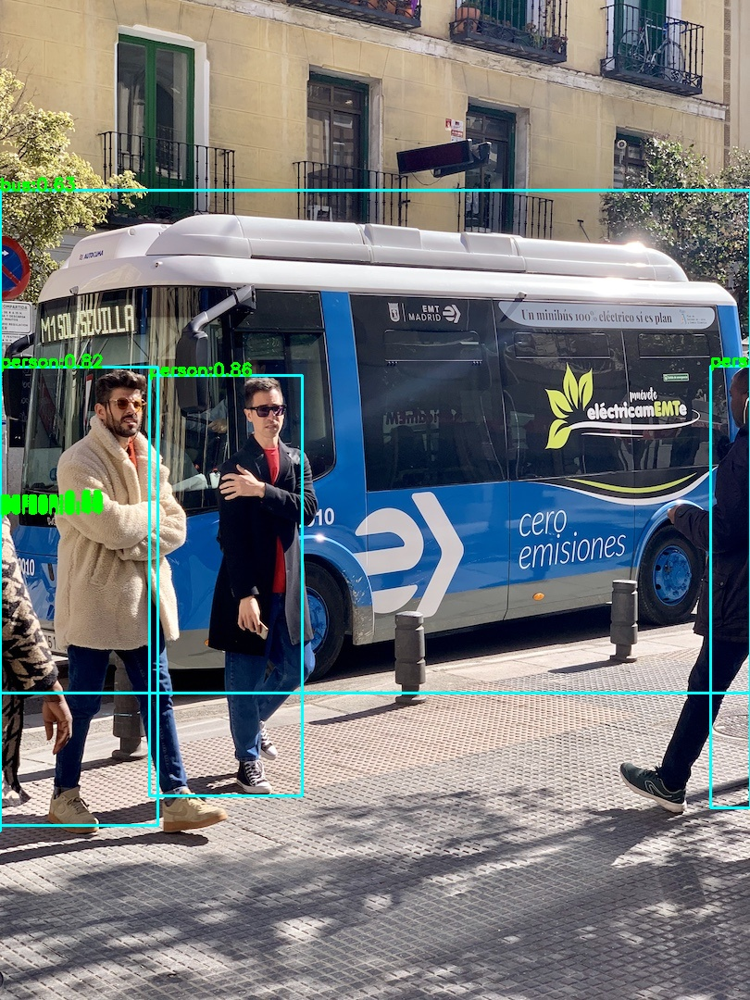
  
  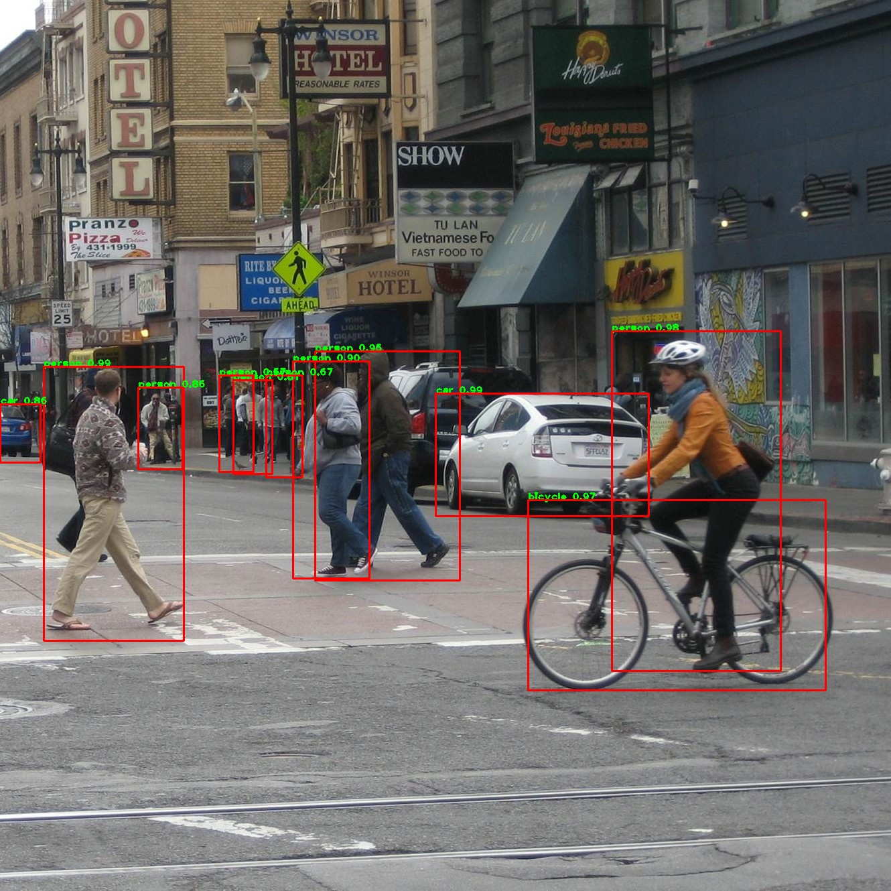
  
  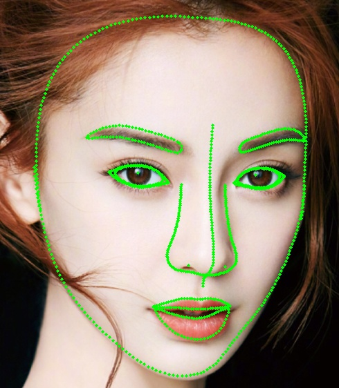
  
  
   
  <br>
  
  
  
  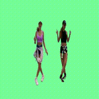  
  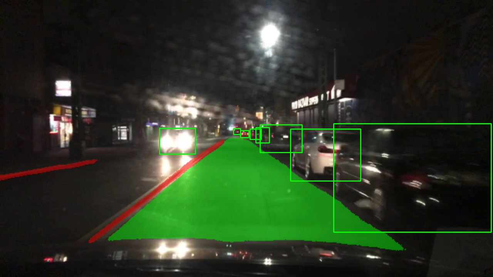
  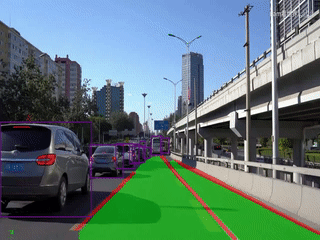
  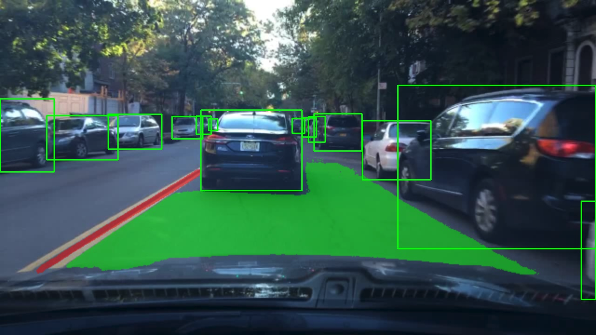
  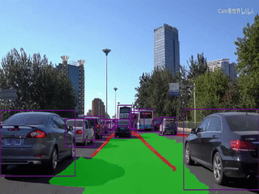

</div>    

<p align="center"><a href="README.md">English</a> | 中文文档 | <a href=#lite.ai.toolkit-Build-MacOS>MacOS</a> | <a href=#lite.ai.toolkit-Build-Linux>Linux</a> | <a href=#lite.ai.toolkit-Build-Windows>Windows</a> </p>

<div align='center'>
  
  
  
  
  
  
  
</div>   

<div align='center'> 
  
  
  
  
</div>    

<!-----
<div align='center'> 
  
  
  
  
<br>
  
  
   
</div>    

----->

🍅🍅*Lite.AI.ToolKit*: 一个轻量级的`C++` AI模型工具箱，用户友好（还行吧），开箱即用。已经包括 *[70+](https://github.com/DefTruth/lite.ai.toolkit/tree/main/docs/hub/lite.ai.toolkit.hub.onnx.md)* 流行的开源模型，如最新的RVM, YOLOX, YOLOP, YOLOR, YoloV5, DeepLabV3, ArcFace等模型，还会继续增加😎。这是一个根据个人兴趣整理的C++工具箱，emmm😞 ... 其实还不是很完善，编个lib来用还是可以的。`关于规划，其实没什么很明确的规划，看到一些有意思的算法可能会把它捏进来，随缘吧。` 个人的兴趣目前主要集中在`检测、分割、抠图、识别和目标跟踪`等领域。 *Lite.AI.ToolKit* 默认是基于 *[ONNXRuntime C++](https://github.com/microsoft/onnxruntime)* 推理引擎的，后期会陆续加入对 *[NCNN](https://github.com/Tencent/ncnn)*, *[MNN](https://github.com/alibaba/MNN)* 和 *[TNN](https://github.com/Tencent/TNN)* 的支持，已经支持部分模型的MNN、NCNN和TNN推理。

## 核心特征👏👋

* *用户友好，开箱即用。* 使用简单一致的调用语法，如*lite::cv::Type::Class*，详见[examples](#lite.ai.toolkit-Examples-for-Lite.AI.ToolKit).
* *少量依赖，构建容易。* 目前, 默认只依赖 *OpenCV* 和 *ONNXRuntime*，详见[build](#lite.ai.toolkit-Build-Lite.AI.ToolKit)。
* *众多的算法模块，且持续更新。* 目前，包括 10+ 算法模块、*[70+](https://github.com/DefTruth/lite.ai.toolkit/tree/main/docs/hub/lite.ai.toolkit.hub.onnx.md)* 流行的开源模型以及 *[500+](https://github.com/DefTruth/lite.ai.toolkit/tree/main/docs/hub/lite.ai.toolkit.hub.onnx.md)* 权重文件, 涵盖[目标检测](#lite.ai.toolkit-object-detection)、[人脸检测](#lite.ai.toolkit-face-detection)、[人脸识别](#lite.ai.toolkit-face-recognition)、[语义分割](#lite.ai.toolkit-segmentation)、[抠图](#lite.ai.toolkit-matting)等领域。详见 [Model Zoo](#lite.ai.toolkit-Model-Zoo) 和 [ONNX Hub](https://github.com/DefTruth/lite.ai.toolkit/tree/main/docs/hub/lite.ai.toolkit.hub.onnx.md) 、[MNN Hub](https://github.com/DefTruth/lite.ai.toolkit/tree/main/docs/hub/lite.ai.toolkit.hub.mnn.md) 、[TNN Hub](https://github.com/DefTruth/lite.ai.toolkit/tree/main/docs/hub/lite.ai.toolkit.hub.tnn.md) 、[NCNN Hub](https://github.com/DefTruth/lite.ai.toolkit/tree/main/docs/hub/lite.ai.toolkit.hub.ncnn.md).

<p align="center"> 若是有用，❤️不妨给个⭐️🌟支持一下吧，感谢支持~  </p>

## 重要更新 !!

|Date|Model|C++ Demo|Paper|Code|Awesome|Type
|:----:|:----:|:----:|:----:|:----:|:----:|:----:| 
|【2021/12/08】|[MGMatting](https://github.com/yucornetto/MGMatting)|[[c++ demo](https://github.com/DefTruth/lite.ai.toolkit/blob/main/examples/lite/cv/test_lite_mg_matting.cpp)]|[[arXiv CVPR 2021](https://arxiv.org/abs/2012.06722)]|[[code](https://github.com/yucornetto/MGMatting)]|| matting |
|【2021/11/11】|[YoloV5_V_6_0](https://github.com/ultralytics/yolov5/releases/tag/v6.0)|[[c++ demo](https://github.com/DefTruth/lite.ai.toolkit/blob/main/examples/lite/cv/test_lite_yolov5_v6.0.cpp)]|[[doi](https://zenodo.org/record/5563715#.YbXffH1Bzfs)]|[[code](https://github.com/ultralytics/yolov5/releases/tag/v6.0)]|| detection |
|【2021/10/26】|[YoloX_V_0_1_1](https://github.com/Megvii-BaseDetection/YOLOX/releases/tag/0.1.1rc0)|[[c++ demo](https://github.com/DefTruth/lite.ai.toolkit/blob/main/examples/lite/cv/test_lite_yolox_v0.1.1.cpp)]|[[arXiv report 2021](https://arxiv.org/abs/2107.08430)]|[[code](https://github.com/Megvii-BaseDetection/YOLOX)]|| detection |
|【2021/10/02】|[NanoDet](https://github.com/RangiLyu/nanodet)|[[c++ demo](https://github.com/DefTruth/lite.ai.toolkit/blob/main/examples/lite/cv/test_lite_nanodet.cpp)]|[[blog](https://zhuanlan.zhihu.com/p/306530300)]|[[code](https://github.com/RangiLyu/nanodet)]|| detection |
|【2021/09/20】|[RobustVideoMatting](https://github.com/PeterL1n/RobustVideoMatting)|[[c++ demo](https://github.com/DefTruth/lite.ai.toolkit/blob/main/examples/lite/cv/test_lite_rvm.cpp)]|[[arXiv WACV 2021](https://arxiv.org/abs/2108.11515)]|[[code](https://github.com/PeterL1n/RobustVideoMatting)]|| matting |
|【2021/09/02】|[YOLOP](https://github.com/hustvl/YOLOP)|[[c++ demo](https://github.com/DefTruth/lite.ai.toolkit/blob/main/examples/lite/cv/test_lite_yolop.cpp)]|[[arXiv report 2021](https://arxiv.org/abs/2108.11250)]|[[code](https://github.com/hustvl/YOLOP)]|| detection |


## 模型支持矩阵

* / = 暂不支持.
* ✅ = 可以运行，且官方支持.
* ✔️ = 可以运行，但非官方支持.
* ❔ = 计划中，但不会很快实现，也许几个月后.

|Class|Size|Type|Demo|ONNXRuntime|MNN|NCNN|TNN|MacOS|Linux|Windows|Android|
|:---:|:---:|:---:|:---:|:---:|:---:|:---:|:---:|:---:|:---:|:---:|:---:|
|[YoloV5](https://github.com/ultralytics/yolov5)|28M|*detection*|[demo](https://github.com/DefTruth/lite.ai.toolkit/blob/main/examples/lite/cv/test_lite_yolov5.cpp)|✅| ✅ | ✅ | ✅ | ✅ |✔️|✔️|❔|
|[YoloV3](https://github.com/onnx/models/blob/master/vision/object_detection_segmentation/yolov3)|236M|*detection*|[demo](https://github.com/DefTruth/lite.ai.toolkit/blob/main/examples/lite/cv/test_lite_yolov3.cpp)|✅| / | / | / | ✅ |✔️|✔️|/|
|[TinyYoloV3](https://github.com/onnx/models/blob/master/vision/object_detection_segmentation/tiny-yolov3)|33M|  *detection*     | [demo](https://github.com/DefTruth/lite.ai.toolkit/blob/main/examples/lite/cv/test_lite_tiny_yolov3.cpp) | ✅ | / | / | / | ✅ |✔️|✔️|/|
|[YoloV4](https://github.com/argusswift/YOLOv4-pytorch)|176M| *detection* | [demo](https://github.com/DefTruth/lite.ai.toolkit/blob/main/examples/lite/cv/test_lite_yolov4.cpp) | ✅ | / | / | / | ✅ |✔️|✔️|/|
|[SSD](https://github.com/onnx/models/blob/master/vision/object_detection_segmentation/ssd)|76M|        *detection*         | [demo](https://github.com/DefTruth/lite.ai.toolkit/blob/main/examples/lite/cv/test_lite_ssd.cpp) | ✅| / | / | / | ✅ |✔️|✔️|/|
|[SSDMobileNetV1](https://github.com/onnx/models/blob/master/vision/object_detection_segmentation/ssd-mobilenetv1)|27M|        *detection*         | [demo](https://github.com/DefTruth/lite.ai.toolkit/blob/main/examples/lite/cv/test_lite_ssd_mobilenetv1.cpp) | ✅ | / | / | / | ✅ |✔️|✔️|/|
|[YoloX](https://github.com/Megvii-BaseDetection/YOLOX)|3.5M|*detection* |[demo](https://github.com/DefTruth/lite.ai.toolkit/blob/main/examples/lite/cv/test_lite_yolox.cpp) | ✅ | ✅ | ✅ | ✅ | ✅ |✔️|✔️|❔|
|[TinyYoloV4VOC](https://github.com/bubbliiiing/yolov4-tiny-pytorch)|22M|*detection* |[demo](https://github.com/DefTruth/lite.ai.toolkit/blob/main/examples/lite/cv/test_lite_tiny_yolov4_voc.cpp) | ✅ | / | / | / | ✅ |✔️|✔️|/|
|[TinyYoloV4COCO](https://github.com/bubbliiiing/yolov4-tiny-pytorch)|22M| *detection* | [demo](https://github.com/DefTruth/lite.ai.toolkit/blob/main/examples/lite/cv/test_lite_tiny_yolov4_coco.cpp) | ✅| / | / | / | ✅ |✔️|✔️|/|
|[YoloR](https://github.com/WongKinYiu/yolor)|39M| *detection* | [demo](https://github.com/DefTruth/lite.ai.toolkit/blob/main/examples/lite/cv/test_lite_yolor.cpp) | ✅ | ✅ | ✅ | ✅ | ✅ |✔️|✔️|❔|
|[ScaledYoloV4](https://github.com/WongKinYiu/ScaledYOLOv4)|270M| *detection* | [demo](https://github.com/DefTruth/lite.ai.toolkit/blob/main/examples/lite/cv/test_lite_scaled_yolov4.cpp) | ✅ | / | / | / | ✅ |✔️|✔️|/|
|[EfficientDet](https://github.com/zylo117/Yet-Another-EfficientDet-Pytorch)|15M| *detection* | [demo](https://github.com/DefTruth/lite.ai.toolkit/blob/main/examples/lite/cv/test_lite_efficientdet.cpp) | ✅ | / | / | / | ✅ |✔️|✔️|/|
|[EfficientDetD7](https://github.com/zylo117/Yet-Another-EfficientDet-Pytorch)|220M| *detection* | [demo](https://github.com/DefTruth/lite.ai.toolkit/blob/main/examples/lite/cv/test_lite_efficientdet_d7.cpp) | ✅ | / | / | / | ✅ |✔️|✔️|/|
|[EfficientDetD8](https://github.com/zylo117/Yet-Another-EfficientDet-Pytorch)|322M| *detection* | [demo](https://github.com/DefTruth/lite.ai.toolkit/blob/main/examples/lite/cv/test_lite_efficientdet_d8.cpp) | ✅ | / | / | / | ✅ |✔️|✔️|/|
|[YOLOP](https://github.com/hustvl/YOLOP)|30M| *detection* | [demo](https://github.com/DefTruth/lite.ai.toolkit/blob/main/examples/lite/cv/test_lite_yolop.cpp) | ✅ | ✅ | ✅ | ✅ | ✅ |✔️|✔️|❔|
|[NanoDet](https://github.com/RangiLyu/nanodet)|1.1M| *detection* | [demo](https://github.com/DefTruth/lite.ai.toolkit/blob/main/examples/lite/cv/test_lite_nanodet.cpp) | ✅ | ✅ | ✅ | ✅ | ✅ |✔️|✔️|❔|
|[NanoDetEffi...](https://github.com/RangiLyu/nanodet)|12M| *detection* | [demo](https://github.com/DefTruth/lite.ai.toolkit/blob/main/examples/lite/cv/test_lite_nanodet_efficientnet_lite.cpp) | ✅ | ✅ | ✅ | ✅ | ✅ |✔️|✔️|❔|
|[YoloX_V_0_1_1](https://github.com/Megvii-BaseDetection/YOLOX)|3.5M| *detection* | [demo](https://github.com/DefTruth/lite.ai.toolkit/blob/main/examples/lite/cv/test_lite_yolox_v0.1.1.cpp) | ✅ | ✅ | ✅ | ✅ | ✅ |✔️|✔️|❔|
|[YoloV5_V_6_0](https://github.com/ultralytics/yolov5)|7.5M|*detection*|[demo](https://github.com/DefTruth/lite.ai.toolkit/blob/main/examples/lite/cv/test_lite_yolov5_v6.0.cpp)|✅| ✅ | ✅ | ✅ | ✅ |✔️|✔️|❔|
| [GlintArcFace](https://github.com/deepinsight/insightface/tree/master/recognition/arcface_torch) |92M|*faceid*|[demo](https://github.com/DefTruth/lite.ai.toolkit/blob/main/examples/lite/cv/test_lite_glint_arcface.cpp)|✅| ✅ | ✅ | ✅ | ✅ |✔️|✔️|❔|
|[GlintCosFace](https://github.com/deepinsight/insightface/tree/master/recognition/arcface_torch)|92M|*faceid*|[demo](https://github.com/DefTruth/lite.ai.toolkit/blob/main/examples/lite/cv/test_lite_glint_cosface.cpp)|✅| ✅ | ✅ | ✅ | ✅ |✔️|✔️|/|
|[GlintPartialFC](https://github.com/deepinsight/insightface/tree/master/recognition/partial_fc)|170M|*faceid*|[demo](https://github.com/DefTruth/lite.ai.toolkit/blob/main/examples/lite/cv/test_lite_glint_partial_fc.cpp)|✅| ✅ | ✅ | ✅ | ✅ |✔️|✔️|/|
|[FaceNet](https://github.com/timesler/facenet-pytorch)|89M|*faceid*|[demo](https://github.com/DefTruth/lite.ai.toolkit/blob/main/examples/lite/cv/test_lite_facenet.cpp)|✅| ✅ | ✅ | ✅ | ✅ |✔️|✔️|/|
|[FocalArcFace](https://github.com/ZhaoJ9014/face.evoLVe.PyTorch)|166M|*faceid*|[demo](https://github.com/DefTruth/lite.ai.toolkit/blob/main/examples/lite/cv/test_lite_focal_arcface.cpp)|✅| ✅ | ✅ | ✅ | ✅ |✔️|✔️|/|
|[FocalAsiaArcFace](https://github.com/ZhaoJ9014/face.evoLVe.PyTorch)|166M|*faceid*|[demo](https://github.com/DefTruth/lite.ai.toolkit/blob/main/examples/lite/cv/test_lite_focal_asia_arcface.cpp)|✅| ✅ | ✅ | ✅ | ✅ |✔️|✔️|/|
|[TencentCurricularFace](https://github.com/Tencent/TFace/tree/master/tasks/distfc)|249M|*faceid*|[demo](https://github.com/DefTruth/lite.ai.toolkit/blob/main/examples/lite/cv/test_lite_tencent_curricular_face.cpp)|✅| ✅ | ✅ | ✅ | ✅ |✔️|✔️|/|
|[TencentCifpFace](https://github.com/Tencent/TFace/tree/master/tasks/cifp)|130M|*faceid*|[demo](https://github.com/DefTruth/lite.ai.toolkit/blob/main/examples/lite/cv/test_lite_tencent_cifp_face.cpp)|✅| ✅ | ✅ | ✅ | ✅ |✔️|✔️|/|
|[CenterLossFace](https://github.com/louis-she/center-loss.pytorch)|280M|*faceid*|[demo](https://github.com/DefTruth/lite.ai.toolkit/blob/main/examples/lite/cv/test_lite_center_loss_face.cpp)|✅| ✅ | ✅ | ✅ | ✅ |✔️|✔️|/|
|[SphereFace](https://github.com/clcarwin/sphereface_pytorch)|80M|*faceid*|[demo](https://github.com/DefTruth/lite.ai.toolkit/blob/main/examples/lite/cv/test_lite_sphere_face.cpp)|✅| ✅ | ✅ | ✅ | ✅ |✔️|✔️|/|
|[PoseRobustFace](https://github.com/penincillin/DREAM)|92M|*faceid*|[demo](https://github.com/DefTruth/lite.ai.toolkit/blob/main/examples/lite/cv/test_lite_pose_robust_face.cpp)|✅| / | / | / | ✅ |✔️|✔️|/|
|[NaivePoseRobustFace](https://github.com/penincillin/DREAM)|43M|*faceid*|[demo](https://github.com/DefTruth/lite.ai.toolkit/blob/main/examples/lite/cv/test_lite_naive_pose_robust_face.cpp)|✅| / | / | / | ✅ |✔️|✔️|/|
|[MobileFaceNet](https://github.com/Xiaoccer/MobileFaceNet_Pytorch)|3.8M|*faceid*|[demo](https://github.com/DefTruth/lite.ai.toolkit/blob/main/examples/lite/cv/test_lite_mobile_facenet.cpp)|✅| ✅ | ✅ | ✅ | ✅ |✔️|✔️|❔|
|[CavaGhostArcFace](https://github.com/cavalleria/cavaface.pytorch)|15M|*faceid*|[demo](https://github.com/DefTruth/lite.ai.toolkit/blob/main/examples/lite/cv/test_lite_cava_ghost_arcface.cpp)|✅| ✅ | ✅ | ✅ | ✅ |✔️|✔️|❔|
|[CavaCombinedFace](https://github.com/cavalleria/cavaface.pytorch)|250M|*faceid*|[demo](https://github.com/DefTruth/lite.ai.toolkit/blob/main/examples/lite/cv/test_lite_cava_combined_face.cpp)|✅| ✅ | ✅ | ✅ | ✅ |✔️|✔️|/|
|[MobileSEFocalFace](https://github.com/grib0ed0v/face_recognition.pytorch)|4.5M|*faceid*|[demo](https://github.com/DefTruth/lite.ai.toolkit/blob/main/examples/lite/cv/test_lite_mobilese_focal_face.cpp)|✅| ✅ | ✅ | ✅ | ✅ |✔️|✔️|❔|
|[RobustVideoMatting](https://github.com/PeterL1n/RobustVideoMatting)|14M|*matting*|[demo](https://github.com/DefTruth/lite.ai.toolkit/blob/main/examples/lite/cv/test_lite_rvm.cpp)|✅| ✅ | / | ✅ | ✅ |✔️|✔️|❔|
|[MGMatting](https://github.com/yucornetto/MGMatting)|113M|*matting*|[demo](https://github.com/DefTruth/lite.ai.toolkit/blob/main/examples/lite/cv/test_lite_mg_matting.cpp)|✅| ✅ | / | ✅ | ✅ |✔️|✔️|/|
|[UltraFace](https://github.com/Linzaer/Ultra-Light-Fast-Generic-Face-Detector-1MB)|1.1M|*face::detect*|[demo](https://github.com/DefTruth/lite.ai.toolkit/blob/main/examples/lite/cv/test_lite_ultraface.cpp)|✅| ✅ | ✅ | ✅ | ✅ |✔️|✔️|❔|
|[RetinaFace](https://github.com/biubug6/Pytorch_Retinaface)|1.6M|*face::detect*|[demo](https://github.com/DefTruth/lite.ai.toolkit/blob/main/examples/lite/cv/test_lite_retinaface.cpp)|✅| ✅ | ✅ | ✅ | ✅ |✔️|✔️|❔|
|[FaceBoxes](https://github.com/zisianw/FaceBoxes.PyTorch)|3.8M|*face::detect*|[demo](https://github.com/DefTruth/lite.ai.toolkit/blob/main/examples/lite/cv/test_lite_faceboxes.cpp)|✅| ✅ | ✅ | ✅ | ✅ |✔️|✔️|❔|
|[PFLD](https://github.com/Hsintao/pfld_106_face_landmarks)|1.0M|*face::align*|[demo](https://github.com/DefTruth/lite.ai.toolkit/blob/main/examples/lite/cv/test_lite_pfld.cpp)|✅| ✅ | ✅ | ✅ | ✅ |✔️|✔️|❔|
|[PFLD98](https://github.com/polarisZhao/PFLD-pytorch)|4.8M|*face::align*|[demo](https://github.com/DefTruth/lite.ai.toolkit/blob/main/examples/lite/cv/test_lite_pfld98.cpp)|✅| ✅ | ✅ | ✅ | ✅ |✔️|✔️|❔|
|[MobileNetV268](https://github.com/cunjian/pytorch_face_landmark)|9.4M|*face::align*|[demo](https://github.com/DefTruth/lite.ai.toolkit/blob/main/examples/lite/cv/test_lite_mobilenetv2_68.cpp)|✅| ✅ | ✅ | ✅ | ✅ |✔️|✔️|❔|
|[MobileNetV2SE68](https://github.com/cunjian/pytorch_face_landmark)|11M|*face::align*|[demo](https://github.com/DefTruth/lite.ai.toolkit/blob/main/examples/lite/cv/test_lite_mobilenetv2_se_68.cpp)|✅| ✅ | ✅ | ✅ | ✅ |✔️|✔️|❔|
|[PFLD68](https://github.com/cunjian/pytorch_face_landmark)|2.8M|*face::align*|[demo](https://github.com/DefTruth/lite.ai.toolkit/blob/main/examples/lite/cv/test_lite_pfld68.cpp)|✅| ✅ | ✅ | ✅ | ✅ |✔️|✔️|❔|
|[FaceLandmark1000](https://github.com/Single430/FaceLandmark1000)|2.0M|*face::align*|[demo](https://github.com/DefTruth/lite.ai.toolkit/blob/main/examples/lite/cv/test_lite_face_landmarks_1000.cpp)|✅| ✅ | ✅ | ✅ | ✅ |✔️|✔️|❔|
|[FSANet](https://github.com/omasaht/headpose-fsanet-pytorch)|1.2M|*face::pose*|[demo](https://github.com/DefTruth/lite.ai.toolkit/blob/main/examples/lite/cv/test_lite_fsanet.cpp)|✅| ✅ | / | ✅ | ✅ |✔️|✔️|❔|
|[AgeGoogleNet](https://github.com/onnx/models/tree/master/vision/body_analysis/age_gender)|23M|*face::attr*|[demo](https://github.com/DefTruth/lite.ai.toolkit/blob/main/examples/lite/cv/test_lite_age_googlenet.cpp)|✅| ✅ | ✅ | ✅ | ✅ |✔️|✔️|❔|
|[GenderGoogleNet](https://github.com/onnx/models/tree/master/vision/body_analysis/age_gender)|23M|*face::attr*|[demo](https://github.com/DefTruth/lite.ai.toolkit/blob/main/examples/lite/cv/test_lite_gender_googlenet.cpp)|✅| ✅ | ✅ | ✅ | ✅ |✔️|✔️|❔|
|[EmotionFerPlus](https://github.com/onnx/models/blob/master/vision/body_analysis/emotion_ferplus)|33M|*face::attr*|[demo](https://github.com/DefTruth/lite.ai.toolkit/blob/main/examples/lite/cv/test_lite_emotion_ferplus.cpp)|✅| ✅ | ✅ | ✅ | ✅ |✔️|✔️|❔|
|[VGG16Age](https://github.com/onnx/models/tree/master/vision/body_analysis/age_gender)|514M|*face::attr*|[demo](https://github.com/DefTruth/lite.ai.toolkit/blob/main/examples/lite/cv/test_lite_vgg16_age.cpp)|✅| ✅ | ✅ | ✅ | ✅ |✔️|✔️|/|
|[VGG16Gender](https://github.com/onnx/models/tree/master/vision/body_analysis/age_gender)|512M|*face::attr*|[demo](https://github.com/DefTruth/lite.ai.toolkit/blob/main/examples/lite/cv/test_lite_vgg16_gender.cpp)|✅| ✅ | ✅ | ✅ | ✅ |✔️|✔️|/|
|[SSRNet](https://github.com/oukohou/SSR_Net_Pytorch)|190K|*face::attr*|[demo](https://github.com/DefTruth/lite.ai.toolkit/blob/main/examples/lite/cv/test_lite_ssrnet.cpp)|✅| ✅ | / | ✅ | ✅ |✔️|✔️|❔|
|[EfficientEmotion7](https://github.com/HSE-asavchenko/face-emotion-recognition)|15M|*face::attr*|[demo](https://github.com/DefTruth/lite.ai.toolkit/blob/main/examples/lite/cv/test_lite_efficient_emotion7.cpp)|✅| ✅ | ✅ | ✅ | ✅ |✔️|✔️|❔|
|[EfficientEmotion8](https://github.com/HSE-asavchenko/face-emotion-recognition)|15M|*face::attr*|[demo](https://github.com/DefTruth/lite.ai.toolkit/blob/main/examples/lite/cv/test_lite_efficient_emotion8.cpp)|✅| ✅ | ✅ | ✅ | ✅ |✔️|✔️|❔|
|[MobileEmotion7](https://github.com/HSE-asavchenko/face-emotion-recognition)|13M|*face::attr*|[demo](https://github.com/DefTruth/lite.ai.toolkit/blob/main/examples/lite/cv/test_lite_mobile_emotion7.cpp)|✅| ✅ | ✅ | ✅ | ✅ |✔️|✔️|❔|
|[ReXNetEmotion7](https://github.com/HSE-asavchenko/face-emotion-recognition)|30M|*face::attr*|[demo](https://github.com/DefTruth/lite.ai.toolkit/blob/main/examples/lite/cv/test_lite_rexnet_emotion7.cpp)|✅| ✅ | / | ✅ | ✅ |✔️|✔️|/|
|[EfficientNetLite4](https://github.com/onnx/models/blob/master/vision/classification/efficientnet-lite4)|49M|*classification*|[demo](https://github.com/DefTruth/lite.ai.toolkit/blob/main/examples/lite/cv/test_lite_efficientnet_lite4.cpp)|✅| ✅ | / | ✅ | ✅ |✔️|✔️|/|
|[ShuffleNetV2](https://github.com/onnx/models/blob/master/vision/classification/shufflenet)|8.7M|*classification*|[demo](https://github.com/DefTruth/lite.ai.toolkit/blob/main/examples/lite/cv/test_lite_shufflenetv2.cpp)|✅| ✅ | ✅ | ✅ | ✅ |✔️|✔️|❔|
|[DenseNet121](https://pytorch.org/hub/pytorch_vision_densenet/)|30.7M|*classification*|[demo](https://github.com/DefTruth/lite.ai.toolkit/blob/main/examples/lite/cv/test_lite_densenet.cpp)|✅| ✅ | ✅ | ✅ | ✅ |✔️|✔️|/|
|[GhostNet](https://pytorch.org/hub/pytorch_vision_ghostnet/)|20M|*classification*|[demo](https://github.com/DefTruth/lite.ai.toolkit/blob/main/examples/lite/cv/test_lite_ghostnet.cpp)|✅| ✅ | ✅ | ✅ | ✅ |✔️|✔️|❔|
|[HdrDNet](https://pytorch.org/hub/pytorch_vision_hardnet//)|13M|*classification*|[demo](https://github.com/DefTruth/lite.ai.toolkit/blob/main/examples/lite/cv/test_lite_hardnet.cpp)|✅| ✅ | ✅ | ✅ | ✅ |✔️|✔️|❔|
|[IBNNet](https://pytorch.org/hub/pytorch_vision_ibnnet/)|97M|*classification*|[demo](https://github.com/DefTruth/lite.ai.toolkit/blob/main/examples/lite/cv/test_lite_ibnnet.cpp)|✅| ✅ | ✅ | ✅ | ✅ |✔️|✔️|/|
|[MobileNetV2](https://pytorch.org/hub/pytorch_vision_mobilenet_v2/)|13M|*classification*|[demo](https://github.com/DefTruth/lite.ai.toolkit/blob/main/examples/lite/cv/test_lite_mobilenetv2.cpp)|✅| ✅ | ✅ | ✅ | ✅ |✔️|✔️|❔|
|[ResNet](https://pytorch.org/hub/pytorch_vision_resnet/)|44M|*classification*|[demo](https://github.com/DefTruth/lite.ai.toolkit/blob/main/examples/lite/cv/test_lite_resnet.cpp)|✅| ✅ | ✅ | ✅ | ✅ |✔️|✔️|/|
|[ResNeXt](https://pytorch.org/hub/pytorch_vision_resnext/)|95M|*classification*|[demo](https://github.com/DefTruth/lite.ai.toolkit/blob/main/examples/lite/cv/test_lite_resnext.cpp)|✅| ✅ | ✅ | ✅ | ✅ |✔️|✔️|/|
|[DeepLabV3ResNet101](https://pytorch.org/hub/pytorch_vision_deeplabv3_resnet101/)|232M|*segmentation*|[demo](https://github.com/DefTruth/lite.ai.toolkit/blob/main/examples/lite/cv/test_lite_deeplabv3_resnet101.cpp)|✅| ✅ | ✅ | ✅ | ✅ |✔️|✔️|/|
|[FCNResNet101](https://pytorch.org/hub/pytorch_vision_fcn_resnet101/)|207M|*segmentation*|[demo](https://github.com/DefTruth/lite.ai.toolkit/blob/main/examples/lite/cv/test_lite_fcn_resnet101.cpp)|✅| ✅ | ✅ | ✅ | ✅ |✔️|✔️|/|
|[FastStyleTransfer](https://github.com/onnx/models/blob/master/vision/style_transfer/fast_neural_style)|6.4M|*style*|[demo](https://github.com/DefTruth/lite.ai.toolkit/blob/main/examples/lite/cv/test_lite_fast_style_transfer.cpp)|✅| ✅ | ✅ | ✅ | ✅ |✔️|✔️|❔|
|[Colorizer](https://github.com/richzhang/colorization)|123M|*colorization*|[demo](https://github.com/DefTruth/lite.ai.toolkit/blob/main/examples/lite/cv/test_lite_colorizer.cpp)|✅| ✅ | / | ✅ | ✅ |✔️|✔️|/|
|[SubPixelCNN](https://github.com/niazwazir/SUB_PIXEL_CNN)|234K|*resolution*|[demo](https://github.com/DefTruth/lite.ai.toolkit/blob/main/examples/lite/cv/test_lite_subpixel_cnn.cpp)|✅| ✅ | / | ✅ | ✅ |✔️|✔️|❔|


## 目录
* [编译](#lite.ai.toolkit-Build-Lite.AI.ToolKit)
* [模型下载](#lite.ai.toolkit-Model-Zoo)
* [应用案例](#lite.ai.toolkit-Examples-for-Lite.AI.ToolKit)
* [开源协议](#lite.ai.toolkit-License)
* [引用参考](#lite.ai.toolkit-References)


## 1. 编译
<div id="lite.ai.toolkit-Build-MacOS"></div>
<div id="lite.ai.toolkit-Build-Lite.AI.ToolKit"></div>

* MacOS: 从*Lite.AI.ToolKit* 源码编译*MacOS*下的动态库。需要注意的是*Lite.AI.ToolKit* 使用`onnxruntime`作为默认的后端，因为onnxruntime支持大部分onnx的原生算子，具有更高的易用性。如何编译Linux和Windows版本？点击 ▶️ 查看。
```shell
    git clone --depth=1 https://github.com/DefTruth/lite.ai.toolkit.git  # 最新源码
    cd lite.ai.toolkit && sh ./build.sh  # 对于MacOS, 你可以直接利用本项目包含的OpenCV, ONNXRuntime, MNN, NCNN and TNN依赖库，无需重新编译
```

<div id="lite.ai.toolkit-Build-Linux"></div>
<div id="lite.ai.toolkit-Build-Windows"></div>

<details>
<summary>💡️ Linux 和 Windows </summary>  

### Linux 和 Windows

⚠️ *Lite.AI.ToolKit* 的发行版本目前不直接支持Linux和Windows，你需要从下载*Lite.AI.ToolKit*的源码进行构建。首先，你需要下载(如果有官方编译好的发行版本的话)或编译*OpenCV* 、*ONNXRuntime* 和其他你需要的推理引擎，如MNN、NCNN、TNN，然后把它们的头文件分别放入各自对应的文件夹，或者直接使用本项目提供的头文件。本项目的依赖库头文件是直接从相应的官方库拷贝而来的，但不同操作系统下的动态库需要重新编译或下载，MacOS用户可以直接使用本项目提供的各个依赖库的动态库。
* *lite.ai.toolkit/opencv2*
  ```shell
    cp -r you-path-to-downloaded-or-built-opencv/include/opencv4/opencv2 lite.ai.toolkit/opencv2
  ```
* *lite.ai.toolkit/onnxruntime*
  ```shell
    cp -r you-path-to-downloaded-or-built-onnxruntime/include/onnxruntime lite.ai.toolkit/onnxruntime
  ```
* *lite.ai.toolkit/MNN*
  ```shell
    cp -r you-path-to-downloaded-or-built-MNN/include/MNN lite.ai.toolkit/MNN
  ```
* *lite.ai.toolkit/ncnn*
  ```shell
    cp -r you-path-to-downloaded-or-built-ncnn/include/ncnn lite.ai.toolkit/ncnn
  ```
* *lite.ai.toolkit/tnn*
  ```shell
    cp -r you-path-to-downloaded-or-built-TNN/include/tnn lite.ai.toolkit/tnn
  ```

然后把各个依赖库拷贝到*lite.ai.toolkit/lib* 文件夹。 请参考依赖库的编译文档[<sup>1</sup>](#lite.ai.toolkit-1)。
* *lite.ai.toolkit/lib*
  ```shell
    cp you-path-to-downloaded-or-built-opencv/lib/*opencv* lite.ai.toolkit/lib
    cp you-path-to-downloaded-or-built-onnxruntime/lib/*onnxruntime* lite.ai.toolkit/lib
    cp you-path-to-downloaded-or-built-MNN/lib/*MNN* lite.ai.toolkit/lib
    cp you-path-to-downloaded-or-built-ncnn/lib/*ncnn* lite.ai.toolkit/lib
    cp you-path-to-downloaded-or-built-TNN/lib/*TNN* lite.ai.toolkit/lib
  ```


* Windows: 你可以参考[issue#6](https://github.com/DefTruth/lite.ai.toolkit/issues/6) ，讨论了常见的编译问题。
* Linux: 参考MacOS下的编译，替换Linux版本的依赖库即可。Linux下的发行版本将会在近期添加 ~ [issue#2](https://github.com/DefTruth/lite.ai.toolkit/issues/2)
* 令人开心的消息!!! : 🚀 你可以直接下载最新的*ONNXRuntime*官方构建的动态库，包含Windows, Linux, MacOS and Arm的版本!!! CPU和GPU的版本均可获得。不需要再从源码进行编译了，nice。可以从[v1.8.1](https://github.com/microsoft/onnxruntime/releases) 下载最新的动态库. 我目前在*Lite.AI.ToolKit*中用的是1.7.0，你可以从[v1.7.0](https://github.com/microsoft/onnxruntime/releases/tag/v1.7.0) 下载, 但1.8.1应该也是可行的。对于*OpenCV*，请尝试从源码构建(Linux) 或者 直接从[OpenCV 4.5.3](https://github.com/opencv/opencv/releases) 下载官方编译好的动态库(Windows). 然后把头文件和依赖库放入上述的文件夹中.

* Windows GPU 兼容性: 详见[issue#10](https://github.com/DefTruth/lite.ai.toolkit/issues/10).
* Linux GPU 兼容性: 详见[issue#97](https://github.com/DefTruth/lite.ai.toolkit/issues/97).

</details>  

<details>
<summary>🔑️ 如何链接Lite.AI.ToolKit动态库?</summary>  

* 你可参考以下的CMakeLists.txt设置来链接动态库.

```cmake
cmake_minimum_required(VERSION 3.17)
project(lite.ai.toolkit.demo)

set(CMAKE_CXX_STANDARD 11)

# setting up lite.ai.toolkit
set(LITE_AI_DIR ${CMAKE_SOURCE_DIR}/lite.ai.toolkit)
set(LITE_AI_INCLUDE_DIR ${LITE_AI_DIR}/include)
set(LITE_AI_LIBRARY_DIR ${LITE_AI_DIR}/lib)
include_directories(${LITE_AI_INCLUDE_DIR})
link_directories(${LITE_AI_LIBRARY_DIR})

set(OpenCV_LIBS
        opencv_highgui
        opencv_core
        opencv_imgcodecs
        opencv_imgproc
        opencv_video
        opencv_videoio
        )
# add your executable
set(EXECUTABLE_OUTPUT_PATH ${CMAKE_SOURCE_DIR}/examples/build)

add_executable(lite_rvm examples/test_lite_rvm.cpp)
target_link_libraries(lite_rvm
        lite.ai.toolkit
        onnxruntime
        MNN  # need, if built lite.ai.toolkit with ENABLE_MNN=ON,  default OFF
        ncnn # need, if built lite.ai.toolkit with ENABLE_NCNN=ON, default OFF 
        TNN  # need, if built lite.ai.toolkit with ENABLE_TNN=ON,  default OFF 
        ${OpenCV_LIBS})  # link lite.ai.toolkit & other libs.
```

```shell
cd ./build/lite.ai.toolkit/lib && otool -L liblite.ai.toolkit.0.0.1.dylib 
liblite.ai.toolkit.0.0.1.dylib:
        @rpath/liblite.ai.toolkit.0.0.1.dylib (compatibility version 0.0.1, current version 0.0.1)
        @rpath/libopencv_highgui.4.5.dylib (compatibility version 4.5.0, current version 4.5.2)
        @rpath/libonnxruntime.1.7.0.dylib (compatibility version 0.0.0, current version 1.7.0)
        ...
```


```shell
cd ../ && tree .
├── bin
├── include
│   ├── lite
│   │   ├── backend.h
│   │   ├── config.h
│   │   └── lite.h
│   └── ort
└── lib
    └── liblite.ai.toolkit.0.0.1.dylib
```
* 运行已经编译好的examples:
```shell
cd ./build/lite.ai.toolkit/bin && ls -lh | grep lite
-rwxr-xr-x  1 root  staff   301K Jun 26 23:10 liblite.ai.toolkit.0.0.1.dylib
...
-rwxr-xr-x  1 root  staff   196K Jun 26 23:10 lite_yolov4
-rwxr-xr-x  1 root  staff   196K Jun 26 23:10 lite_yolov5
...
```

```shell
./lite_yolov5
LITEORT_DEBUG LogId: ../../../hub/onnx/cv/yolov5s.onnx
=============== Input-Dims ==============
...
detected num_anchors: 25200
generate_bboxes num: 66
Default Version Detected Boxes Num: 5
```

为了链接`lite.ai.toolkit`动态库，你需要确保`OpenCV` and `onnxruntime`也被正确地链接。你可以在[CMakeLists.txt](https://github.com/DefTruth/RobustVideoMatting-ncnn-mnn-tnn-onnxruntime/blob/main/CMakeLists.txt) 中找到一个简单且完整的，关于如何正确地链接Lite.AI.ToolKit动态库的应用案例。

</details>


## 2. 模型下载  
<div id="lite.ai.toolkit-2"></div>
<div id="lite.ai.toolkit-Model-Zoo"></div>

*Lite.AI.ToolKit* 目前包括 *[70+](https://github.com/DefTruth/lite.ai.toolkit/tree/main/docs/hub/lite.ai.toolkit.hub.onnx.md)* 流行的开源模型以及 *[500+](https://github.com/DefTruth/lite.ai.toolkit/tree/main/docs/hub/lite.ai.toolkit.hub.onnx.md)* 文件，大部分文件是我自己转换的。你可以通过*lite::cv::Type::Class* 语法进行调用，如 *[lite::cv::detection::YoloV5](#lite.ai.toolkit-object-detection)*。更多的细节见[Examples for Lite.AI.ToolKit](#lite.ai.toolkit-Examples-for-Lite.AI.ToolKit)。注意，由于Google Driver(15G)的存储限制，我无法上传所有的模型文件，国内的小伙伴请使用百度云盘。

|File|Baidu Drive|Google Drive|Hub|  
|:---:|:---:|:---:|:---:|
|ONNX|[Baidu Drive](https://pan.baidu.com/s/1elUGcx7CZkkjEoYhTMwTRQ) code: 8gin|[Google Drive](https://drive.google.com/drive/folders/1p6uBcxGeyS1exc-T61vL8YRhwjYL4iD2?usp=sharing)|[ONNX Hub](https://github.com/DefTruth/lite.ai.toolkit/tree/main/docs/hub/lite.ai.toolkit.hub.onnx.md)|    
|MNN|[Baidu Drive](https://pan.baidu.com/s/1KyO-bCYUv6qPq2M8BH_Okg) code: 9v63 |❔|[MNN Hub](https://github.com/DefTruth/lite.ai.toolkit/tree/main/docs/hub/lite.ai.toolkit.hub.mnn.md)|  
|NCNN|[Baidu Drive](https://pan.baidu.com/s/1hlnqyNsFbMseGFWscgVhgQ) code: sc7f |❔|[NCNN Hub](https://github.com/DefTruth/lite.ai.toolkit/tree/main/docs/hub/lite.ai.toolkit.hub.ncnn.md)|
|TNN|[Baidu Drive](https://pan.baidu.com/s/1lvM2YKyUbEc5HKVtqITpcw) code: 6o6k|❔|[TNN Hub](https://github.com/DefTruth/lite.ai.toolkit/tree/main/docs/hub/lite.ai.toolkit.hub.tnn.md)|

<details>
<summary> 命名空间和Lite.AI.ToolKit算法模块的对应关系 </summary>  

### 命名空间和Lite.AI.ToolKit算法模块的对应关系

| Namepace                   | Details                                                      |
| :------------------------- | :----------------------------------------------------------- |
| *lite::cv::detection*      | Object Detection. one-stage and anchor-free detectors, YoloV5, YoloV4, SSD, etc. ✅ |
| *lite::cv::classification* | Image Classification. DensNet, ShuffleNet, ResNet, IBNNet, GhostNet, etc. ✅ |
| *lite::cv::faceid*         | Face Recognition. ArcFace, CosFace, CurricularFace, etc. ❇️   |
| *lite::cv::face*           | Face Analysis. *detect*, *align*, *pose*, *attr*, etc. ❇️    |
| *lite::cv::face::detect*   | Face Detection. UltraFace, RetinaFace, FaceBoxes, PyramidBox, etc. ❇️ |
| *lite::cv::face::align*    | Face Alignment. PFLD(106), FaceLandmark1000(1000 landmarks), PRNet, etc. ❇️ |
| *lite::cv::face::pose*     | Head Pose Estimation.  FSANet, etc. ❇️                        |
| *lite::cv::face::attr*     | Face Attributes. Emotion, Age, Gender. EmotionFerPlus, VGG16Age, etc. ❇️ |
| *lite::cv::segmentation*   | Object Segmentation. Such as FCN, DeepLabV3, etc. ⚠️          |
| *lite::cv::style*          | Style Transfer. Contains neural style transfer now, such as FastStyleTransfer.  ⚠️ |
| *lite::cv::matting*        | Image Matting. Object and Human matting.  ⚠️                  |
| *lite::cv::colorization*   | Colorization. Make Gray image become RGB. ⚠️                  |
| *lite::cv::resolution*     | Super Resolution.  ⚠️                                         |


### Lite.AI.ToolKit的类与权重文件对应关系说明

Lite.AI.ToolKit的类与权重文件对应关系说明，可以在[lite.ai.toolkit.hub.onnx.md](https://github.com/DefTruth/lite.ai.toolkit/tree/main/docs/hub/lite.ai.toolkit.hub.onnx.md) 中找到。比如, *lite::cv::detection::YoloV5* 和 *lite::cv::detection::YoloX* 的权重文件为：


|             Class             | Pretrained ONNX Files |                   Rename or Converted From (Repo)                   | Size  |
| :---------------------------: | :-------------------: | :----------------------------------------------------: | :---: |
| *lite::cv::detection::YoloV5* |     yolov5l.onnx      | [yolov5](https://github.com/ultralytics/yolov5) (🔥🔥💥↑) | 188Mb |
| *lite::cv::detection::YoloV5* |     yolov5m.onnx      | [yolov5](https://github.com/ultralytics/yolov5) (🔥🔥💥↑) | 85Mb  |
| *lite::cv::detection::YoloV5* |     yolov5s.onnx      | [yolov5](https://github.com/ultralytics/yolov5) (🔥🔥💥↑) | 29Mb  |
| *lite::cv::detection::YoloV5* |     yolov5x.onnx      | [yolov5](https://github.com/ultralytics/yolov5) (🔥🔥💥↑) | 351Mb |
| *lite::cv::detection::YoloX* |     yolox_x.onnx      | [YOLOX](https://github.com/Megvii-BaseDetection/YOLOX) (🔥🔥!!↑) | 378Mb |
| *lite::cv::detection::YoloX* |     yolox_l.onnx      | [YOLOX](https://github.com/Megvii-BaseDetection/YOLOX) (🔥🔥!!↑) | 207Mb  |
| *lite::cv::detection::YoloX* |     yolox_m.onnx      | [YOLOX](https://github.com/Megvii-BaseDetection/YOLOX) (🔥🔥!!↑) | 97Mb  |
| *lite::cv::detection::YoloX* |     yolox_s.onnx      | [YOLOX](https://github.com/Megvii-BaseDetection/YOLOX) (🔥🔥!!↑) | 34Mb |
| *lite::cv::detection::YoloX* |     yolox_tiny.onnx      | [YOLOX](https://github.com/Megvii-BaseDetection/YOLOX) (🔥🔥!!↑) | 19Mb |
| *lite::cv::detection::YoloX* |     yolox_nano.onnx      | [YOLOX](https://github.com/Megvii-BaseDetection/YOLOX) (🔥🔥!!↑) | 3.5Mb |

这意味着，你可以通过Lite.AI.ToolKit中的同一个类，根据你的使用情况，加载任意一个`yolov5*.onnx`或`yolox_*.onnx`，如 *YoloV5*, *YoloX*等.

```c++
auto *yolov5 = new lite::cv::detection::YoloV5("yolov5x.onnx");  // for server
auto *yolov5 = new lite::cv::detection::YoloV5("yolov5l.onnx"); 
auto *yolov5 = new lite::cv::detection::YoloV5("yolov5m.onnx");  
auto *yolov5 = new lite::cv::detection::YoloV5("yolov5s.onnx");  // for mobile device 
auto *yolox = new lite::cv::detection::YoloX("yolox_x.onnx");  
auto *yolox = new lite::cv::detection::YoloX("yolox_l.onnx");  
auto *yolox = new lite::cv::detection::YoloX("yolox_m.onnx");  
auto *yolox = new lite::cv::detection::YoloX("yolox_s.onnx");  
auto *yolox = new lite::cv::detection::YoloX("yolox_tiny.onnx");  
auto *yolox = new lite::cv::detection::YoloX("yolox_nano.onnx");  // 3.5Mb only !
```

</details>

## 3. 应用案例

<div id="lite.ai.toolkit-Examples-for-Lite.AI.ToolKit"></div>

更多的应用案例详见[examples](https://github.com/DefTruth/lite.ai.toolkit/tree/main/examples/lite/cv) 。点击 ▶️ 可以看到该主题下更多的案例。

<div id="lite.ai.toolkit-object-detection"></div>

#### 案例0: 使用[YoloV5](https://github.com/ultralytics/yolov5) 进行目标检测。请从Model-Zoo[<sup>2</sup>](#lite.ai.toolkit-2) 下载模型文件。
```c++
#include "lite/lite.h"

static void test_default()
{
  std::string onnx_path = "../../../hub/onnx/cv/yolov5s.onnx";
  std::string test_img_path = "../../../examples/lite/resources/test_lite_yolov5_1.jpg";
  std::string save_img_path = "../../../logs/test_lite_yolov5_1.jpg";

  auto *yolov5 = new lite::cv::detection::YoloV5(onnx_path); 
  std::vector<lite::types::Boxf> detected_boxes;
  cv::Mat img_bgr = cv::imread(test_img_path);
  yolov5->detect(img_bgr, detected_boxes);
  
  lite::utils::draw_boxes_inplace(img_bgr, detected_boxes);
  cv::imwrite(save_img_path, img_bgr);  
  
  delete yolov5;
}
```

输出的结果是:
<div align='center'>
  
  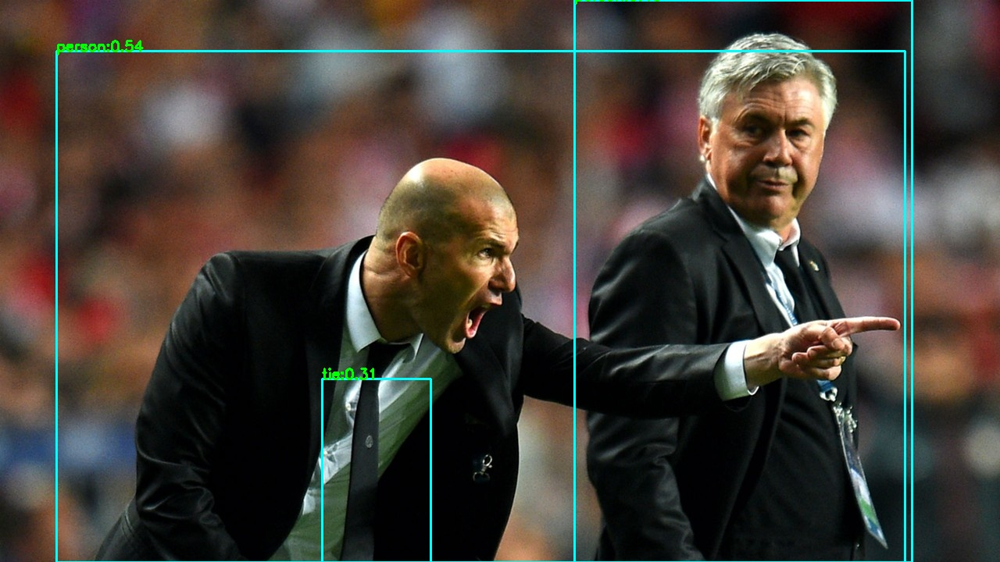
</div>

或者你可以使用最新的 🔥🔥 ! YOLO 系列检测器[YOLOX](https://github.com/Megvii-BaseDetection/YOLOX) 或 [YoloR](https://github.com/WongKinYiu/yolor) ，它们会获得接近的结果。

更多可用的通用目标检测器（80类、COCO）:  
```c++
auto *detector = new lite::cv::detection::YoloX(onnx_path);  // Newest YOLO detector !!! 2021-07
auto *detector = new lite::cv::detection::YoloV4(onnx_path); 
auto *detector = new lite::cv::detection::YoloV3(onnx_path); 
auto *detector = new lite::cv::detection::TinyYoloV3(onnx_path); 
auto *detector = new lite::cv::detection::SSD(onnx_path); 
auto *detector = new lite::cv::detection::YoloV5(onnx_path); 
auto *detector = new lite::cv::detection::YoloR(onnx_path);  // Newest YOLO detector !!! 2021-05
auto *detector = new lite::cv::detection::TinyYoloV4VOC(onnx_path); 
auto *detector = new lite::cv::detection::TinyYoloV4COCO(onnx_path); 
auto *detector = new lite::cv::detection::ScaledYoloV4(onnx_path); 
auto *detector = new lite::cv::detection::EfficientDet(onnx_path); 
auto *detector = new lite::cv::detection::EfficientDetD7(onnx_path); 
auto *detector = new lite::cv::detection::EfficientDetD8(onnx_path); 
auto *detector = new lite::cv::detection::YOLOP(onnx_path);
auto *detector = new lite::cv::detection::NanoDet(onnx_path); // Super fast and tiny!
auto *detector = new lite::cv::detection::NanoDetEfficientNetLite(onnx_path); // Super fast and tiny!
```

****

<div id="lite.ai.toolkit-matting"></div>  

#### 案例1: 使用[RobustVideoMatting2021🔥🔥🔥](https://github.com/PeterL1n/RobustVideoMatting) 进行视频抠图。请从Model-Zoo[<sup>2</sup>](#lite.ai.toolkit-2) 下载模型文件。

```c++
#include "lite/lite.h"

static void test_default()
{
  std::string onnx_path = "../../../hub/onnx/cv/rvm_mobilenetv3_fp32.onnx";
  std::string video_path = "../../../examples/lite/resources/test_lite_rvm_0.mp4";
  std::string output_path = "../../../logs/test_lite_rvm_0.mp4";
  
  auto *rvm = new lite::cv::matting::RobustVideoMatting(onnx_path, 16); // 16 threads
  std::vector<lite::types::MattingContent> contents;
  
  // 1. video matting.
  rvm->detect_video(video_path, output_path, contents, false, 0.4f);
  
  delete rvm;
}
```
输出的结果是:

<div align='center'>
  
    
  
  
  <br>
  
    
  
  
</div>

更多可用的抠图模型（图片抠图、视频抠图、trimap/mask-free、trimap/mask-based）:
```c++
auto *matting = new lite::cv::matting::RobustVideoMatting:(onnx_path);  //  WACV 2022.
auto *matting = new lite::cv::matting::MGMatting(onnx_path); // CVPR 2021
```

****

<div id="lite.ai.toolkit-face-alignment"></div>

#### 案例2: 使用[FaceLandmarks1000](https://github.com/Single430/FaceLandmark1000) 进行人脸1000关键点检测。请从Model-Zoo[<sup>2</sup>](#lite.ai.toolkit-2) 下载模型文件。
```c++
#include "lite/lite.h"

static void test_default()
{
  std::string onnx_path = "../../../hub/onnx/cv/FaceLandmark1000.onnx";
  std::string test_img_path = "../../../examples/lite/resources/test_lite_face_landmarks_0.png";
  std::string save_img_path = "../../../logs/test_lite_face_landmarks_1000.jpg";
    
  auto *face_landmarks_1000 = new lite::cv::face::align::FaceLandmark1000(onnx_path);

  lite::types::Landmarks landmarks;
  cv::Mat img_bgr = cv::imread(test_img_path);
  face_landmarks_1000->detect(img_bgr, landmarks);
  lite::utils::draw_landmarks_inplace(img_bgr, landmarks);
  cv::imwrite(save_img_path, img_bgr);
  
  delete face_landmarks_1000;
}
```
输出的结果是:
<div align='center'>
  
  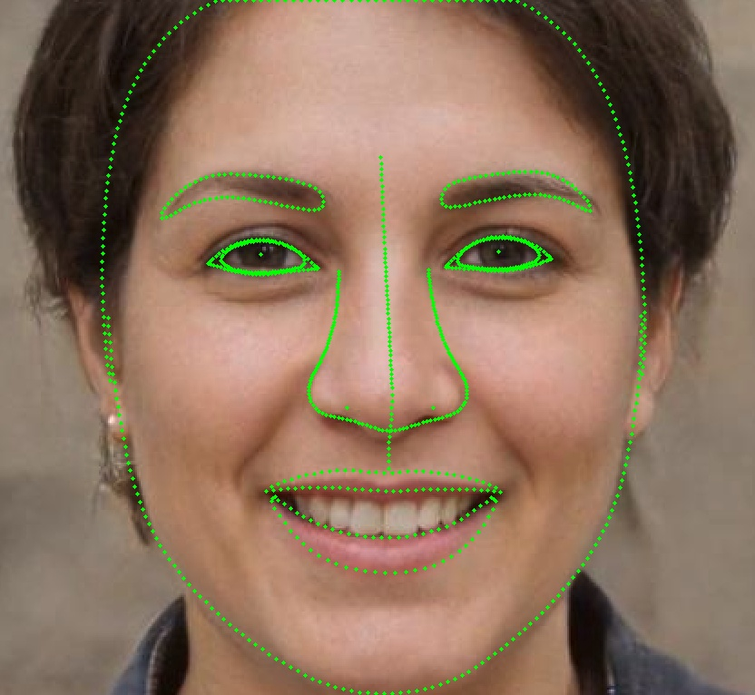
  
</div>    

更多可用的人脸关键点检测器（68点、98点、106点、1000点）:
```c++
auto *align = new lite::cv::face::align::PFLD(onnx_path);  // 106 landmarks, 1.0Mb only!
auto *align = new lite::cv::face::align::PFLD98(onnx_path);  // 98 landmarks, 4.8Mb only!
auto *align = new lite::cv::face::align::PFLD68(onnx_path);  // 68 landmarks, 2.8Mb only!
auto *align = new lite::cv::face::align::MobileNetV268(onnx_path);  // 68 landmarks, 9.4Mb only!
auto *align = new lite::cv::face::align::MobileNetV2SE68(onnx_path);  // 68 landmarks, 11Mb only!
auto *align = new lite::cv::face::align::FaceLandmark1000(onnx_path);  // 1000 landmarks, 2.0Mb only!
```

****  

<div id="lite.ai.toolkit-colorization"></div>

#### 案例3: 使用[colorization](https://github.com/richzhang/colorization) 进行图像着色。请从Model-Zoo[<sup>2</sup>](#lite.ai.toolkit-2) 下载模型文件。
```c++
#include "lite/lite.h"

static void test_default()
{
  std::string onnx_path = "../../../hub/onnx/cv/eccv16-colorizer.onnx";
  std::string test_img_path = "../../../examples/lite/resources/test_lite_colorizer_1.jpg";
  std::string save_img_path = "../../../logs/test_lite_eccv16_colorizer_1.jpg";
  
  auto *colorizer = new lite::cv::colorization::Colorizer(onnx_path);
  
  cv::Mat img_bgr = cv::imread(test_img_path);
  lite::types::ColorizeContent colorize_content;
  colorizer->detect(img_bgr, colorize_content);
  
  if (colorize_content.flag) cv::imwrite(save_img_path, colorize_content.mat);
  delete colorizer;
}
```
输出的结果是:

<div align='center'>
  
  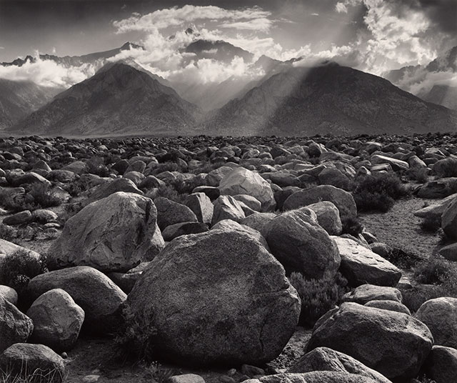
    
  <br> 
  
  
  
</div>    

更多可用的着色器模型（灰度图转彩色图）:
```c++
auto *colorizer = new lite::cv::colorization::Colorizer(onnx_path);
```

****

<div id="lite.ai.toolkit-face-recognition"></div>  

#### 案例4: 使用[ArcFace](https://github.com/deepinsight/insightface/tree/master/recognition/arcface_torch) 进行人脸识别。请从Model-Zoo[<sup>2</sup>](#lite.ai.toolkit-2) 下载模型文件。

```c++
#include "lite/lite.h"

static void test_default()
{
  std::string onnx_path = "../../../hub/onnx/cv/ms1mv3_arcface_r100.onnx";
  std::string test_img_path0 = "../../../examples/lite/resources/test_lite_faceid_0.png";
  std::string test_img_path1 = "../../../examples/lite/resources/test_lite_faceid_1.png";
  std::string test_img_path2 = "../../../examples/lite/resources/test_lite_faceid_2.png";

  auto *glint_arcface = new lite::cv::faceid::GlintArcFace(onnx_path);

  lite::types::FaceContent face_content0, face_content1, face_content2;
  cv::Mat img_bgr0 = cv::imread(test_img_path0);
  cv::Mat img_bgr1 = cv::imread(test_img_path1);
  cv::Mat img_bgr2 = cv::imread(test_img_path2);
  glint_arcface->detect(img_bgr0, face_content0);
  glint_arcface->detect(img_bgr1, face_content1);
  glint_arcface->detect(img_bgr2, face_content2);

  if (face_content0.flag && face_content1.flag && face_content2.flag)
  {
    float sim01 = lite::utils::math::cosine_similarity<float>(
        face_content0.embedding, face_content1.embedding);
    float sim02 = lite::utils::math::cosine_similarity<float>(
        face_content0.embedding, face_content2.embedding);
    std::cout << "Detected Sim01: " << sim  << " Sim02: " << sim02 << std::endl;
  }

  delete glint_arcface;
}
```

输出的结果是:
<div align='center'>
  
  
  
</div>  

> Detected Sim01: 0.721159  Sim02: -0.0626267

更多可用的人脸识别模型（人脸特征提取）:
```c++
auto *recognition = new lite::cv::faceid::GlintCosFace(onnx_path);  // DeepGlint(insightface)
auto *recognition = new lite::cv::faceid::GlintArcFace(onnx_path);  // DeepGlint(insightface)
auto *recognition = new lite::cv::faceid::GlintPartialFC(onnx_path); // DeepGlint(insightface)
auto *recognition = new lite::cv::faceid::FaceNet(onnx_path);
auto *recognition = new lite::cv::faceid::FocalArcFace(onnx_path);
auto *recognition = new lite::cv::faceid::FocalAsiaArcFace(onnx_path);
auto *recognition = new lite::cv::faceid::TencentCurricularFace(onnx_path); // Tencent(TFace)
auto *recognition = new lite::cv::faceid::TencentCifpFace(onnx_path); // Tencent(TFace)
auto *recognition = new lite::cv::faceid::CenterLossFace(onnx_path);
auto *recognition = new lite::cv::faceid::SphereFace(onnx_path);
auto *recognition = new lite::cv::faceid::PoseRobustFace(onnx_path);
auto *recognition = new lite::cv::faceid::NaivePoseRobustFace(onnx_path);
auto *recognition = new lite::cv::faceid::MobileFaceNet(onnx_path); // 3.8Mb only !
auto *recognition = new lite::cv::faceid::CavaGhostArcFace(onnx_path);
auto *recognition = new lite::cv::faceid::CavaCombinedFace(onnx_path);
auto *recognition = new lite::cv::faceid::MobileSEFocalFace(onnx_path); // 4.5Mb only !
```

****

<div id="lite.ai.toolkit-face-detection"></div>

#### 案例5: 使用[UltraFace](https://github.com/Linzaer/Ultra-Light-Fast-Generic-Face-Detector-1MB) 进行人脸检测。请从Model-Zoo[<sup>2</sup>](#lite.ai.toolkit-2) 下载模型文件。
```c++
#include "lite/lite.h"

static void test_default()
{
  std::string onnx_path = "../../../hub/onnx/cv/ultraface-rfb-640.onnx";
  std::string test_img_path = "../../../examples/lite/resources/test_lite_ultraface.jpg";
  std::string save_img_path = "../../../logs/test_lite_ultraface.jpg";

  auto *ultraface = new lite::cv::face::detect::UltraFace(onnx_path);

  std::vector<lite::types::Boxf> detected_boxes;
  cv::Mat img_bgr = cv::imread(test_img_path);
  ultraface->detect(img_bgr, detected_boxes);
  lite::utils::draw_boxes_inplace(img_bgr, detected_boxes);
  cv::imwrite(save_img_path, img_bgr);

  delete ultraface;
}
```
输出的结果是:
<div align='center'>
  
  
  
</div>  

更多可用的人脸检测器（轻量级人脸检测器）:
```c++
auto *detector = new lite::face::detect::UltraFace(onnx_path);  // 1.1Mb only !
auto *detector = new lite::face::detect::FaceBoxes(onnx_path);  // 3.8Mb only ! 
auto *detector = new lite::face::detect::RetinaFace(onnx_path);  // 1.6Mb only ! CVPR2020
```

<div id="lite.ai.toolkit-segmentation"></div>  

#### 案例6: 使用 [DeepLabV3ResNet101](https://pytorch.org/hub/pytorch_vision_deeplabv3_resnet101/) 进行语义分割. 请从Model-Zoo[<sup>2</sup>](#lite.ai.toolkit-2) 下载模型文件。
```c++
#include "lite/lite.h"

static void test_default()
{
  std::string onnx_path = "../../../hub/onnx/cv/deeplabv3_resnet101_coco.onnx";
  std::string test_img_path = "../../../examples/lite/resources/test_lite_deeplabv3_resnet101.png";
  std::string save_img_path = "../../../logs/test_lite_deeplabv3_resnet101.jpg";

  auto *deeplabv3_resnet101 = new lite::cv::segmentation::DeepLabV3ResNet101(onnx_path, 16); // 16 threads

  lite::types::SegmentContent content;
  cv::Mat img_bgr = cv::imread(test_img_path);
  deeplabv3_resnet101->detect(img_bgr, content);

  if (content.flag)
  {
    cv::Mat out_img;
    cv::addWeighted(img_bgr, 0.2, content.color_mat, 0.8, 0., out_img);
    cv::imwrite(save_img_path, out_img);
    if (!content.names_map.empty())
    {
      for (auto it = content.names_map.begin(); it != content.names_map.end(); ++it)
      {
        std::cout << it->first << " Name: " << it->second << std::endl;
      }
    }
  }
  delete deeplabv3_resnet101;
}
```

输出的结果是:  
<div align='center'>
  
  
</div> 

更多可用的语义分割模型（人像分割、实例分割）:
```c++
auto *segment = new lite::cv::segmentation::FCNResNet101(onnx_path);
auto *segment = new lite::cv::segmentation::DeepLabV3ResNet101(onnx_path);
```

<div id="lite.ai.toolkit-face-attributes-analysis"></div>    

#### 案例7: 使用 [SSRNet](https://github.com/oukohou/SSR_Net_Pytorch) 进行年龄估计. 请从Model-Zoo[<sup>2</sup>](#lite.ai.toolkit-2) 下载模型文件。
```c++
#include "lite/lite.h"

static void test_default()
{
  std::string onnx_path = "../../../hub/onnx/cv/ssrnet.onnx";
  std::string test_img_path = "../../../examples/lite/resources/test_lite_ssrnet.jpg";
  std::string save_img_path = "../../../logs/test_lite_ssrnet.jpg";

  lite::cv::face::attr::SSRNet *ssrnet = new lite::cv::face::attr::SSRNet(onnx_path);

  lite::types::Age age;
  cv::Mat img_bgr = cv::imread(test_img_path);
  ssrnet->detect(img_bgr, age);
  lite::utils::draw_age_inplace(img_bgr, age);
  cv::imwrite(save_img_path, img_bgr);
  std::cout << "Default Version Done! Detected SSRNet Age: " << age.age << std::endl;

  delete ssrnet;
}
```
输出的结果是:  
<div align='center'>
  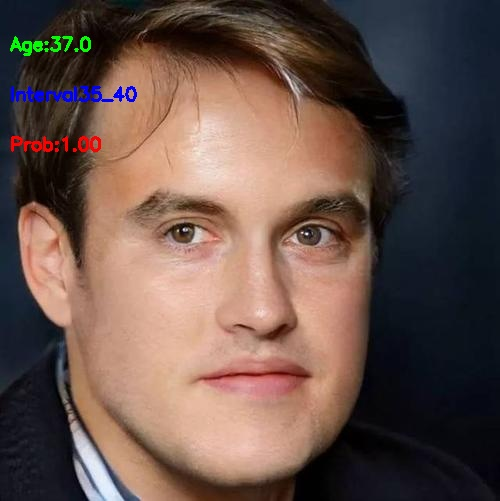
  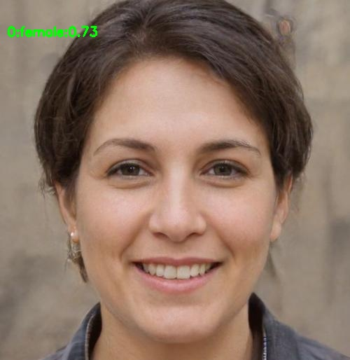
  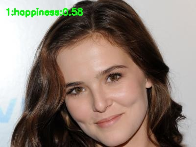
</div>    

更多可用的人脸属性识别模型（性别、年龄、情绪）:
```c++
auto *attribute = new lite::cv::face::attr::AgeGoogleNet(onnx_path);  
auto *attribute = new lite::cv::face::attr::GenderGoogleNet(onnx_path); 
auto *attribute = new lite::cv::face::attr::EmotionFerPlus(onnx_path);
auto *attribute = new lite::cv::face::attr::VGG16Age(onnx_path);
auto *attribute = new lite::cv::face::attr::VGG16Gender(onnx_path);
auto *attribute = new lite::cv::face::attr::EfficientEmotion7(onnx_path); // 7 emotions, 15Mb only!
auto *attribute = new lite::cv::face::attr::EfficientEmotion8(onnx_path); // 8 emotions, 15Mb only!
auto *attribute = new lite::cv::face::attr::MobileEmotion7(onnx_path); // 7 emotions, 13Mb only!
auto *attribute = new lite::cv::face::attr::ReXNetEmotion7(onnx_path); // 7 emotions
auto *attribute = new lite::cv::face::attr::SSRNet(onnx_path); // age estimation, 190kb only!!!
```


<div id="lite.ai.toolkit-image-classification"></div>   

#### 案例8: 使用 [DenseNet](https://pytorch.org/hub/pytorch_vision_densenet/) 进行图片1000分类. 请从Model-Zoo[<sup>2</sup>](#lite.ai.toolkit-2) 下载模型文件。
```c++
#include "lite/lite.h"

static void test_default()
{
  std::string onnx_path = "../../../hub/onnx/cv/densenet121.onnx";
  std::string test_img_path = "../../../examples/lite/resources/test_lite_densenet.jpg";

  auto *densenet = new lite::cv::classification::DenseNet(onnx_path);

  lite::types::ImageNetContent content;
  cv::Mat img_bgr = cv::imread(test_img_path);
  densenet->detect(img_bgr, content);
  if (content.flag)
  {
    const unsigned int top_k = content.scores.size();
    if (top_k > 0)
    {
      for (unsigned int i = 0; i < top_k; ++i)
        std::cout << i + 1
                  << ": " << content.labels.at(i)
                  << ": " << content.texts.at(i)
                  << ": " << content.scores.at(i)
                  << std::endl;
    }
  }
  delete densenet;
}
```

输出的结果是:  
<div align='center'>
  
  
</div>  

更多可用的图像分类模型（1000类）:
```c++
auto *classifier = new lite::cv::classification::EfficientNetLite4(onnx_path);  
auto *classifier = new lite::cv::classification::ShuffleNetV2(onnx_path); // 8.7Mb only!
auto *classifier = new lite::cv::classification::GhostNet(onnx_path);
auto *classifier = new lite::cv::classification::HdrDNet(onnx_path);
auto *classifier = new lite::cv::classification::IBNNet(onnx_path);
auto *classifier = new lite::cv::classification::MobileNetV2(onnx_path); // 13Mb only!
auto *classifier = new lite::cv::classification::ResNet(onnx_path); 
auto *classifier = new lite::cv::classification::ResNeXt(onnx_path);
```


<div id="lite.ai.toolkit-head-pose-estimation"></div>   

#### 案例9: 使用 [FSANet](https://github.com/omasaht/headpose-fsanet-pytorch) 进行头部姿态识别. 请从Model-Zoo[<sup>2</sup>](#lite.ai.toolkit-2) 下载模型文件。

```c++
#include "lite/lite.h"

static void test_default()
{
  std::string onnx_path = "../../../hub/onnx/cv/fsanet-var.onnx";
  std::string test_img_path = "../../../examples/lite/resources/test_lite_fsanet.jpg";
  std::string save_img_path = "../../../logs/test_lite_fsanet.jpg";

  auto *fsanet = new lite::cv::face::pose::FSANet(onnx_path);
  cv::Mat img_bgr = cv::imread(test_img_path);
  lite::types::EulerAngles euler_angles;
  fsanet->detect(img_bgr, euler_angles);
  
  if (euler_angles.flag)
  {
    lite::utils::draw_axis_inplace(img_bgr, euler_angles);
    cv::imwrite(save_img_path, img_bgr);
    std::cout << "yaw:" << euler_angles.yaw << " pitch:" << euler_angles.pitch << " row:" << euler_angles.roll << std::endl;
  }
  delete fsanet;
}
```

输出的结果是:  
<div align='center'>
  
  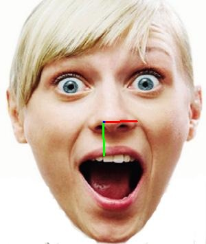
  
</div>  

更多可用的头部姿态识别模型（欧拉角、yaw、pitch、roll）:
```c++
auto *pose = new lite::cv::face::pose::FSANet(onnx_path); // 1.2Mb only!
```

<div id="lite.ai.toolkit-style-transfer"></div>  

#### 案例10: 使用 [FastStyleTransfer](https://github.com/onnx/models/tree/master/vision/style_transfer/fast_neural_style) 进行风格迁移. 请从Model-Zoo[<sup>2</sup>](#lite.ai.toolkit-2) 下载模型文件。
```c++
#include "lite/lite.h"

static void test_default()
{
  std::string onnx_path = "../../../hub/onnx/cv/style-candy-8.onnx";
  std::string test_img_path = "../../../examples/lite/resources/test_lite_fast_style_transfer.jpg";
  std::string save_img_path = "../../../logs/test_lite_fast_style_transfer_candy.jpg";
  
  auto *fast_style_transfer = new lite::cv::style::FastStyleTransfer(onnx_path);
 
  lite::types::StyleContent style_content;
  cv::Mat img_bgr = cv::imread(test_img_path);
  fast_style_transfer->detect(img_bgr, style_content);

  if (style_content.flag) cv::imwrite(save_img_path, style_content.mat);
  delete fast_style_transfer;
}
```
输出的结果是:  

<div align='center'>
  
  
    
  <br> 
  
  
  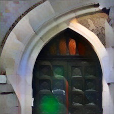
</div>

更多可用的风格迁移模型（自然风格迁移、其他）:
```c++
auto *transfer = new lite::cv::style::FastStyleTransfer(onnx_path); // 6.4Mb only
```

## 4. 开源协议

<div id="lite.ai.toolkit-License"></div>

[Lite.AI.ToolKit](#lite.ai.toolkit-Introduction) 的代码采用GPL-3.0协议。


## 5. 引用参考

<div id="lite.ai.toolkit-References"></div>

本项目参考了以下开源项目。

* [RobustVideoMatting](https://github.com/PeterL1n/RobustVideoMatting) (🔥🔥🔥new!!↑)
* [nanodet](https://github.com/RangiLyu/nanodet) (🔥🔥🔥↑)
* [YOLOX](https://github.com/Megvii-BaseDetection/YOLOX) (🔥🔥🔥new!!↑)
* [YOLOP](https://github.com/hustvl/YOLOP) (🔥🔥new!!↑)
* [YOLOR](https://github.com/WongKinYiu/yolor) (🔥🔥new!!↑)
* [ScaledYOLOv4](https://github.com/WongKinYiu/ScaledYOLOv4) (🔥🔥🔥↑)
* [insightface](https://github.com/deepinsight/insightface) (🔥🔥🔥↑)
* [yolov5](https://github.com/ultralytics/yolov5) (🔥🔥💥↑)
* [TFace](https://github.com/Tencent/TFace) (🔥🔥↑)
* [YOLOv4-pytorch](https://github.com/argusswift/YOLOv4-pytorch) (🔥🔥🔥↑)
* [Ultra-Light-Fast-Generic-Face-Detector-1MB](https://github.com/Linzaer/Ultra-Light-Fast-Generic-Face-Detector-1MB) (🔥🔥🔥↑)

<details>
<summary> 展开更多引用参考 </summary>  

* [headpose-fsanet-pytorch](https://github.com/omasaht/headpose-fsanet-pytorch) (🔥↑)
* [pfld_106_face_landmarks](https://github.com/Hsintao/pfld_106_face_landmarks) (🔥🔥↑)
* [onnx-models](https://github.com/onnx/models) (🔥🔥🔥↑)
* [SSR_Net_Pytorch](https://github.com/oukohou/SSR_Net_Pytorch) (🔥↑)
* [colorization](https://github.com/richzhang/colorization) (🔥🔥🔥↑)
* [SUB_PIXEL_CNN](https://github.com/niazwazir/SUB_PIXEL_CNN) (🔥↑)
* [torchvision](https://github.com/pytorch/vision) (🔥🔥🔥↑)
* [facenet-pytorch](https://github.com/timesler/facenet-pytorch) (🔥↑)
* [face.evoLVe.PyTorch](https://github.com/ZhaoJ9014/face.evoLVe.PyTorch) (🔥🔥🔥↑)
* [center-loss.pytorch](https://github.com/louis-she/center-loss.pytorch) (🔥🔥↑)
* [sphereface_pytorch](https://github.com/clcarwin/sphereface_pytorch) (🔥🔥↑)
* [DREAM](https://github.com/penincillin/DREAM) (🔥🔥↑)
* [MobileFaceNet_Pytorch](https://github.com/Xiaoccer/MobileFaceNet_Pytorch) (🔥🔥↑)
* [cavaface.pytorch](https://github.com/cavalleria/cavaface.pytorch) (🔥🔥↑)
* [CurricularFace](https://github.com/HuangYG123/CurricularFace) (🔥🔥↑)
* [face-emotion-recognition](https://github.com/HSE-asavchenko/face-emotion-recognition) (🔥↑)
* [face_recognition.pytorch](https://github.com/grib0ed0v/face_recognition.pytorch) (🔥🔥↑)
* [PFLD-pytorch](https://github.com/polarisZhao/PFLD-pytorch) (🔥🔥↑)
* [pytorch_face_landmark](https://github.com/cunjian/pytorch_face_landmark) (🔥🔥↑)
* [FaceLandmark1000](https://github.com/Single430/FaceLandmark1000) (🔥🔥↑)
* [Pytorch_Retinaface](https://github.com/biubug6/Pytorch_Retinaface) (🔥🔥🔥↑)
* [FaceBoxes](https://github.com/zisianw/FaceBoxes.PyTorch) (🔥🔥↑)

</details>    


## 6. 编译选项
未来会增加一些模型的[MNN](https://github.com/alibaba/MNN) 、[NCNN](https://github.com/Tencent/ncnn) 和 [TNN](https://github.com/Tencent/TNN) 支持，但由于算子兼容等原因，也无法确保所有被[ONNXRuntime C++](https://github.com/microsoft/onnxruntime) 支持的模型能够在[MNN](https://github.com/alibaba/MNN) 、[NCNN](https://github.com/Tencent/ncnn) 和 [TNN](https://github.com/Tencent/TNN) 下跑通。所以，如果您想使用本项目支持的所有模型，并且不在意*1~2ms*的性能差距的话，请使用ONNXRuntime版本的实现。[ONNXRuntime](https://github.com/microsoft/onnxruntime) 是本仓库默认的推理引擎。但是如果你确实希望编译支持[MNN](https://github.com/alibaba/MNN) 、[NCNN](https://github.com/Tencent/ncnn) 和 [TNN](https://github.com/Tencent/TNN) 支持的Lite.AI.ToolKit🍅🍅动态库，你可以按照以下的步骤进行设置。

* 在`build.sh`中添加`DENABLE_MNN=ON` 、`DENABLE_NCNN=ON` 或 `DENABLE_TNN=ON`，比如
```shell
cd build && cmake \
  -DCMAKE_BUILD_TYPE=MinSizeRel \
  -DINCLUDE_OPENCV=ON \   # 是否打包OpenCV进lite.ai.toolkit，默认ON；否则，你需要单独设置OpenCV
  -DENABLE_MNN=ON \       # 是否编译MNN版本的模型， 默认OFF，目前只支持部分模型
  -DENABLE_NCNN=OFF \     # 是否编译NCNN版本的模型，默认OFF，目前只支持部分模型
  -DENABLE_TNN=OFF \      # 是否编译TNN版本的模型， 默认OFF，目前只支持部分模型
  .. && make -j8
```  
* 使用MNN、NCNN或TNN版本的接口，详见案例[demo](https://github.com/DefTruth/lite.ai.toolkit/blob/main/examples/lite/cv/test_lite_nanodet.cpp) ，比如
```C++
auto *nanodet = new lite::mnn::cv::detection::NanoDet(mnn_path);
auto *nanodet = new lite::tnn::cv::detection::NanoDet(proto_path, model_path);
auto *nanodet = new lite::ncnn::cv::detection::NanoDet(param_path, bin_path);
```

## 7. 引用

如果您在自己的项目中使用了*Lite.AI.ToolKit*，可考虑按以下方式进行引用。
```BibTeX
@misc{lite.ai.toolkit2021,
  title={lite.ai.toolkit: A lite C++ toolkit of awesome AI models.},
  url={https://github.com/DefTruth/lite.ai.toolkit},
  note={Open-source software available at https://github.com/DefTruth/lite.ai.toolkit},
  author={Yan Jun},
  year={2021}
}
```  

<p align="center"> 若是有用，❤️不妨给个⭐️🌟支持一下吧，感谢支持~  </p>
