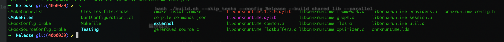
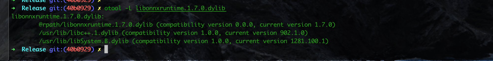

# MacOS源码编译onnxruntime

## 1. git拉取分支
```shell
git clone --depth=1 --branch v1.7.0 https://github.com.cnpmjs.org/microsoft/onnxruntime.git
```  
注意，`--depth=1 --branch v1.7.0`表示只拉取分支*v1.7.0*的最新提交，如果不指定这个参数，则会拉取所有的历史版本。而`.cnpmjs.org`后缀则是参考[利用github.com.cnpmjs.org快速下载GitHub仓库](https://note.qidong.name/2020/12/github-proxy/)来加速国内github仓库的下载。你也可以选择直接修改`~/.gitconfig`文件来达到同样的目的。
## 2. build.sh编译选项解读
### 2.1 build.sh源码分析
我们首先看一下这个脚本长啥样：
```bash
#!/bin/bash
# Get directory this script is in
DIR="$( cd "$( dirname "${BASH_SOURCE[0]}" )" && pwd )"
OS=$(uname -s)
if [ "$OS" = "Darwin" ]; then
    DIR_OS="MacOS"
else
    DIR_OS="Linux"
fi

if [[ "$*" == *"--ios"* ]]; then
    DIR_OS="iOS"
elif [[ "$*" == *"--android"* ]]; then
    DIR_OS="Android"
fi
#requires python3.6 or higher
python3 $DIR/tools/ci_build/build.py --build_dir $DIR/build/$DIR_OS "$@"
```  
其实build.sh干的事情只是判断操作系统类型以及获取当前目录，然后把编译参数`"$@"`原封不动地传给`build.py`这个脚本。 所以真正的构建过程都在这个脚本里。
```shell
➜  onnxruntime git:(40b0929) ✗ DIR="$( cd "$( dirname "${BASH_SOURCE[0]}" )" && pwd )"
➜  onnxruntime git:(40b0929) ✗ echo ${DIR}
/Users/xxx/xxx/third_party/library/onnxruntime
➜  onnxruntime git:(40b0929) ✗ OS=$(uname -s)
➜  onnxruntime git:(40b0929) ✗ echo ${OS}
Darwin
```

### 2.2 build.py脚本及编译选项
打开`tools/ci_build/build.py`我们发现里面的代码还不少，针对各种平台的编译都做了设置。具体的细节大家可以自己看，这里只罗列一些关键的选项。如果只是编译MacOS上的cpu(x86_64)版本，我们主要看以下几个参数就够了：
```python
    # Main arguments
    parser.add_argument(
        "--build_dir", required=True, help="Path to the build directory.")
    parser.add_argument(
        "--config", nargs="+", default=["Debug"],
        choices=["Debug", "MinSizeRel", "Release", "RelWithDebInfo"],
        help="Configuration(s) to build.")
    parser.add_argument(
        "--update", action='store_true', help="Update makefiles.")
    parser.add_argument("--build", action='store_true', help="Build.")
    parser.add_argument(
        "--parallel", nargs='?', const='0', default='1', type=int,
        help="Use parallel build. The optional value specifies the maximum number of parallel jobs. "
             "If the optional value is 0 or unspecified, it is interpreted as the number of CPUs.")
    parser.add_argument(
        "--skip_tests", action='store_true', help="Skip all tests.")
    # Build a shared lib
    parser.add_argument(
        "--build_shared_lib", action='store_true',
        help="Build a shared library for the ONNXRuntime.")
```
参数解释：
* `--build_dir`：指定编译后的库文件存放路径，不能为空
* `--config`：指定编译的库类型，有4种选择，`["Debug", "MinSizeRel", "Release", "RelWithDebInfo"]`，MinSizeRel可以用于优化目标文件的大小，具体可以参考[CMake选项减少目标文件大小](https://blog.csdn.net/Huoon/article/details/108520571)。都可以正常使用，我最后使用的是MinSizeRel版本的动态库。

* `--update`：是否更新makefile文件，这里解释一下`action='store_true'`，意思是，一旦在命令行指定了`--update`，则`args.update`会被设置成`True`，否则为`False`；所以，所有指定了`action='store_true'`的参数，默认值都为`False`
* `--parallel`：是否利用多核并行构建，用就是了。
* `--skip_tests`：是否跳过单元测试，不跳过编译过程会慢很多，建议跳过。
* `--build_shared_lib`：注意，如果你需要编译一个动态库，则需要指定此参数，否则编译的是静态库。  

这个几种方式编译出来的目标文件大小如下(Debug版本没有编译)：  
  
|RelWithDebInfo|Release|MinSizeRel|
|---|---|---|
|19Mb|15Mb|12Mb|  


那么接下来的问题是，这些编译选项究竟是如何和cmake关联起来，以串联整个构建过程的呢？这主要是通过`generate_build_tree`这个函数，函数太长，我摘录了关键部分：
```python
def generate_build_tree(cmake_path, source_dir, build_dir, cuda_home, cudnn_home, rocm_home,
                        mpi_home, nccl_home, tensorrt_home, migraphx_home, acl_home, acl_libs, armnn_home, armnn_libs,
                        path_to_protoc_exe, configs, cmake_extra_defines, args, cmake_extra_args):
    log.info("Generating CMake build tree")
    # 这句很重要 确定了cmake构建初始化时需要的CMakeLists.txt的所在路径
    # 即 your-path-to/onnxruntime/cmake/CMakeLists.txt
    cmake_dir = os.path.join(source_dir, "cmake")
    # 只展示部分选项
    cmake_args = [
        cmake_path, cmake_dir,
        "-Donnxruntime_RUN_ONNX_TESTS=" + ("ON" if args.enable_onnx_tests else "OFF"),
        "-Donnxruntime_BUILD_WINML_TESTS=" + ("OFF" if args.skip_winml_tests else "ON"),
        "-Donnxruntime_GENERATE_TEST_REPORTS=ON",
        # Need to use 'is not None' with minimal_build check as it could be an empty list.
        "-Donnxruntime_MINIMAL_BUILD=" + ("ON" if args.minimal_build is not None else "OFF"),
        "-Donnxruntime_EXTENDED_MINIMAL_BUILD=" + ("ON" if args.minimal_build and 'extended' in args.minimal_build
                                                   else "OFF"),
        "-Donnxruntime_MINIMAL_BUILD_CUSTOM_OPS=" + ("ON" if args.minimal_build and 'custom_ops' in args.minimal_build
                                                     else "OFF"),
        "-Donnxruntime_REDUCED_OPS_BUILD=" + ("ON" if args.include_ops_by_config else "OFF"),
        "-Donnxruntime_MSVC_STATIC_RUNTIME=" + ("ON" if args.enable_msvc_static_runtime else "OFF"),
        # enable pyop if it is nightly build
        "-Donnxruntime_ENABLE_LANGUAGE_INTEROP_OPS=" + ("ON" if args.enable_language_interop_ops else "OFF"),
        "-Donnxruntime_USE_DML=" + ("ON" if args.use_dml else "OFF"),
        "-Donnxruntime_USE_WINML=" + ("ON" if args.use_winml else "OFF"),
        "-Donnxruntime_BUILD_MS_EXPERIMENTAL_OPS=" + ("ON" if args.ms_experimental else "OFF"),
        "-Donnxruntime_USE_TELEMETRY=" + ("ON" if args.use_telemetry else "OFF"),
        "-Donnxruntime_ENABLE_LTO=" + ("ON" if args.enable_lto else "OFF"),
        "-Donnxruntime_USE_ACL=" + ("ON" if args.use_acl else "OFF"),
        "-Donnxruntime_USE_ACL_1902=" + ("ON" if args.use_acl == "ACL_1902" else "OFF"),
        "-Donnxruntime_USE_ACL_1905=" + ("ON" if args.use_acl == "ACL_1905" else "OFF"),
        "-Donnxruntime_USE_ACL_1908=" + ("ON" if args.use_acl == "ACL_1908" else "OFF"),
        "-Donnxruntime_USE_ACL_2002=" + ("ON" if args.use_acl == "ACL_2002" else "OFF"),
        "-Donnxruntime_USE_ARMNN=" + ("ON" if args.use_armnn else "OFF"),
        "-Donnxruntime_ARMNN_RELU_USE_CPU=" + ("OFF" if args.armnn_relu else "ON"),
        "-Donnxruntime_ARMNN_BN_USE_CPU=" + ("OFF" if args.armnn_bn else "ON"),
        # 省略很多选项 有兴趣的读者可以查看build.py源码
        "-Donnxruntime_USE_MPI=" + ("ON" if args.use_mpi else "OFF"),
        "-Donnxruntime_ENABLE_MEMORY_PROFILE=" + ("ON" if args.enable_memory_profile else "OFF"),
    ]
    # 省略一大段代码
    for config in configs:
        config_build_dir = get_config_build_dir(build_dir, config)
        os.makedirs(config_build_dir, exist_ok=True)
        if args.use_nuphar:
            os.environ["PATH"] = os.path.join(
                config_build_dir, "external", "tvm",
                config) + os.pathsep + os.path.dirname(sys.executable) + os.pathsep + os.environ["PATH"]
        # 在这里执行编译命令
        run_subprocess(
            cmake_args + [
                "-Donnxruntime_ENABLE_MEMLEAK_CHECKER=" +
                ("ON" if config.lower() == 'debug' and not args.use_nuphar and not
                 args.use_openvino and not
                 args.enable_msvc_static_runtime
                 else "OFF"), "-DCMAKE_BUILD_TYPE={}".format(config)],
            cwd=config_build_dir)
```  
上面最重要的有两部分，第一部分是确定了CMakeLists.txt工程文件的路径，这是整个构建的入口。第二部分则是，启动了另一个函数，来运行构建进程。
```python
def run_subprocess(args, cwd=None, capture_stdout=False, dll_path=None,
                   shell=False, env={}):
    if isinstance(args, str):
        raise ValueError("args should be a sequence of strings, not a string")

    my_env = os.environ.copy()
    if dll_path:
        if is_windows():
            my_env["PATH"] = dll_path + os.pathsep + my_env["PATH"]
        else:
            if "LD_LIBRARY_PATH" in my_env:
                my_env["LD_LIBRARY_PATH"] += os.pathsep + dll_path
            else:
                my_env["LD_LIBRARY_PATH"] = dll_path

    my_env.update(env)

    return run(*args, cwd=cwd, capture_stdout=capture_stdout, shell=shell, env=my_env)
```  
抛开所有的细节不管，这一大串代码的意思无非就是：
```shell
cmake your-path-to/onnxruntime/cmake -Donnxruntime_RUN_ONNX_TESTS=OFF -Donnxruntime_BUILD_WINML_TESTS=OFF ...
```
其实就是常规的cmake初始化项目构建信息的过程。那么问题又来了，到这里只是初始化了构建信息呀，没有具体的build啊。不要着急，我们再来挖一挖build.py中的main函数代码：

```python
def main():
    # 省略一大段
    # 这是build.py中main函数的一段代码
        if args.enable_pybind and is_windows():
            install_python_deps(args.numpy_version)
        if args.enable_onnx_tests:
            setup_test_data(build_dir, configs)
        # 初始化构建信息    
        generate_build_tree(
            cmake_path, source_dir, build_dir, cuda_home, cudnn_home, rocm_home, mpi_home, nccl_home,
            tensorrt_home, migraphx_home, acl_home, acl_libs, armnn_home, armnn_libs,
            path_to_protoc_exe, configs, cmake_extra_defines, args, cmake_extra_args)
            
    if args.build:
        if args.parallel < 0:
            raise BuildError("Invalid parallel job count: {}".format(args.parallel))
        num_parallel_jobs = os.cpu_count() if args.parallel == 0 else args.parallel
        # build的过程在这里
        build_targets(args, cmake_path, build_dir, configs, num_parallel_jobs, args.target)
```  
发现最后的build被放在了`build_targets`函数中，这个函数长这样：
```python
def build_targets(args, cmake_path, build_dir, configs, num_parallel_jobs, target=None):
    for config in configs:
        log.info("Building targets for %s configuration", config)
        build_dir2 = get_config_build_dir(build_dir, config)
        cmd_args = [cmake_path,
                    "--build", build_dir2,
                    "--config", config]
        if target:
            cmd_args.extend(['--target', target])

       #省略
        run_subprocess(cmd_args, env=env)
```  
总的来说，这个函数其实是执行了一条类似以下的命令：
```shell
cmake --build your-path-to/onnxruntime/build/MacOS/Release --config Release
```
至此，这个流程就算是走完了，总结一下：


## 3. CMakeLists工程文件简介
### 3.1 CMakeLists中的编译选项
上一部分有讲到，build.py实际上是处理了一系列的工程初始化和构建问题。`generate_build_tree`中所有的编译选项，都可以在这个CMakeLists.txt中找到预设的值，如：
```cmake
if(NOT CMAKE_BUILD_TYPE)
  message(STATUS "Build type not set - using RelWithDebInfo")
  set(CMAKE_BUILD_TYPE "RelWithDebInfo" CACHE STRING "Choose build type: Debug Release RelWithDebInfo MinSizeRel." FORCE)
endif()

# Options
option(onnxruntime_RUN_ONNX_TESTS "Enable ONNX Compatibility Testing" OFF)
option(onnxruntime_GENERATE_TEST_REPORTS "Enable test report generation" OFF)
option(onnxruntime_ENABLE_STATIC_ANALYSIS "Enable static analysis" OFF)
option(onnxruntime_ENABLE_PYTHON "Enable python buildings" OFF)
# Enable it may cause LNK1169 error
option(onnxruntime_ENABLE_MEMLEAK_CHECKER "Experimental: Enable memory leak checker in Windows debug build" OFF)
option(onnxruntime_USE_CUDA "Build with CUDA support" OFF)
option(onnxruntime_ENABLE_CUDA_LINE_NUMBER_INFO "When building with CUDA support, generate device code line number information." OFF)
option(onnxruntime_USE_OPENVINO "Build with OpenVINO support" OFF)
option(onnxruntime_USE_COREML "Build with CoreML support" OFF)
option(onnxruntime_USE_NNAPI_BUILTIN "Build with builtin NNAPI lib for Android NNAPI support" OFF)
option(onnxruntime_USE_RKNPU "Build with RKNPU support" OFF)
option(onnxruntime_USE_DNNL "Build with DNNL support" OFF)
option(onnxruntime_USE_FEATURIZERS "Build ML Featurizers support" OFF)
option(onnxruntime_DEV_MODE "Enable developer warnings and treat most of them as error." OFF)
option(onnxruntime_MSVC_STATIC_RUNTIME "Compile for the static CRT" OFF)
option(onnxruntime_GCC_STATIC_CPP_RUNTIME "Compile for the static libstdc++" OFF)
option(onnxruntime_BUILD_UNIT_TESTS "Build ONNXRuntime unit tests" ON) 
option(onnxruntime_BUILD_CSHARP "Build C# library" OFF)
option(onnxruntime_USE_PREINSTALLED_EIGEN "Use pre-installed EIGEN. Need to provide eigen_SOURCE_PATH if turn this on." OFF)
option(onnxruntime_BUILD_BENCHMARKS "Build ONNXRuntime micro-benchmarks" OFF)
# 省略一大堆option
```  
`generate_build_tree`会在运行时，根据我们传入的实际参数，修改CMakeLists.txt中预设的值

### 3.2 对PRIVATE链接的理解
```cmake
# In case we are building static libraries, link also the runtime library statically
    # so that MSVCR*.DLL is not required at runtime.
    # https://msdn.microsoft.com/en-us/library/2kzt1wy3.aspx
    # This is achieved by replacing msvc option /MD with /MT and /MDd with /MTd
    # https://gitlab.kitware.com/cmake/community/wikis/FAQ#how-can-i-build-my-msvc-application-with-a-static-runtime
```
这块我现在也没完全整明白，我对一下这几段cmake代码的大致的理解是，指定的onnxruntime动态库，并且添加许多`PRIVATE`依赖，并且所有的依赖都是静态的，因为add_library默认添加静态库，而依赖库在被添加时，并没有指定`SHARED`；`PRIVATE`意味着只在onnxruntime的链接阶段需要用到这些依赖库，onnxruntime的源码中cpp文件包含了依赖库的头文件，但是onnxruntime暴露给用户使用的头文件并没有包含依赖库的头文件。所以在编译+链接完成后，我们只需要onnxruntime本身的头文件就可以了，不用去管第三方库的头文件。参考[PRIVATE|PUBLIC|INTERFACE的含义与生成的so库的关系](https://blog.csdn.net/weixin_42539973/article/details/113048985?utm_medium=distribute.pc_relevant.none-task-blog-baidujs_title-0&spm=1001.2101.3001.4242)

```cmake
# 摘自onnxruntime.cmake
if(WIN32)
    onnxruntime_add_shared_library(onnxruntime
      ${SYMBOL_FILE}
      "${ONNXRUNTIME_ROOT}/core/dll/dllmain.cc"
      "${ONNXRUNTIME_ROOT}/core/dll/onnxruntime.rc"
    )
else()
    onnxruntime_add_shared_library(onnxruntime ${CMAKE_CURRENT_BINARY_DIR}/generated_source.c)
endif() 
# 摘自CMakeLists.txt
function(onnxruntime_add_shared_library target_name)
  add_library(${target_name} SHARED ${ARGN})
  target_link_directories(${target_name} PRIVATE ${onnxruntime_LINK_DIRS}) 
  if (MSVC)
    target_compile_options(${target_name} PRIVATE "$<$<COMPILE_LANGUAGE:CUDA>:SHELL:--compiler-options /utf-8>" "$<$<NOT:$<COMPILE_LANGUAGE:CUDA>>:/utf-8>")
    target_compile_options(${target_name} PRIVATE "$<$<COMPILE_LANGUAGE:CUDA>:SHELL:--compiler-options /sdl>" "$<$<NOT:$<COMPILE_LANGUAGE:CUDA>>:/sdl>")
    set_target_properties(${target_name} PROPERTIES VS_CA_EXCLUDE_PATH "${CMAKE_CURRENT_SOURCE_DIR}")
  else()
    target_compile_definitions(${target_name} PUBLIC -DNSYNC_ATOMIC_CPP11)
    target_include_directories(${target_name} PRIVATE "${CMAKE_CURRENT_SOURCE_DIR}/external/nsync/public")
  endif()
  target_include_directories(${target_name} PRIVATE ${CMAKE_CURRENT_BINARY_DIR} ${ONNXRUNTIME_ROOT})
  if(onnxruntime_ENABLE_LTO)
    set_target_properties(${target_name} PROPERTIES INTERPROCEDURAL_OPTIMIZATION_RELEASE TRUE)
    set_target_properties(${target_name} PROPERTIES INTERPROCEDURAL_OPTIMIZATION_RELWITHDEBINFO TRUE)
    set_target_properties(${target_name} PROPERTIES INTERPROCEDURAL_OPTIMIZATION_MINSIZEREL TRUE)
  endif()
endfunction()
# 摘自onnxruntime.cmake
target_link_libraries(onnxruntime PRIVATE
    onnxruntime_session
    ${onnxruntime_libs}
    ${PROVIDERS_CUDA}
    ${PROVIDERS_NNAPI}
    ${PROVIDERS_RKNPU}
    ${PROVIDERS_MIGRAPHX}
    ${PROVIDERS_NUPHAR}
    ${PROVIDERS_VITISAI}
    ${PROVIDERS_DML}
    ${PROVIDERS_ACL}
    ${PROVIDERS_ARMNN}
    ${PROVIDERS_INTERNAL_TESTING}
    ${onnxruntime_winml}
    ${PROVIDERS_ROCM}
    ${PROVIDERS_COREML}
    onnxruntime_optimizer
    onnxruntime_providers
    onnxruntime_util
    ${onnxruntime_tvm_libs}
    onnxruntime_framework
    onnxruntime_graph
    onnxruntime_common
    onnxruntime_mlas
    onnxruntime_flatbuffers
    ${onnxruntime_EXTERNAL_LIBRARIES})

```
## 4. 源码编译与brew安装的区别
* @rpath相关知识点
* [关于Mac下动态库路径问题总结](https://www.jianshu.com/p/7f1b50b502d3?utm_campaign=maleskine&utm_content=note&utm_medium=seo_notes&utm_source=recommendation)
* [Mac dylib动态库加载路径问题](https://www.it610.com/article/1281775382382526464.htm)
* [otool的一些用途](https://www.jianshu.com/p/fc67f95eee41?utm_campaign=maleskine&utm_content=note&utm_medium=seo_notes&utm_source=recommendation)
* [iOS 逆向----otool命令入门](https://www.jianshu.com/p/c0a8df55ffdd?utm_campaign=maleskine&utm_content=note&utm_medium=seo_notes&utm_source=recommendation)

说了那么多，其实在MacOS下，一句brew就可以一键安装：
```shell
brew update
brew install onnxruntime
```
但由onnxruntime的Formula源码可以看到，在brew安装后会执行`make install`安装在默认的系统目录下，并且动态库的依赖库路径是绝对路径，即类似于`usr/local/...`；我尝试使用install_name_tool进行修改，但并未成功。贴一下onnxruntime的Formula源码：
```bash
def install
    cmake_args = %W[
      -Donnxruntime_RUN_ONNX_TESTS=OFF
      -Donnxruntime_GENERATE_TEST_REPORTS=OFF
      -DPYTHON_EXECUTABLE=#{Formula["python@3.9"].opt_bin}/python3
      -Donnxruntime_BUILD_SHARED_LIB=ON
      -Donnxruntime_BUILD_UNIT_TESTS=OFF
    ]

    mkdir "build" do
      system "cmake", "../cmake", *std_cmake_args, *cmake_args
      system "make", "install"
    end
  end
```

## 5. 编译过程
剩下的就是执行编译命令了。当然这里可能还有个坑，在编译之前你需要先同步onnxruntime的第三方库，否则会编译失败，可以参考onnxruntime官方的[onnxruntime-MacOS CI Pipeline](https://dev.azure.com/onnxruntime/onnxruntime/_build/results?buildId=354028&view=logs&j=7636b40b-abcf-5c6b-cc48-bcd7d4ae0854&t=4f922874-195a-5571-f5f1-e2f658fa1687)  
先同步需要编译的第三方库：
```shell
git  submodule update --init --force --recursive
```  
如果遇到科学上网的问题，可以参考[利用github.com.cnpmjs.org快速下载GitHub仓库](https://note.qidong.name/2020/12/github-proxy/)解决。由于依赖库还有依赖库，所以其实需要下载挺多第三方库的。不过还好数的过来。我个人是手动在github.com后添加cnpmjs.org；比如
```shell
cd .git
vim config
```
修改成:
```shell
[core]
	repositoryformatversion = 0
	filemode = true
	bare = false
	logallrefupdates = true
	ignorecase = true
	precomposeunicode = true
[remote "origin"]
	url = https://github.com.cnpmjs.org/microsoft/onnxruntime.git
	fetch = +refs/tags/v1.7.0:refs/tags/v1.7.0
```

进行编译：
```shell
bash ./build.sh --skip_tests --config RelWithDebInfo --build_shared_lib --parallel

bash ./build.sh --skip_tests --config MinSizeRel --build_shared_lib --parallel

bash ./build.sh --skip_tests --config Release --build_shared_lib --parallel
```


编译成功：
```shell
[ 98%] Building CXX object CMakeFiles/onnxruntime_providers.dir/Users/yanjunqiu/Desktop/third_party/library/onnxruntime/onnxruntime/contrib_ops/cpu/skip_layer_norm.cc.o
[ 98%] Building CXX object CMakeFiles/onnxruntime_providers.dir/Users/yanjunqiu/Desktop/third_party/library/onnxruntime/onnxruntime/contrib_ops/cpu/tokenizer.cc.o
[100%] Building CXX object CMakeFiles/onnxruntime_providers.dir/Users/yanjunqiu/Desktop/third_party/library/onnxruntime/onnxruntime/contrib_ops/cpu/trilu.cc.o
[100%] Building CXX object CMakeFiles/onnxruntime_providers.dir/Users/yanjunqiu/Desktop/third_party/library/onnxruntime/onnxruntime/contrib_ops/cpu/unique.cc.o
[100%] Building CXX object CMakeFiles/onnxruntime_providers.dir/Users/yanjunqiu/Desktop/third_party/library/onnxruntime/onnxruntime/contrib_ops/cpu/word_conv_embedding.cc.o
[100%] Linking CXX static library libonnxruntime_providers.a
/Library/Developer/CommandLineTools/usr/bin/ranlib: file: libonnxruntime_providers.a(dft.cc.o) has no symbols
/Library/Developer/CommandLineTools/usr/bin/ranlib: file: libonnxruntime_providers.a(window_functions.cc.o) has no symbols
/Library/Developer/CommandLineTools/usr/bin/ranlib: file: libonnxruntime_providers.a(dft.cc.o) has no symbols
/Library/Developer/CommandLineTools/usr/bin/ranlib: file: libonnxruntime_providers.a(window_functions.cc.o) has no symbols
[100%] Built target onnxruntime_providers
[100%] Building C object CMakeFiles/onnxruntime.dir/generated_source.c.o
[100%] Linking CXX shared library libonnxruntime.dylib
[100%] Built target onnxruntime
2021-04-15 22:39:10,495 util.run [DEBUG] - Subprocess completed. Return code: 0
2021-04-15 22:39:10,496 build [INFO] - Build complete
```
文件如下：

我们使用otool来查看一下libonnxruntime的依赖库路径：

看起来挺正常。你可以在这里找到我编译好的动态库[libonnxruntime.1.7.0.dylib](https://github.com/DefTruth/litehub/tree/main/third_party) ，以及一些c++接口的使用案例[onnxruntime-c++-examples](https://github.com/DefTruth/litehub/tree/main/examples/ort/cv)

## 6. 参考资料
* [1] [onnxruntime-MacOS CI Pipeline](https://dev.azure.com/onnxruntime/onnxruntime/_build/results?buildId=354028&view=logs&j=7636b40b-abcf-5c6b-cc48-bcd7d4ae0854&t=4f922874-195a-5571-f5f1-e2f658fa1687)
* [2] [Homebrew Formula for onnxruntime](https://github.com/Homebrew/homebrew-core/blob/HEAD/Formula/onnxruntime.rb)
* [3] [onnxruntime源码编译](https://blog.csdn.net/wuqingshan2010/article/details/106372580)
* [4] [onnxruntime编译选项解析](https://blog.csdn.net/zhuikefeng/article/details/108672033?utm_medium=distribute.pc_relevant.none-task-blog-2%7Edefault%7EBlogCommendFromBaidu%7Edefault-6.control&dist_request_id=1330144.24052.16181386077064005&depth_1-utm_source=distribute.pc_relevant.none-task-blog-2%7Edefault%7EBlogCommendFromBaidu%7Edefault-6.control)