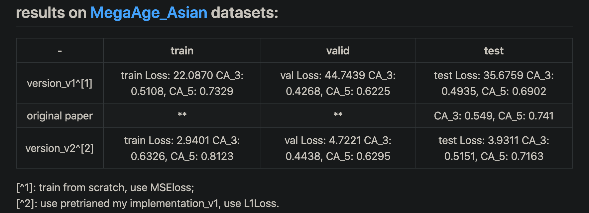

# How to convert SSRNet to ONNX and implements with onnxruntime c++
## 1. 前言

这篇文档主要记录将项目[ssrnet-pytorch](https://github.com/oukohou/SSR_Net_Pytorch/blob/master/ReadMe.md) 的模型转换为onnx模型，并使用onnxruntime c++接口实现推理的过程。




## 2. 转换成ONNX模型

* 依赖库：
  * pytorch 1.8
  * onnx 1.7.0
  * onnxruntime 1.7.0
  * opencv 4.5.1
  * onnxsim (latest)

下载模型文件后，重命名为`ssrnet.pth`，采用`export_onnx.py`将其转换为onnx模型。

```python
import os
import cv2
import torch
import onnx
import onnxruntime as ort
from onnxsim import simplify
import numpy as np
from SSR_models.SSR_Net_model import SSRNet

if __name__ == "__main__":
    input_size = 64
    batch_size = 1
    model_file = "./pretrained_model/ssrnet.pth"
    onnx_path =  "./pretrained_model/ssrnet.onnx"
    sim_onnx_path =  "./pretrained_model/ssrnet_sim.onnx"
    device = torch.device("cuda:0" if torch.cuda.is_available() else "cpu")

    inference_model = SSRNet()
    loaded_model = torch.load(model_file, map_location=device)
    inference_model.load_state_dict(loaded_model['state_dict'])
    inference_model = inference_model.to(device)
    inference_model.eval()

    x = torch.randn(batch_size, 3, 64, 64, requires_grad=False).cpu()  # moving the tensor to cpu
    torch.onnx.export(inference_model,  # model being run
                      x,  # model input (or a tuple for multiple inputs)
                      onnx_path,  # where to save the model (can be a file or file-like object)
                      export_params=True,  # store the trained parameter weights inside the model file
                      opset_version=11,  # the ONNX version to export the model to
                      do_constant_folding=True,  # whether to execute constant folding for optimization
                      input_names=['input'],  # the model's input names
                      output_names=['age']  # the model's output names
                      )

    print("export onnx done.")
    onnx_model = onnx.load(onnx_path)
    onnx.checker.check_model(onnx_model)

    model_simp, check = simplify(onnx_model, check_n=3)
    onnx.save(model_simp, sim_onnx_path)
    print("export onnx sim done.")

    # test onnxruntime
    ort_session = ort.InferenceSession(sim_onnx_path)

    image_path_ = "./test.jpg"
    image_ = cv2.imread(image_path_)  # keep BGR
    image_ = cv2.resize(image_, (input_size, input_size))
    image_ = image_.astype(np.float32) / 255.0
    image_[:, :, 0] = (image_[:, :, 0] - 0.485) / 0.229
    image_[:, :, 1] = (image_[:, :, 1] - 0.456) / 0.224
    image_[:, :, 2] = (image_[:, :, 2] - 0.406) / 0.225
    image_ = image_.transpose((2, 0, 1))  # (3,64,64)

    image_ = np.expand_dims(image_, 0)

    age = ort_session.run(['age'], input_feed={"input": image_})

    print("age: ", age[0])

    """
    PYTHONPATH=. python3 ./export_onnx.py
    """
```


## 3. python版本onnxruntime推理接口

原始项目的推理采用了torch和PIL的接口做数据预处理，但考虑到在c++，我们想尽可能减少依赖库，于是需要将原始推理中得预处理，用opencv改写。`inference_single_image`函数中的逻辑，就是作者提供的推理代码。`inference_single_image_cv2`函数是我用opencv重写后的推理代码。中间有些坑，对于`T.ToPILImage()`，如果channel=3则假设输入的数据是RGB 但由于作者的代码中输入是opencv读入的，所以事实上是BGR；`T.Resize()`, 与opencv resize 的INTER_LINEAR方法结果不完全一致导致模型推理结果无法对其 参考训练过程 没有用到Resize 因此 直接在外部使用opencv的resize，结果就一样了；`T.ToTensor()`, 会默认将数值转换为[0.,1.]范围内的float32。

```python

"""Description for the script:
inference one single image or many images of a directory using pretrained SSRNet.
"""
import os

# os.environ["CUDA_VISIBLE_DEVICES"] = '0'

from SSR_models.SSR_Net_model import SSRNet
import time

import numpy as np
import torch
from torchvision import transforms as T
import cv2

device = torch.device("cuda:0" if torch.cuda.is_available() else "cpu")


def inference_single_image(model_, image_path_, input_size_=64):
    image_ = cv2.imread(image_path_)
    # image_ = cv2.cvtColor(image_, cv2.COLOR_BGR2RGB)
    image_ = cv2.resize(image_, (input_size_, input_size_))

    start_time_ = time.time()
    image_ = T.Compose([
        T.ToPILImage(),  # 如果channel=3则假设输入的数据是RGB 但由于输入是opencv读入的，所以事实上是BGR
        # T.Resize((input_size_, input_size_)), # 与Opencv resize 的INTER_LINEAR方法结果不完全一致导致模型推理结果无法对其 参考训练过程 没有用到Resize 因此 直接在外部使用opencv的resize，结果就一样了
        #T.RandomHorizontalFlip(),
        T.ToTensor(),  # (0., 1.0)
        T.Normalize([0.485, 0.456, 0.406], [0.229, 0.224, 0.225])])(image_)
    
    image_ = image_[np.newaxis, ]
    image_ = image_.to(device)
    results_ = model_(image_)
    return results_,  time.time() - start_time_


def inference_single_image_cv2(model_, image_path_, input_size_=64):
    image_ = cv2.imread(image_path_)  # keep BGR
    image_ = cv2.resize(image_, (input_size_, input_size_), interpolation=cv2.INTER_LINEAR)
    image_ = image_.astype(np.float32) / 255.0
    image_[:, :, 0] = (image_[:, :, 0] - 0.485) / 0.229
    image_[:, :, 1] = (image_[:, :, 1] - 0.456) / 0.224
    image_[:, :, 2] = (image_[:, :, 2] - 0.406) / 0.225
    image_ = image_.transpose((2,0,1))  # (1,3,64,64)
    image_ = torch.from_numpy(image_) # (1,3,64,64)

    start_time_ = time.time()

    image_ = image_[np.newaxis,]
    image_ = image_.to(device)
    results_ = model_(image_)
    return results_, time.time() - start_time_


if __name__ == "__main__":
    image_file_path = "./test.jpg"
    model_file = "./pretrained_model/ssrnet.pth"
    
    # parser = argparse.ArgumentParser()
    # parser.add_argument("--image", help="image to be processed, dir or a single image.")
    # parser.add_argument("--graph", help="graph/model to be executed")
    #
    # args = parser.parse_args()
    #
    # if args.graph:
    #     model_file = args.graph
    # if args.image:
    #     image_file_path = args.image
    
    input_size = 64
    
    inference_model = SSRNet()
    loaded_model = torch.load(model_file, map_location=device)
    inference_model.load_state_dict(loaded_model['state_dict'])
    inference_model = inference_model.to(device)
    inference_model.eval()

    age_, cost_time = inference_single_image_cv2(inference_model, image_file_path)
    print("age:\t{}, used {} ms in total.".format(age_[0], cost_time * 1000))
    age_, cost_time = inference_single_image(inference_model, image_file_path)
    print("age:\t{}, used {} ms in total.".format(age_[0], cost_time * 1000))

    """CMD
    PYTHONPATH=. python3 ./inference_images.py
    """
```

采用onnxruntime的python接口重写上述推理过程，如下。

```python
import cv2
import numpy as np
import onnxruntime as ort

if __name__ == "__main__":
    input_size = 64
    sim_onnx_path = "./pretrained_model/ssrnet_sim.onnx"
    # test onnxruntime
    ort_session = ort.InferenceSession(sim_onnx_path)

    image_path_ = "./test.jpg"
    image_ = cv2.imread(image_path_)  # keep BGR
    image_ = cv2.resize(image_, (input_size, input_size))
    image_ = image_.astype(np.float32) / 255.0
    image_[:, :, 0] = (image_[:, :, 0] - 0.485) / 0.229  # B
    image_[:, :, 1] = (image_[:, :, 1] - 0.456) / 0.224  # G
    image_[:, :, 2] = (image_[:, :, 2] - 0.406) / 0.225  # R
    image_ = image_.transpose((2, 0, 1))  # (3,64,64)

    image_ = np.expand_dims(image_, 0)

    age = ort_session.run(['age'], input_feed={"input": image_})

    print("age: ", age[0])
```


## 4. c++版本onnxruntime推理接口

`ort_ssrnet.h`头文件如下：

```c++
//
// Created by DefTruth on 2021/3/14.
//

#ifndef LITEHUB_ORT_CV_SSRNET_H
#define LITEHUB_ORT_CV_SSRNET_H

#include "ort/core/ort_core.h"

namespace ortcv
{
  class SSRNet : public BasicOrtHandler
  {
  private:
    const float mean_val[3] = {0.485f, 0.456f, 0.406f};
    const float scale_val[3] = {1.0f/0.229f, 1.0f/0.224f, 1.0f/0.225f};

  public:
    explicit SSRNet(const std::string &_onnx_path, unsigned int _num_threads = 1) :
        BasicOrtHandler(_onnx_path, _num_threads)
    {};

    ~SSRNet() override = default;

  private:
    ort::Value transform(const cv::Mat &mat) override;

  public:
    void detect(const cv::Mat &mat, types::Age &age);
  };
}

#endif //LITEHUB_ORT_CV_SSRNET_H

```

`ort_ssrnet.cpp`接口实现如下：

```c++
//
// Created by DefTruth on 2021/3/14.
//

#include "ssrnet.h"
#include "ort/core/ort_utils.h"

using ortcv::SSRNet;

ort::Value SSRNet::transform(const cv::Mat &mat)
{
  cv::Mat canva = mat.clone();
  cv::resize(canva, canva, cv::Size(input_node_dims.at(3),
                                    input_node_dims.at(2))); // 64x64x3
  canva.convertTo(canva, CV_32FC3, 1.0f / 255.0f, 0.f);  // 64x64x3 (0.,1.0)
  // (1,3,64,64)
  ortcv::utils::transform::normalize_inplace(canva, mean_val, scale_val); // float32

  return ortcv::utils::transform::create_tensor(
      canva, input_node_dims, memory_info_handler,
      input_values_handler, ortcv::utils::transform::CHW);
}

void SSRNet::detect(const cv::Mat &mat, types::Age &age)
{
  if (mat.empty()) return;
  // 1. make input tensor
  ort::Value input_tensor = this->transform(mat);
  // 2. inference
  auto output_tensors = ort_session->Run(
      ort::RunOptions{nullptr}, input_node_names.data(),
      &input_tensor, 1, output_node_names.data(), num_outputs
  );
  ort::Value &age_tensor = output_tensors.at(0); // (1,)
  const float pred_age = age_tensor.At<float>({0});
  const unsigned int interval_min = static_cast<int>(pred_age - 2.f > 0.f ? pred_age - 2.f : 0.f);
  const unsigned int interval_max = static_cast<int>(pred_age + 3.f < 100.f ? pred_age + 3.f : 100.f);

  age.age = pred_age;
  age.age_interval[0] = interval_min;
  age.age_interval[1] = interval_max;
  age.interval_prob = 1.0f;
  age.flag = true;
}
```


