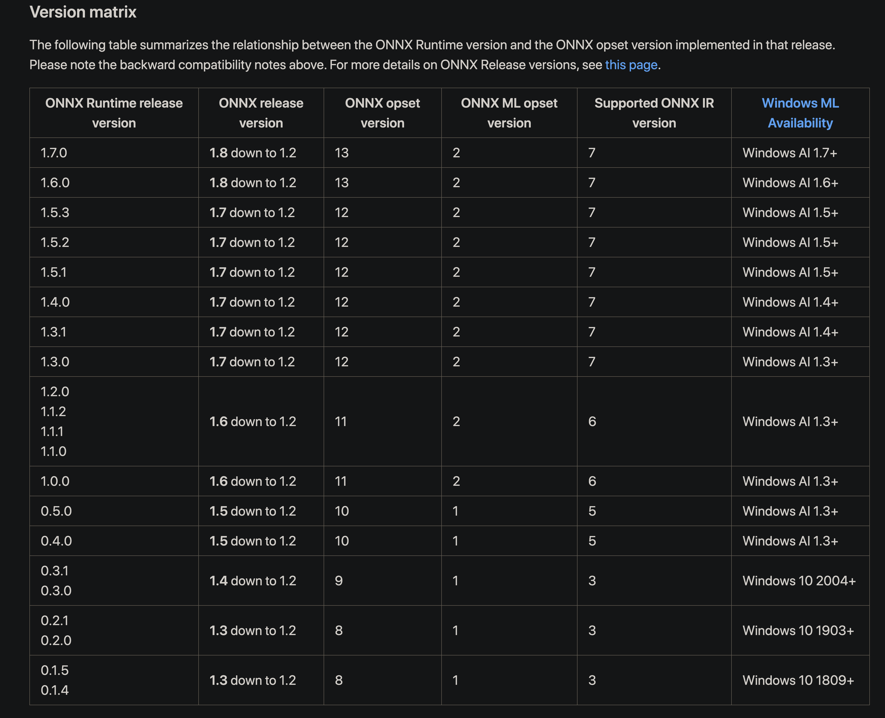
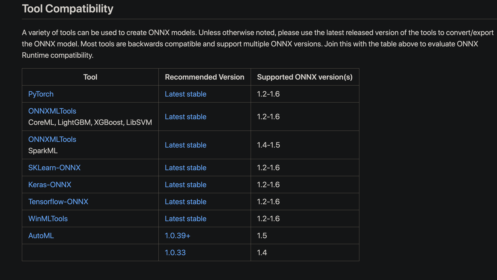

# Some very useful onnxruntime c++ interfaces 

  
  
整理不易，欢迎关注，🌟点赞收藏~ 🙃🤪🍀

## 前言  
这份文档主要记录了onnxruntime的一些参考资料，以及本人在使用过程中的一些经验。

## 1. onnxruntime官方资料
* [1] [onnxruntime官网学习资料](https://www.onnxruntime.ai/)
* [2] [onnxruntime自定义op](https://www.onnxruntime.ai/docs/how-to/export-pytorch-model.html)
* [3] [onnxruntime-gpu和cuda版本对应](https://github.com/microsoft/onnxruntime/releases/tag/v1.5.1)
* [4] [onnxruntime-openmp](https://pypi.org/project/onnxruntime-openmp/)
* [5] [onnxruntime和cuda之间的版本对应-很详细](https://www.onnxruntime.ai/docs/reference/execution-providers/CUDA-ExecutionProvider.html#version-dependency)
* [6] [onnxruntime-api文档](https://www.onnxruntime.ai/docs/get-started/inference.html)
* [7] [onnxruntime-python-api-docs](https://www.onnxruntime.ai/python/api_summary.html#)
* [8] [onnxruntime-java-api-docs](https://www.onnxruntime.ai/java/)

## 2.onnxruntime-C++参考
* [1] [onnx_runtime_cpp-github](https://github.com/xmba15/onnx_runtime_cpp)
* [2] [onnxruntime python/c/c++/java使用案列](https://www.onnxruntime.ai/docs/get-started/inference.html)
* [3] [onnxruntime-各种语言官方案列](https://github.com/microsoft/onnxruntime/tree/master/samples)
* [4] [onnxruntime的c++使用](https://blog.csdn.net/baidu_34595620/article/details/112176278)
* [5] [onnxruntime-cxx官方案例](https://github.com/microsoft/onnxruntime/blob/master/csharp/test/Microsoft.ML.OnnxRuntime.EndToEndTests.Capi/CXX_Api_Sample.cpp)
* [6] [onnxruntime-FAQ](https://github.com/microsoft/onnxruntime/blob/master/docs/FAQ.md)
* [7] [onnxruntime-c++多输入多数出case](https://github.com/microsoft/onnxruntime/blob/master/onnxruntime/test/shared_lib/test_inference.cc)

## 3. onnxruntime-java参考
* [1] [onnxruntime-minst-java](https://github.com/microsoft/onnxruntime/blob/master/java/src/test/java/sample/ScoreMNIST.java)
* [2] [在java中使用onnxruntime](https://blog.csdn.net/mzl87/article/details/109170580)
* [3] [onnxruntime的build.gradle](https://github.com/microsoft/onnxruntime/blob/master/java/build.gradle)

## 4. onnxruntime的Docker镜像
* [1] [Dockerfile-onnxruntime](https://github.com/microsoft/onnxruntime/tree/master/dockerfiles)

## 5. onnxruntime源码编译
* [1] [onnxruntime源码编译](https://blog.csdn.net/wuqingshan2010/article/details/106372580#t1)
* [2] [linux编译onnxruntime](https://blog.csdn.net/hxljzx/article/details/111320847?utm_medium=distribute.pc_relevant.none-task-blog-baidujs_baidulandingword-1&spm=1001.2101.3001.4242)
* [3] [onnxruntime编译选项解析](https://blog.csdn.net/zhuikefeng/article/details/108672033?utm_medium=distribute.pc_relevant.none-task-blog-2%7Edefault%7EBlogCommendFromBaidu%7Edefault-6.control&dist_request_id=1330144.24052.16181386077064005&depth_1-utm_source=distribute.pc_relevant.none-task-blog-2%7Edefault%7EBlogCommendFromBaidu%7Edefault-6.control)
* [4] [onnxtunrime中CMake使用指南和ABI-Dev-Notes](https://blog.csdn.net/xxradon/article/details/104100442/)
* [5] [onnxruntime-cmake_guildline.md](https://github.com/microsoft/onnxruntime/blob/master/docs/cmake_guideline.md)
* [6] [mac编译中出现has no symbols提示](https://www.cnblogs.com/zzugyl/p/4193647.html)

## 6. 开源项目
* [1] [chineseocr_lite-onnxruntime/ncnn等各种语言应用](https://github.com/DayBreak-u/chineseocr_lite)
* [2] [onnxruntime-projects](https://codechina.csdn.net/mirrors/tenglike1997/onnxruntime-projects)
* [3] [比较不错的Ort-c++应用项目](https://github.com/xmba15/onnx_runtime_cpp)


## 7. 与ONNX的Opset兼容性
* [1] [onnxruntime与onnx各opset的对应](https://github.com/microsoft/onnxruntime/blob/master/docs/Versioning.md)



与各个转换工具的兼容性


## 8. 获取Ort::Value的值
### 8.1 通过At<>获取
```c++
TEST(CApiTest, access_tensor_data_elements) {
  /**
   * Create a 2x3 data blob that looks like:
   *
   *  0 1 2
   *  3 4 5
   */
  std::vector<int64_t> shape = {2, 3};
  int element_count = 6;  // 2*3
  std::vector<float> values(element_count);
  for (int i = 0; i < element_count; i++)
    values[i] = static_cast<float>(i);

  Ort::MemoryInfo info("Cpu", OrtDeviceAllocator, 0, OrtMemTypeDefault);

  Ort::Value tensor = Ort::Value::CreateTensor<float>(info, values.data(), values.size(), shape.data(), shape.size());

  float expected_value = 0;
  for (int64_t row = 0; row < shape[0]; row++) {
    for (int64_t col = 0; col < shape[1]; col++) {
      ASSERT_EQ(expected_value++, tensor.At<float>({row, col}));
    }
  }
}
```
### 8.2 通过裸指针获取
```c++
  const float *var_angles = output_var_tensors.front().GetTensorMutableData<float>();
  const float *conv_angles = output_conv_tensors.front().GetTensorMutableData<float>();
  const float mean_yaw = (var_angles[0] + conv_angles[0]) / 2.0f;
  const float mean_pitch = (var_angles[1] + conv_angles[1]) / 2.0f;
  const float mean_roll = (var_angles[2] + conv_angles[2]) / 2.0f;
```
### 8.3 通过引用&和At获取
Ort::Value不允许复制拷贝，因此无法通过`=`去使用输出的结果，但是可以结合引用`&+At<>`来获取，使用方式如下:
```c++
  ort::Value &var_angles_tensor = output_var_tensors.at(0);
  ort::Value &conv_angles_tensor = output_conv_tensors.at(0);
  const float mean_ref_yaw = 
      (var_angles_tensor.At<float>({0}) + conv_angles_tensor.At<float>({0})) / 2.0f;
  const float mean_ref_pitch = 
      (var_angles_tensor.At<float>({1}) + conv_angles_tensor.At<float>({1})) / 2.0f;
  const float mean_ref_roll =
      (var_angles_tensor.At<float>({2}) + conv_angles_tensor.At<float>({2})) / 2.0f;
```
可以看到`At<>`的源码为：
```c++
inline T& Value::At(const std::vector<int64_t>& location) {
  static_assert(!std::is_same<T, std::string>::value, "this api does not support std::string");
  T* out;
  ThrowOnError(GetApi().TensorAt(p_, location.data(), location.size(), (void**)&out));
  return *out;
}
```
实际上也是利用指针`p_`获取数据，只不过`At`替我们处理了数据位置的计算。这个方法返回的实际上是一个`非const`引用，这意味着你可以通过这个引用直接修改内存中的值。
### 8.4 其他用法参考
```c++
std::vector<OrtSessionHandler::DataOutputType> OrtSessionHandler::OrtSessionHandlerIml::
operator()(const std::vector<float*>& inputData)
{
    if (m_numInputs != inputData.size()) {
        throw std::runtime_error("Mismatch size of input data\n");
    }

    Ort::MemoryInfo memoryInfo = Ort::MemoryInfo::CreateCpu(OrtArenaAllocator, OrtMemTypeDefault);

    std::vector<Ort::Value> inputTensors;
    inputTensors.reserve(m_numInputs);

    for (int i = 0; i < m_numInputs; ++i) {
        inputTensors.emplace_back(std::move(
            Ort::Value::CreateTensor<float>(memoryInfo, const_cast<float*>(inputData[i]), m_inputTensorSizes[i],
                                            m_inputShapes[i].data(), m_inputShapes[i].size())));
    }

    auto outputTensors = m_session.Run(Ort::RunOptions{nullptr}, m_inputNodeNames.data(), inputTensors.data(),
                                       m_numInputs, m_outputNodeNames.data(), m_numOutputs);

    assert(outputTensors.size() == m_numOutputs);
    std::vector<DataOutputType> outputData;
    outputData.reserve(m_numOutputs);

    int count = 1;
    for (auto& elem : outputTensors) {
        DEBUG_LOG("type of input %d: %s", count++, toString(elem.GetTensorTypeAndShapeInfo().GetElementType()).c_str());
        outputData.emplace_back(
            std::make_pair(std::move(elem.GetTensorMutableData<float>()), elem.GetTensorTypeAndShapeInfo().GetShape()));
    }

    return outputData;
}
```

## 9. 源码应用案例
* [1] [onnxruntime-c++多输入多输出案列](https://blog.csdn.net/baidu_34595620/article/details/112176278)
```c++
#include <assert.h>
#include <vector>
#include <onnxruntime_cxx_api.h>

int main(int argc, char* argv[]) {
  Ort::Env env(ORT_LOGGING_LEVEL_WARNING, "test");
  Ort::SessionOptions session_options;
  session_options.SetIntraOpNumThreads(1);
  session_options.SetGraphOptimizationLevel(GraphOptimizationLevel::ORT_ENABLE_EXTENDED);

#ifdef _WIN32
  const wchar_t* model_path = L"model.onnx";
#else
  const char* model_path = "model.onnx";
#endif

  Ort::Session session(env, model_path, session_options);
  // print model input layer (node names, types, shape etc.)
  Ort::AllocatorWithDefaultOptions allocator;

  // print number of model input nodes
  size_t num_input_nodes = session.GetInputCount();
  std::vector<const char*> input_node_names = {"input","input_mask"};
  std::vector<const char*> output_node_names = {"output","output_mask"};
    
  std::vector<int64_t> input_node_dims = {10, 20};
  size_t input_tensor_size = 10 * 20; 
  std::vector<float> input_tensor_values(input_tensor_size);
  for (unsigned int i = 0; i < input_tensor_size; i++)
    input_tensor_values[i] = (float)i / (input_tensor_size + 1);
  // create input tensor object from data values
  auto memory_info = Ort::MemoryInfo::CreateCpu(OrtArenaAllocator, OrtMemTypeDefault);
  Ort::Value input_tensor = Ort::Value::CreateTensor<float>(memory_info, input_tensor_values.data(), input_tensor_size, input_node_dims.data(), 2);
  assert(input_tensor.IsTensor());

  std::vector<int64_t> input_mask_node_dims = {1, 20, 4};
  size_t input_mask_tensor_size = 1 * 20 * 4; 
  std::vector<float> input_mask_tensor_values(input_mask_tensor_size);
  for (unsigned int i = 0; i < input_mask_tensor_size; i++)
    input_mask_tensor_values[i] = (float)i / (input_mask_tensor_size + 1);
  // create input tensor object from data values
  auto mask_memory_info = Ort::MemoryInfo::CreateCpu(OrtArenaAllocator, OrtMemTypeDefault);
  Ort::Value input_mask_tensor = Ort::Value::CreateTensor<float>(mask_memory_info, input_mask_tensor_values.data(), input_mask_tensor_size, input_mask_node_dims.data(), 3);
  assert(input_mask_tensor.IsTensor());
    
  std::vector<Ort::Value> ort_inputs;
  ort_inputs.push_back(std::move(input_tesor));
  ort_inputs.push_back(std::move(input_mask_tensor));
  // score model & input tensor, get back output tensor
  auto output_tensors = session.Run(Ort::RunOptions{nullptr}, input_node_names.data(), ort_inputs.data(), ort_inputs.size(), output_node_names.data(), 2);
  
  // Get pointer to output tensor float values
  float* floatarr = output_tensors[0].GetTensorMutableData<float>();
  float* floatarr_mask = output_tensors[1].GetTensorMutableData<float>();
  
  printf("Done!\n");
  return 0;
}

```

## 9. onnxruntime动态维度推理
* [1] [onnxruntime-c++ dynamic维度模型的推理](https://blog.csdn.net/baidu_34595620/article/details/112176278)

## 10. onnxruntime源码学习
* [0] [onnxruntime源码阅读：模型推理过程概览](https://blog.csdn.net/ZM_Yang/article/details/103977679?utm_medium=distribute.pc_relevant_t0.none-task-blog-2%7Edefault%7EBlogCommendFromMachineLearnPai2%7Edefault-1.baidujs&dist_request_id=&depth_1-utm_source=distribute.pc_relevant_t0.none-task-blog-2%7Edefault%7EBlogCommendFromMachineLearnPai2%7Edefault-1.baidujs)
* [1] [onnxruntime源码解析：引擎运行过程总览](https://blog.csdn.net/ZM_Yang/article/details/105158051)
* [2] [pytorch-onnx-operator-export-type设置](https://pytorch.org/docs/stable/onnx.html?highlight=onnx%20runtime#tracing-vs-scripting)
* [3] [onnxruntime与pytorch对接方法汇总](https://blog.csdn.net/xxradon/article/details/104182111?utm_medium=distribute.pc_relevant.none-task-blog-2%7Edefault%7EBlogCommendFromBaidu%7Edefault-3.baidujs&dist_request_id=1330144.24096.16181393611009723&depth_1-utm_source=distribute.pc_relevant.none-task-blog-2%7Edefault%7EBlogCommendFromBaidu%7Edefault-3.baidujs)
* [4] [onnxruntime的设计理念](https://blog.csdn.net/xxradon/article/details/104099603?spm=1001.2014.3001.5501)
* [5] [onnxruntime增加新的operator和kernel](https://blog.csdn.net/xxradon/article/details/104100114?spm=1001.2014.3001.5501)
* [6] [onnx模型如何修改或删除里面的node即修改图的方法](https://blog.csdn.net/xxradon/article/details/104715524?spm=1001.2014.3001.5501)
* [7] [onnxruntime添加一个新的execution-provider](https://blog.csdn.net/xxradon/article/details/104100243?spm=1001.2014.3001.5501)
* [8] [onnxruntime图优化方法说明](https://blog.csdn.net/xxradon/article/details/104117617?spm=1001.2014.3001.5501)
* [9] [onnx结构分析](https://blog.csdn.net/u013597931/article/details/84401047?utm_medium=distribute.pc_relevant.none-task-blog-2%7Edefault%7EBlogCommendFromMachineLearnPai2%7Edefault-4.baidujs&dist_request_id=&depth_1-utm_source=distribute.pc_relevant.none-task-blog-2%7Edefault%7EBlogCommendFromMachineLearnPai2%7Edefault-4.baidujs)

  

整理不易，欢迎关注，🌟点赞收藏~ 🙃🤪🍀
